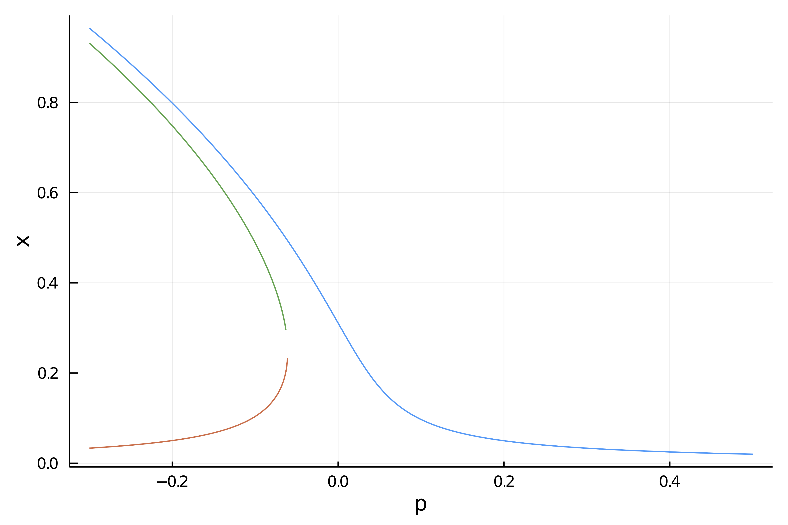

# Deflated Continuation

!!! unknown "References"
    Farrell, Patrick E., Casper H. L. Beentjes, and Ásgeir Birkisson. **The Computation of Disconnected Bifurcation Diagrams.** ArXiv:1603.00809 [Math], March 2, 2016. http://arxiv.org/abs/1603.00809.

Deflated continuation allows to compute branches of solutions to the equation $F(x,p)=0$. It is based on the Deflated Newton (see [Deflated problems](@ref)).

However, unlike the regular continuation method, deflated continuation allows to compute **disconnected** bifurcation diagrams, something that is impossible to our Automatic Bifurcation diagram computation method.

You can find an example of use in the [Deflated Continuation in the Carrier Problem](@ref). We reproduce below the result of the computation:


## Algorithm

```
Input: Initial parameter value λmin.
Input: Final parameter value λmax > λmin. Input: Step size ∆λ > 0.
Input: Nonlinear residual f(u,λ).
Input: Deflation operator M(u; u∗).
Input: Initial solutions S(λmin) to f(·,λmin).
λ ← λmin
while λ < λmax do
	F(·) ← f(·,λ+∆λ) ◃ Fix the value of λ to solve for.
	S(λ+∆λ) ← ∅
	for u0 ∈ S(λ) do ◃ Continue known branches.
	apply Newton’s method to F from initial guess u0.
	if solution u∗ found then
		S(λ + ∆λ) ← S(λ + ∆λ) ∪ {u∗} ◃ Record success
		F(·) ← M(·;u∗)F(·)		◃ Deflate solution
		
	for u0 ∈ S(λ) do 	◃ Seek new branches.
		success ← true 
		while success do
			apply Newton’s method to F from initial guess u0.
			if solution u∗ found then
				S(λ + ∆λ) ← S(λ + ∆λ) ∪ {u∗} ◃ Record success
				F(·) ← M(·;u∗)F(·)		◃ Deflate solution
		else
			success ← false 
	λ←λ+∆λ
return S
```

## Basic example

We show a quick and simple example of use. Note in particular that the algoritm is able to find the disconnected branch. The starting points are marked with crosses

```julia
using BifurcationKit, LinearAlgebra, Setfield, SparseArrays, Plots
const BK = BifurcationKit

k = 2
N = 1
F = (x, p) -> p .* x .+ x.^(k+1)/(k+1) .+ 0.01
Jac_m = (x, p) -> diagm(0 => p .+ x.^k)

opts = BK.ContinuationPar(dsmax = 0.051, dsmin = 1e-3, ds=0.001, maxSteps = 140, pMin = -3., saveSolEveryStep = 0, newtonOptions = NewtonPar(tol = 1e-8, verbose = false), saveEigenvectors = false)

brdc, = continuation(F,Jac_m, 0.5, (@lens _),
	ContinuationPar(opts, ds = -0.001, maxSteps = 800, newtonOptions = NewtonPar(verbose = true, maxIter = 6), plotEveryStep = 40),
	DeflationOperator(2.0, dot, .001, [[0.]]); showplot=true, verbosity = 1,
	perturbSolution = (x,p,id) -> (x  .+ 0.1 .* rand(length(x))),
	callbackN = (x, f, J, res, iteration, itlinear, options; kwargs...) -> res <1e3)
```


