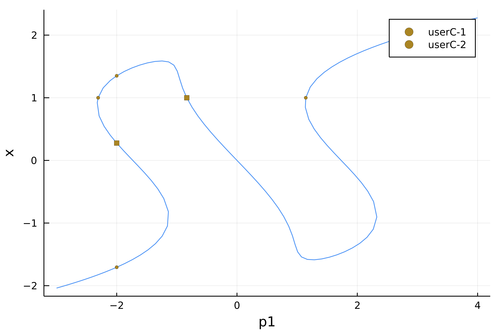

# Event Handling

`BifurcationKit.jl` allows the detection of events along the branch of solutions. Its main use consists in detecting bifurcation points but they can be used and combined together by the user too.

The events are detected during a call to `br, = continuation(F, J, u0, p0, lens, contParams::ContinuationPar;kwargs...)` by turning on the following flags:

- `contParams.detectEvent = 1`

The event points are located by looking at the function defining the event (see below). The located event points are then returned in `br.specialpoint`.

## Precise detection of event points using Bisection

Note that the event points detected when `detectEvent = 1` are only approximate event points. Indeed, we only signal that, in between two continuation steps which can be large, a (several) event point has been detected. Hence, we only have a rough idea of where the event is located, unless your `ContinuationPar().dsmax` is very small... This can be improved as follows.

If you choose `detectEvent = 2`, a bisection algorithm is used to locate the event points more precisely. It means that we recursively track down the event. Some options in `ContinuationPar` control this behavior:

- `nInversion`: number of sign inversions in the bisection algorithm
- `maxBisectionSteps` maximum number of bisection steps
- `tolParamBisectionEvent` tolerance on parameter to locate event

## Different event types

The set of possible events `DiscreteEvent, ContinuousEvent, SetOfEvents, PairOfEvents` is detailed in the [Library](https://rveltz.github.io/BifurcationKit.jl/dev/library/#Events-1).

## Built-in events

```@docs
BifurcationKit.SaveAtEvent
```

```@docs
BifurcationKit.FoldDetectEvent
```

```@docs
BifurcationKit.BifDetectEvent
```


## Examples

We show how to use the different events. We first set up a problem as usual.

```julia
using Revise, BifurcationKit, Setfield, ForwardDiff
using Plots
const BK = BifurcationKit
####################################################################################################
# test vector field for event detection
function Feve(X, p)
	p1, p2, k = p
	x, y = X
	out = similar(X)
	out[1] = p1 + x - y - x^k/k
	out[2] = p1 + y + x - 2y^k/k
	out
end

# associated jacobian
Jeve(X, p) = ForwardDiff.jacobian(z -> Feve(z,p), X)

# parameters for the vector field
par = (p1 = -3., p2=-3., k=3)

# parameters for the continuation
opts = ContinuationPar(dsmax = 0.1, ds = 0.001, maxSteps = 128, pMin = -3., pMax = 4.0,
     saveSolEveryStep = 1, plotEveryStep = 10,
     newtonOptions = NewtonPar(tol = 1e-10, verbose = false, maxIter = 5),
     # parameters specific to event detection
     detectBifurcation = 0, detectEvent = 2, nInversion = 6, dsminBisection = 1e-9,
     maxBisectionSteps = 15, detectFold=false)

# arguments for continuation
args = (Feve, Jeve, -2ones(2), par, (@lens _.p1), opts)
kwargs = (plot = true, verbosity = 3, recordFromSolution = (x,p) -> x[1],
    linearAlgo = MatrixBLS(),)
```

### Example of continuous event

In this first example, we build an event to detect when the parameter value is `-2` or when the first component of the solution is `1`.

```julia
br, = continuation(args...; kwargs...,
	event = BK.ContinuousEvent(2, 
		(iter, state) -> (getp(state)+2, getx(state)[1]-1)),)
```

gives

```Julia
julia> br
Branch number of points: 128
Branch of Equilibrium
Parameters p1 from -3.0 to 4.0
Special points:
 (ind_ev = index of the bifurcating eigenvalue e.g. `br.eig[idx].eigenvals[ind_ev]`)
- #  1, userC-1 at p1 ≈ -1.99996995 ∈ (-2.00003555, -1.99996995), |δp|=7e-05, [converged], δ = ( 0,  0), step =  25, eigenelements in eig[ 25], ind_ev =   0
- #  2, userC-1 at p1 ≈ -2.10228497 ∈ (-2.10228497, -1.99999798), |δp|=1e-01, [    guess], δ = ( 0,  0), step =  42, eigenelements in eig[ 42], ind_ev =   0
- #  3, userC-2 at p1 ≈ -2.30841066 ∈ (-2.30881920, -2.30841066), |δp|=4e-04, [converged], δ = ( 0,  0), step =  46, eigenelements in eig[ 46], ind_ev =   0
- #  4, userC-1 at p1 ≈ -1.99983405 ∈ (-2.00007518, -1.99983405), |δp|=2e-04, [converged], δ = ( 0,  0), step =  49, eigenelements in eig[ 49], ind_ev =   0
- #  5, userC-2 at p1 ≈ -0.83491347 ∈ (-0.83506349, -0.83491347), |δp|=2e-04, [converged], δ = ( 0,  0), step =  61, eigenelements in eig[ 61], ind_ev =   0
- #  6, userC-2 at p1 ≈ +1.14438624 ∈ (+1.14308305, +1.14438624), |δp|=1e-03, [converged], δ = ( 0,  0), step = 105, eigenelements in eig[105], ind_ev =   0
```

This shows for example that the first component of the event was detected `userC-1` first. This yields `plot(br)`



You can also name the events as follows

```julia
 br, = continuation(args...; kwargs...,
 	event = BK.ContinuousEvent(2, 
 		(iter, state) -> (getp(state)+2, getx(state)[1]-1),
 		("event1", "event2")))
```

And get:

```julia
julia> br
(Branch number of points: 128
Branch of Equilibrium
Parameters p1 from -3.0 to 4.0
Special points:
 (ind_ev = index of the bifurcating eigenvalue e.g. `br.eig[idx].eigenvals[ind_ev]`)
- #  1, event1 at p1 ≈ -1.99996995 ∈ (-2.00003555, -1.99996995), |δp|=7e-05, [converged], δ = ( 0,  0), step =  25, eigenelements in eig[ 25], ind_ev =   0
- #  2, event1 at p1 ≈ -2.10228497 ∈ (-2.10228497, -1.99999798), |δp|=1e-01, [    guess], δ = ( 0,  0), step =  42, eigenelements in eig[ 42], ind_ev =   0
- #  3, event2 at p1 ≈ -2.30841066 ∈ (-2.30881920, -2.30841066), |δp|=4e-04, [converged], δ = ( 0,  0), step =  46, eigenelements in eig[ 46], ind_ev =   0
- #  4, event1 at p1 ≈ -1.99983405 ∈ (-2.00007518, -1.99983405), |δp|=2e-04, [converged], δ = ( 0,  0), step =  49, eigenelements in eig[ 49], ind_ev =   0
- #  5, event2 at p1 ≈ -0.83491347 ∈ (-0.83506349, -0.83491347), |δp|=2e-04, [converged], δ = ( 0,  0), step =  61, eigenelements in eig[ 61], ind_ev =   0
- #  6, event2 at p1 ≈ +1.14438624 ∈ (+1.14308305, +1.14438624), |δp|=1e-03, [converged], δ = ( 0,  0), step = 105, eigenelements in eig[105], ind_ev =   0
```

### Example of discrete event

You can also use discrete events to detect a change. For example, the following detect when the parameter value equals `-2`:

```julia
br, = continuation(args...; kwargs...,
	event = BK.DiscreteEvent(1, 
		(iter, state) -> getp(state)>-2))
```

gives

```julia
julia> br
Branch number of points: 128
Branch of Equilibrium
Parameters p1 from -3.0 to 4.0
Special points:
 (ind_ev = index of the bifurcating eigenvalue e.g. `br.eig[idx].eigenvals[ind_ev]`)
- #  1, userD at p1 ≈ -1.99996995 ∈ (-2.00003555, -1.99996995), |δp|=7e-05, [converged], δ = ( 0,  0), step =  25, eigenelements in eig[ 25], ind_ev =   0
- #  2, userD at p1 ≈ -2.10228497 ∈ (-2.10228497, -1.99999798), |δp|=1e-01, [    guess], δ = ( 0,  0), step =  42, eigenelements in eig[ 42], ind_ev =   0
- #  3, userD at p1 ≈ -1.99998059 ∈ (-2.00001073, -1.99998059), |δp|=3e-05, [converged], δ = ( 0,  0), step =  49, eigenelements in eig[ 49], ind_ev =   0
```


### Example of PairOfEvents event

Let us be a bit more creative and combine a continuous event with a discrete one:

```julia
br, = continuation(args...; kwargs...,
	event = BK.PairOfEvents(
		BK.ContinuousEvent(1, (iter, state) -> getp(state)),
		BK.DiscreteEvent(1, (iter, state) -> getp(state)>-2)))
```

and obtain

```julia
julia> br
(Branch number of points: 128
Branch of Equilibrium
Parameters p1 from -3.0 to 4.0
Special points:
 (ind_ev = index of the bifurcating eigenvalue e.g. `br.eig[idx].eigenvals[ind_ev]`)
- #  1, userD-1 at p1 ≈ -1.99996995 ∈ (-2.00003555, -1.99996995), |δp|=7e-05, [converged], δ = ( 0,  0), step =  25, eigenelements in eig[ 25], ind_ev =   0
- #  2, userD-1 at p1 ≈ -2.10228497 ∈ (-2.10228497, -1.99999798), |δp|=1e-01, [    guess], δ = ( 0,  0), step =  42, eigenelements in eig[ 42], ind_ev =   0
- #  3, userD-1 at p1 ≈ -1.99998059 ∈ (-2.00001073, -1.99998059), |δp|=3e-05, [converged], δ = ( 0,  0), step =  49, eigenelements in eig[ 49], ind_ev =   0
- #  4, userC-1 at p1 ≈ +0.00000555 ∈ (-0.00000855, +0.00000555), |δp|=1e-05, [converged], δ = ( 0,  0), step =  69, eigenelements in eig[ 69], ind_ev =   0
```

Here `userD-1` means that the first component of the discrete event was detected. Of course, you can name the event like done above.

### Example of set of events
We can combine more events and chain them like we want using `SetOfEvents`. In this example, we show how to do bifurcation detection and event location altogether:

```julia		
ev1 = BK.ContinuousEvent(1, (iter, state) -> getp(state)-1)
ev2 = BK.ContinuousEvent(2, (iter, state) -> (getp(state)-2, getp(state)-2.5))
# event to detect bifurcation
ev3 = BK.BifDetectEvent
# we combine the events together
eve = BK.SetOfEvents(ev1, ev2, ev3)

br, = continuation(args...; kwargs...,
		event = eve)
```

Which gives

```julia
julia> br
Branch number of points: 132
Branch of Equilibrium
Parameters p1 from -3.0 to 4.0
Special points:
 (ind_ev = index of the bifurcating eigenvalue e.g. `br.eig[idx].eigenvals[ind_ev]`)
- #  1,    bp at p1 ≈ -1.13352254 ∈ (-1.13352254, -1.13351184), |δp|=1e-05, [    guess], δ = ( 1,  0), step =  33, eigenelements in eig[ 34], ind_ev =   1
- #  2,    bp at p1 ≈ -2.32505840 ∈ (-2.32505840, -2.32505721), |δp|=1e-06, [converged], δ = (-1,  0), step =  46, eigenelements in eig[ 47], ind_ev =   1
- #  3,  hopf at p1 ≈ -0.95278292 ∈ (-0.95406239, -0.95278292), |δp|=1e-03, [converged], δ = ( 2,  2), step =  60, eigenelements in eig[ 61], ind_ev =   2
- #  4,  hopf at p1 ≈ +0.95484802 ∈ (+0.95357386, +0.95484802), |δp|=1e-03, [converged], δ = (-2, -2), step =  80, eigenelements in eig[ 81], ind_ev =   2
- #  5, userC1 at p1 ≈ +1.00001539 ∈ (+0.99997148, +1.00001539), |δp|=4e-05, [converged], δ = ( 0,  0), step =  82, eigenelements in eig[ 82], ind_ev =   0
- #  6, userC2-1 at p1 ≈ +2.00064090 ∈ (+1.99678144, +2.00064090), |δp|=4e-03, [converged], δ = ( 0,  0), step =  91, eigenelements in eig[ 91], ind_ev =   0
- #  7,    bp at p1 ≈ +2.32505860 ∈ (+2.32505860, +2.32505861), |δp|=1e-08, [converged], δ = ( 1,  0), step =  95, eigenelements in eig[ 96], ind_ev =   1
- #  8, userC2-1 at p1 ≈ +1.99961809 ∈ (+1.99961809, +2.00135833), |δp|=2e-03, [converged], δ = ( 0,  0), step =  99, eigenelements in eig[ 99], ind_ev =   0
- #  9,    bp at p1 ≈ +1.13290310 ∈ (+1.13286417, +1.13290310), |δp|=4e-05, [converged], δ = (-1,  0), step = 108, eigenelements in eig[109], ind_ev =   1
- # 10, userC2-1 at p1 ≈ +2.00114454 ∈ (+1.99694626, +2.00114454), |δp|=4e-03, [converged], δ = ( 0,  0), step = 116, eigenelements in eig[116], ind_ev =   0
- # 11, userC2-2 at p1 ≈ +2.50216926 ∈ (+2.49360973, +2.50216926), |δp|=9e-03, [converged], δ = ( 0,  0), step = 120, eigenelements in eig[120], ind_ev =   0
```

And 


