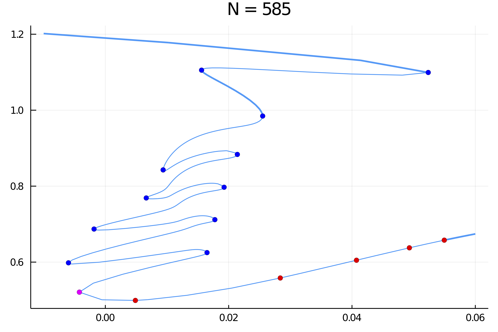
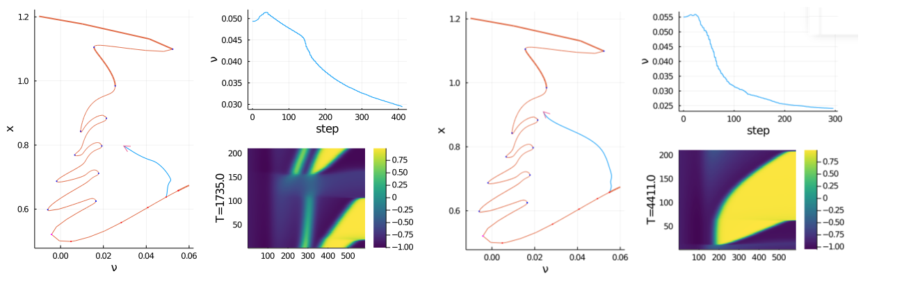

# Langmuir–Blodgett transfer model (really advanced)

!!! warning "Advanced"
    Work in progress...


!!! note "Advanced"
    This is by far the most advanced example in the package. It uses all functionalities to their best. For example, the computation of periodic orbits with Finite Differences uses an inplace modification of the jacobian which allows to have quite a fine time discretization. The Shooting methods rely on parallel shooting with preconditioner and highly tuned ODE time stepper.
      
    
In this tutorial, we try to replicate some of the results of the amazing paper [^Köpf]. This example is quite a marvel in the realm of bifurcation analysis, featuring a harp-like bifurcation diagram. The equations of the thin film are as follows:

$$\partial_{t} c=-\partial_{x}^{2}\left[\partial_{x}^{2} c-c^{3}+c-\mu \zeta(x)\right]-V \partial_{x} c$$

with boundary conditions

$$c(0)=c_{0}, \quad \partial_{x x} c(0)=\partial_{x} c(L)=\partial_{x x} c(L)=0$$

and where

$$\zeta(x)=-\frac{1}{2}\left[1+\tanh \left(\frac{x-x_{s}}{l_{s}}\right)\right].$$

As can be seen in the reference above, the bifurcation diagram is significantly more involved as $L$ increases. So we set up for the "simple" case $L=50$.

```julia
using Revise
	using Parameters, Setfield, SparseArrays
	using BifurcationKit, LinearAlgebra, Plots, ForwardDiff, BandedMatrices
	const BK = BifurcationKit
```

Let us define the parameters of the model

```julia
# domain size
L = 50.0

# number of unknowns
N = 390*3/2 |> Int
Δx = L/(N+1)
X = ((1:N) |> collect) .* Δx

# define the (laplacian of) g function
xs = 10.0; ls = 2.0
Δg = @. tanh((X - xs)/ls) * (1 - tanh((X - xs)/ls)^2)/ls^2

# define the parameters of the model
par = (N = N, Δx = Δx, c0 = -0.9, σ = 1.0, μ = 0.5, ν = 0.08, Δg = Δg)
```

We call the Krylov-Newton to find a stationary solution. Note that for this to work, the guess has to satisfy the boundary conditions approximately.

```julia
# newton iterations to refine the guess
opt_new = NewtonPar(tol = 1e-9, verbose = true, maxIter = 50)
	out, = @time newton(Flgvf, Jana, 0X .-0.9, par, opt_new)
plot(X, out)
```


We then continue the previous guess and find this very nice folded structure with many Hopf bifurcation points.

```julia
# careful here, in order to use Arpack.eig, you need rather big space or compute ~100 eigenvalues
opts_cont = ContinuationPar(
	dsmin = 1e-5, dsmax = 0.04, ds= -0.001, pMin = -0.01, pMax = 10.1,
	# we adjust theta so that the continuation steps are larger
	theta = 0.4, a = 0.75, plotEveryStep = 30,
	newtonOptions = setproperties(opt_new; tol = 1e-9, maxIter = 10, verbose = false),
	maxSteps = 600,
	nev = 10, saveEigenvectors = true, precisionStability = 1e-5, detectBifurcation = 3, dsminBisection = 1e-8, maxBisectionSteps = 15, nInversion = 6, tolBisectionEigenvalue = 1e-9, saveSolEveryStep = 50)

	eig = EigKrylovKit(tol=1e-9, x₀ = rand(N), dim = 150)

	@time br, u1 = @time continuation(
		Flgvf, JanaSP,
		out, (@set par.ν = 0.06), (@lens _.ν ), opts_cont,
		linearAlgo = MatrixBLS(),
		plot = true,
		printSolution = (x, p) -> normL2(x),
		plotSolution = (x, p; kwargs...) -> plot!(X, x, subplot = 3, xlabel = "Nx = $(length(x))", label = ""),
		normC = normL2)
```




## Continuation of periodic orbits (FD)

We would like to compute the branches of periodic solutions from the Hopf points. We do this automatic branch switching as follows

```julia
using ForwardDiff
D(f, x, p, dx) = ForwardDiff.derivative(t->f(x .+ t .* dx, p), 0.)
d1F(x,p,dx1) = D((z, p0) -> Flgvf(z, p0), x, p, dx1)
d2F(x,p,dx1,dx2) = D((z, p0) -> d1F(z, p0, dx1), x, p, dx2)
d3F(x,p,dx1,dx2,dx3) = D((z, p0) -> d2F(z, p0, dx1, dx2), x, p, dx3)

# jet to compute the normal form
jet  = (Flgvf, JanaSP, d2F, d3F)

# parameters for newton
opt_po = NewtonPar(tol =  1e-10, verbose = true, maxIter = 50)

opts_po_cont = ContinuationPar(dsmin = 1e-5, dsmax = 0.35, ds= 0.001,
	pMax = 1.0, maxSteps = 100, theta = 0.75,
	newtonOptions = setproperties(opt_po; maxIter = 15, tol = 1e-6), plotEveryStep = 1)

M = 100 # numbr of time sections
br_potrap, utrap = continuation(
	# arguments for branch switching
	jet..., br, 5,
	# arguments for continuation
	opts_po_cont, PeriodicOrbitTrapProblem(M = M);
	ampfactor = 0.99, δp = 1e-5,
	linearPO = :FullSparseInplace,
	tangentAlgo = BorderedPred(),
	verbosity = 3,	plot = true,
	usedeflation = true,
	updateSectionEveryStep = 1,
	printSolution = (x, p) -> normL2T(x[1:end-1], M = M),
	plotSolution  = (x, p; kwargs...) -> begin
			heatmap!(reshape(x[1:end-1], N, M)'; ylabel="T=$(round(x[end]))", color=:viridis, kwargs...)
			plot!(br, subplot=1, label="")
		end,
	normC = norminf)
```
 and we obtain the following graph. It is interesting to note that the periodic solutions converge to an homoclinic orbit here with a very large period.


We can do this for the other Hopf points as well. Note that, we have to increase the number of time sections `M` to improve the convergence to the homoclinic orbits.


Here are some examples of periodic solutions.



[^Köpf]:> Köpf and Thiele, **Emergence of the Bifurcation Structure of a Langmuir–Blodgett Transfer Model.**, 2014