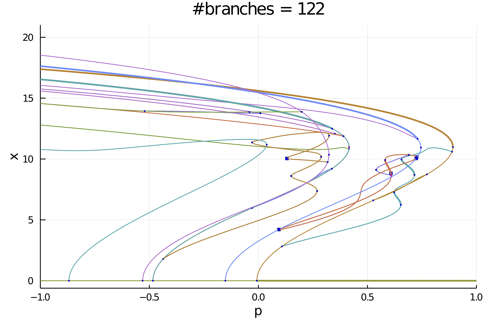
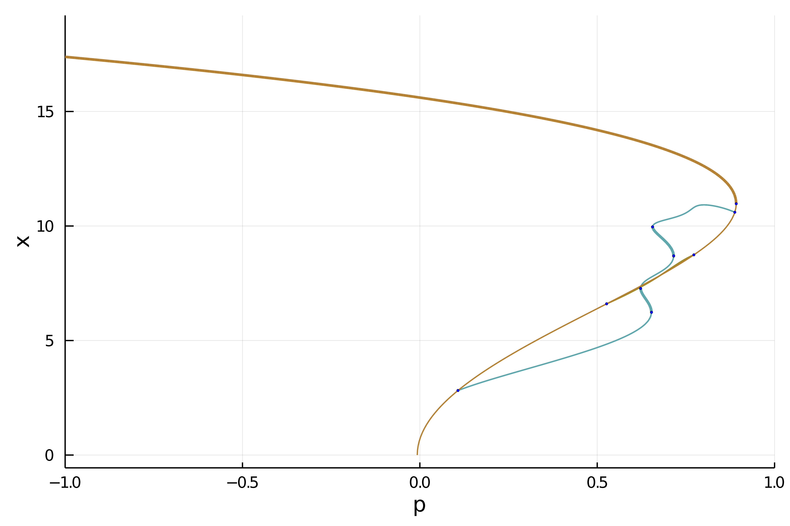

# Swift-Hohenberg equation 1d

```@contents
Pages = ["Swift-Hohenberg1d.md"]
Depth = 3
```

In this tutorial, we will see how to compute automatically the bifurcation diagram of the 1d Swift-Hohenberg equation

$$-(I+\Delta)^2 u+l\cdot u +\nu u^2-u^3 = 0\tag{E}$$

with Dirichlet boundary conditions. We use a Sparse Matrix to express the operator $L_1=(I+\Delta)^2$. We start by loading the packages:

```julia
using Revise
using SparseArrays, LinearAlgebra, DiffEqOperators, Setfield, Parameters
using BifurcationKit
using Plots
const BK = BifurcationKit
```

We then define a discretization of the problem

```julia
# define a norm
norminf(x) = norm(x, Inf64)

# discretisation
Nx = 200; Lx = 6.;
X = -Lx .+ 2Lx/Nx*(0:Nx-1) |> collect
hx = X[2]-X[1]

# boundary condition
Q = Dirichlet0BC(hx |> typeof)
Dxx = sparse(CenteredDifference(2, 2, hx, Nx) * Q)[1]
Lsh = -(I + Dxx)^2

# functional of the problem
function R_SH(u, par)
	@unpack p, b, L1 = par
	out = similar(u)
	out .= L1 * u .- p .* u .+ b .* u.^3 - u.^5
end

# Jacobian of the function
Jac_sp = (u, par) -> par.L1 + spdiagm(0 => -par.p .+ 3*par.b .* u.^2 .- 5 .* u.^4)

# second derivative
d2R(u,p,dx1,dx2) = @. p.b * 6u*dx1*dx2 - 5*4u^3*dx1*dx2

# third derivative
d3R(u,p,dx1,dx2,dx3) = @. p.b * 6dx3*dx1*dx2 - 5*4*3u^2*dx1*dx2*dx3

# jet associated with the functional
jet = (R_SH, Jac_sp, d2R, d3R)

# parameters associated with the equation
parSH = (p = 0.7, b = 2., L1 = Lsh)
```

We then choose the parameters for [`continuation`](@ref) with precise detection of bifurcation points by bisection:

```julia
opts = BK.ContinuationPar(dsmin = 0.0001, dsmax = 0.01, ds = -0.01, pMin = -2.1,
	newtonOptions = setproperties(optnew; maxIter = 30, tol = 1e-8), 
	maxSteps = 300, plotEveryStep = 40, 
	detectBifurcation = 3, nInversion = 4, tolBisectionEigenvalue = 1e-17, dsminBisection = 1e-7)
```

Before we continue, it is useful to define a callback (see [`continuation`](@ref)) for the [`newton`](@ref) to avoid spurious branch switching. It is not strictly necessary for what follows but 

```julia
function cb(x,f,J,res,it,itl,optN; kwargs...)
	_x = get(kwargs, :z0, nothing)
	if _x isa BorderedArray
		# if the residual is too large or if the parameter jump
		# is too big, abord continuation step
		return norm(_x.u - x) < 20.5 && abs(_x.p - kwargs[:p]) < 0.05
	end
	true
end
```

Next, we specify the arguments to be used during continuation, such as plotting function, tangent predictors, callbacks...

```julia
args = (verbosity = 3,
	plot = true,
	linearAlgo  = MatrixBLS(),
	plotSolution = (x, p;kwargs...)->(plot!(X, x; ylabel="solution", label="", kwargs...)),
	callbackN = cb
	)
```

Depending on the level of recursion in the bifurcation diagram, we change a bit the options as follows

```julia
function optrec(x, p, l; opt = opts)
	level =  l
	if level <= 2
		return setproperties(opt; maxSteps = 300, detectBifurcation = 3, nev = Nx, detectLoop = false)
	else
		return setproperties(opt; maxSteps = 250, detectBifurcation = 3, nev = Nx, detectLoop = true)
	end
end
```

!!! tip "Tuning"
    The function `optrec` modifies the continuation options `opts` as function of the branching `level`. It can be used to alter the continuation parameters inside the bifurcation diagram.
    
We are now in position to compute the bifurcation diagram

```julia
diagram = @time bifurcationdiagram(jet..., sol1, (@set parSH.p = 1.), (@lens _.p), 4, optrec; args...)
```  

and plot it  

```julia
plot(diagram;  code = (1,), plotfold = false,  
	markersize = 2, putbifptlegend = false, xlims=(-1,1))
title!("#branches = $(size(branches))")
```	



Et voilà!

## Exploration of the diagram

The bifurcation diagram `diagram` is stored as tree:

```julia
julia> diagram
Bifurcation diagram. Root branch (level 1) has 6 children and is such that:
Branch number of points: 224
Branch of Equilibrium
Bifurcation points:
 (ind_ev = index of the bifurcating eigenvalue e.g. `br.eig[idx].eigenvals[ind_ev]`)
- #  1,      bp point around p ≈ -0.00729225, step =  72, eigenelements in eig[ 73], ind_ev =   1 [converged], δ = ( 1,  0)
- #  2,      bp point around p ≈ -0.15169672, step =  83, eigenelements in eig[ 84], ind_ev =   2 [converged], δ = ( 1,  0)
- #  3,      bp point around p ≈ -0.48386427, step = 107, eigenelements in eig[108], ind_ev =   3 [converged], δ = ( 1,  0)
- #  4,      bp point around p ≈ -0.53115204, step = 111, eigenelements in eig[112], ind_ev =   4 [converged], δ = ( 1,  0)
- #  5,      bp point around p ≈ -0.86889220, step = 135, eigenelements in eig[136], ind_ev =   5 [converged], δ = ( 1,  0)
- #  6,      bp point around p ≈ -2.07693994, step = 221, eigenelements in eig[222], ind_ev =   6 [converged], δ = ( 1,  0)
```

We can access the different branches with `BK.getBranch(diagram, (1,))`. Alternatively, you can plot a specific branch:

```julia
plot(diagram; code = (1,), plotfold = false,  markersize = 2, putbifptlegend = false, xlims=(-1,1))
```


