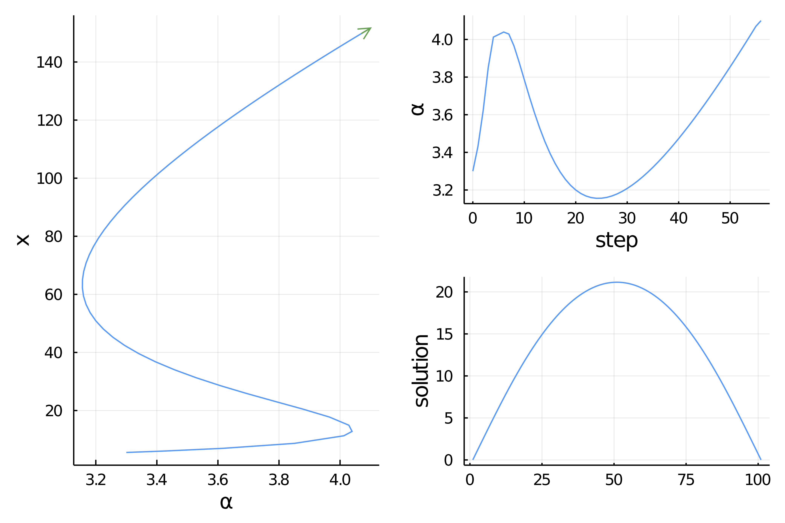
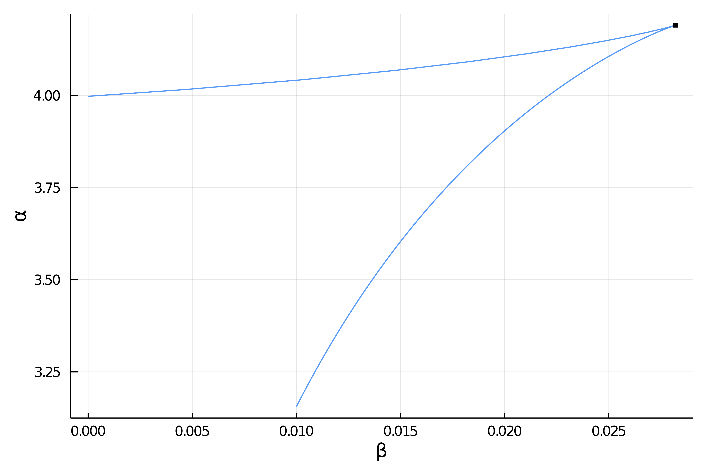
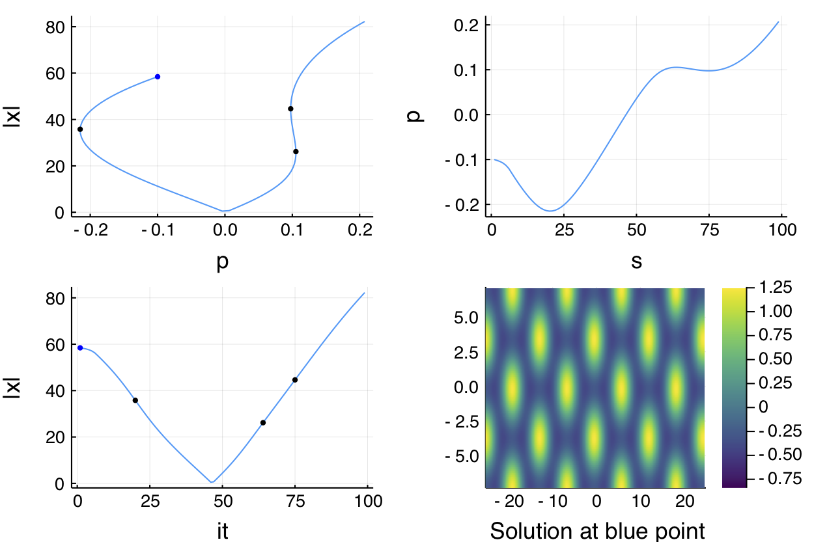
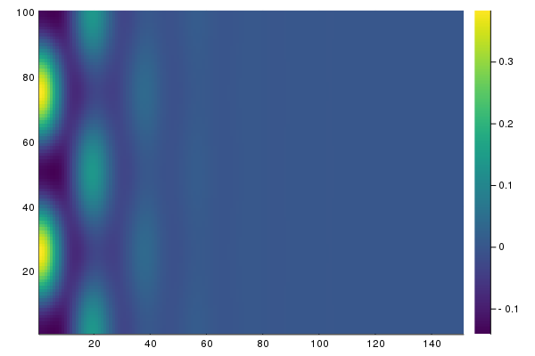
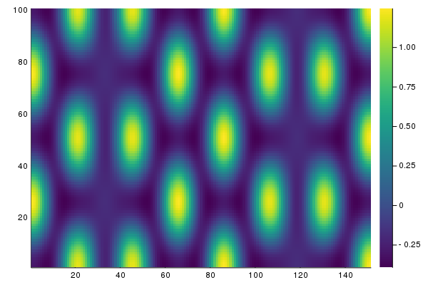
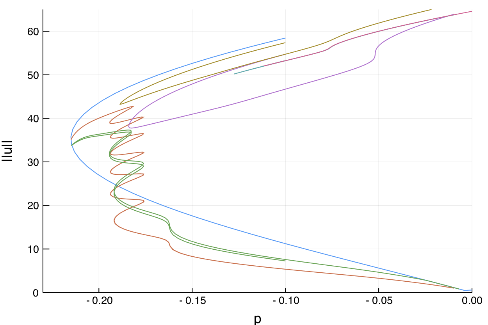
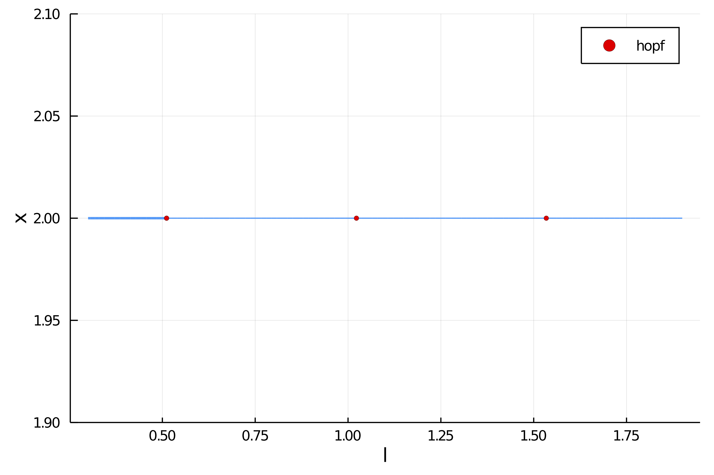
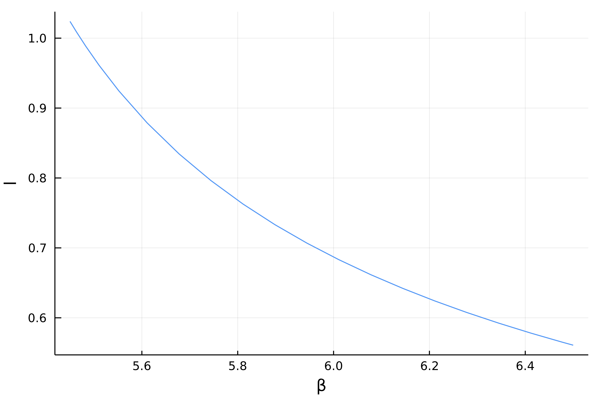
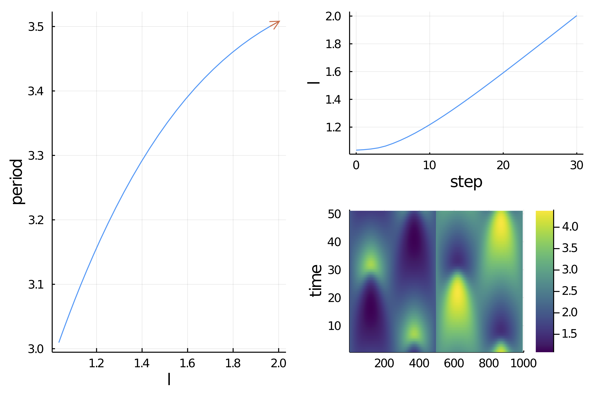
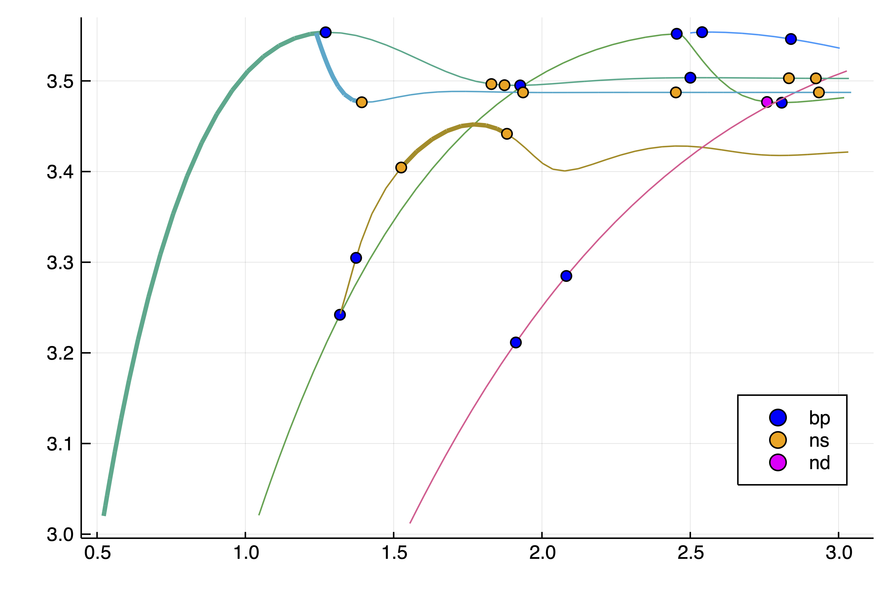

# PseudoArcLengthContinuation.jl

This package aims at solving equations $F(u,\lambda)=0$ where $\lambda \in\mathbb R$ starting from an initial guess $(u_0,\lambda_0)$. It relies on the pseudo arclength continuation algorithm which provides a *predictor* $(u_1,\lambda_1)$ from $(u_0,\lambda_0)$. A Newton method is then used to correct this predictor.

The current package focuses on large scale problem and multiple hardware. Hence, the goal is to use Matrix Free / Sparse methods on GPU or a cluster in order to solve non linear equations (PDE for example).

Finally, we leave it to the user to take advantage of automatic differentiation.

## Other softwares

We were inspired by [pde2path](http://www.staff.uni-oldenburg.de/hannes.uecker/pde2path/). One can also mention the venerable AUTO, or also, [MATCONT](http://www.matcont.ugent.be/) and [COCO](https://sourceforge.net/projects/cocotools/) or [Trilinos](https://trilinos.org/). Most continuation softwares are listed on [DSWeb](https://dsweb.siam.org/Software). There is also this MATLAB continuation [code](https://www.dropbox.com/s/inqwpl0mp7o1oy0/AvitabileICMNS2016Workshop.zip?dl=0) by [D. Avitabile](https://www.maths.nottingham.ac.uk/plp/pmzda/index.html).


In Julia, we have for now a [wrapper](https://github.com/JuliaDiffEq/PyDSTool.jl) to PyDSTools, and also [Bifurcations.jl](https://github.com/tkf/Bifurcations.jl).

One design choice is that we try not to require `u` to be a subtype of an `AbstractArray` as this would forbid the use of spectral methods (like the one from `ApproxFun.jl`) or some GPU package, *e.g.* `ArrayFire.jl`. So far, our implementation does not allow this for Fold / Hopf continuation and computation of periodic orbits. It will be improved later.

## A word on performance

The examples which follow have not been written with the goal of performance but rather simplicity. One could surely turn them into more efficient codes. The intricacies of PDEs make the writing of efficient code highly problem dependent and one should take advantage of every particularity of the problem under study.

For example, in the first example below, one could use `BandedMatrices.jl` for the jacobian and an inplace modification when the jacobian is called ; using a composite type would be favoured. Porting them to GPU would be another option.


# Example 1: nonlinear pendulum

This is a simple example in which we aim at solving $\Delta\theta+\alpha f(\theta,\beta)=0$ with boundary conditions $\theta(0) = \theta(1)=0$. This example is coded in `examples/chan.jl` ; it is a basic example from the Trilinos library. We start with some imports:

```julia
using PseudoArcLengthContinuation, LinearAlgebra, Plots
const Cont = PseudoArcLengthContinuation

source_term(x; a = 0.5, b = 0.01) = 1 + (x + a*x^2)/(1 + b*x^2)
dsource_term(x; a = 0.5, b = 0.01) = (1-b*x^2+2*a*x)/(1+b*x^2)^2
```

We then write our functional:

```julia
function F_chan(x, α, β = 0.)
	f = similar(x)
	n = length(x)
	f[1] = x[1] - β
	f[n] = x[n] - β
	for i=2:n-1
		f[i] = (x[i-1] - 2 * x[i] + x[i+1]) * (n-1)^2 + α * source_term(x[i], b = β)
	end
	return f
end
```
We want to call a Newton solver. We first need an initial guess:

```julia
n = 101
sol = [(i-1)*(n-i)/n^2+0.1 for i=1:n]
```
and parameters

```julia
a = 3.3
```
Finally, we need to define some parameters for the Newton iterations. This is done by calling

```julia
opt_newton = Cont.NewtonPar(tol = 1e-11, verbose = true)
```

We call the Newton solver:

```julia
out, hist, flag = @time Cont.newton(
		x -> F_chan(x, a, 0.01),
		sol,
		opt_newton)
```
and you should see

```
Newton Iterations
   Iterations      Func-count      f(x)      Linear-Iterations

        0                1     2.3440e+01         0
        1                2     1.3774e+00         1
        2                3     1.6267e-02         1
        3                4     2.4521e-06         1
        4                5     5.9356e-11         1
        5                6     5.8117e-12         1
  0.102035 seconds (119.04 k allocations: 7.815 MiB)
```

Note that, in this case, we did not give the Jacobian. It was computed internally using Finite Differences. We can now perform numerical continuation wrt the parameter `a`. Again, we need to define some parameters for the continuation:

```julia
opts_br0 = Cont.ContinuationPar(dsmin = 0.01, dsmax = 0.15, ds= 0.01, pMax = 4.1)
	# options for the newton solver
	opts_br0.newtonOptions.maxIter = 20
	opts_br0.newtonOptions.tol = 1e-8
	opts_br0.detect_fold = true
	opts_br0.maxSteps = 150
```

Then, we can call the continuation routine

```julia
br, u1 = @time Cont.continuation((x,p) -> F_chan(x,p, 0.01),
	out, a,
	opts_br0,
	printsolution = x -> norm(x,Inf64),
	plot = true,
	plotsolution = (x;kwargs...) -> (plot!(x,subplot=4,ylabel="solution",label="")))
```
and you should see


The top left figure is the norm of the solution as function of the parameter `a`. The bottom left figure is the norm of the solution as function of iteration number. The bottom right is the solution for the current value of the parameter.
	
!!! note "Bif. point detection"
    Krylov Two Fold points were detected. This can be seen by looking at `br.bifpoint` or by the black 	dots on the continuation plots.


## Continuation of Fold points
We can for example take the first Fold point and create an initial guess to locate it precisely. However, this only works when the jacobian is computed precisely:

```julia
function Jac_mat(u, α, β = 0.)
	n = length(u)
	J = zeros(n, n)
	J[1, 1] = 1.0
	J[n, n] = 1.0
	for i = 2:n-1
		J[i, i-1] = (n-1)^2
		J[i, i+1] = (n-1)^2
    	J[i, i] = -2 * (n-1)^2 + α * dsource_term(u[i], b = β)
	end
	return J
end

outfold, hist, flag = @time Cont.newtonFold((x,α) -> F_chan(x, α, 0.01),
				(x, α) -> Jac_mat(x, α, 0.01),
				br, 3, #index of the fold point
				opts_br0.newtonOptions)
		flag && printstyled(color=:red,"--> We found a Fold Point at α = ", outfold[end], ", β = 0.01\n")
```

which gives

```julia
  0.085458 seconds (98.05 k allocations: 40.414 MiB, 21.55% gc time)
--> We found a Fold Point at α = 3.1556507316136138, β = 0.01
```

We can also continue this fold point in the plane $(a,b)$ performing a Fold Point Continuation. In the present case, we find a Cusp point.

```julia
optcontfold = ContinuationPar(dsmin = 0.001, dsmax = 0.05,ds= 0.01, pMax = 4.1, pMin = 0., a = 2., theta = 0.3)
	optcontfold.newtonOptions.tol = 1e-8
	outfoldco, hist, flag = @time Cont.continuationFold(
		(x, α, β) ->  F_chan(x, α, β),
		(x, α, β) -> Jac_mat(x, α, β),
		br, 3,
		0.01,
		optcontfold)

Cont.plotBranch(outfoldco;xlabel="b",ylabel="a")
```

which produces



## Using GMRES or another linear solver

We continue the previous example but now using Matrix Free methods. The user can pass its own solver by implementing a version of `LinearSolver`. Some basic linear solvers have been implemented from `KrylovKit.jl` and `IterativeSolvers.jl`, we can use them here. Note that we can implement preconditioners with this. The same functionality is present for the eigensolver.

```julia
# very easy to write since we have F_chan. Could use Automatic Differentiation as well
function dF_chan(x, dx, α, β = 0.)
	out = similar(x)
	n = length(x)
	out[1] = dx[1]
	out[n] = dx[n]
	for i=2:n-1
		out[i] = (dx[i-1] - 2 * dx[i] + dx[i+1]) * (n-1)^2 + α * dsource_term(x[i], b = β) * dx[i]
	end
	return out
end

ls = Cont.GMRES_KrylovKit{Float64}(dim = 100)
	opt_newton_mf = Cont.NewtonPar(tol = 1e-11, verbose = true, linsolve = ls, eigsolve = Default_eig())
	out_mf, hist, flag = @time Cont.newton(
		x -> F_chan(x, a, 0.01),
		x -> (dx -> dF_chan(x, dx, a, 0.01)),
		sol,
		opt_newton_mf)
```

which gives:

```julia
Newton Iterations
   Iterations      Func-count      f(x)      Linear-Iterations

        0                1     2.3440e+01         0
        1                2     1.3774e+00        68
        2                3     1.6267e-02        98
        3                4     2.4336e-06        73
        4                5     6.2617e-12        73
  0.336398 seconds (1.15 M allocations: 54.539 MiB, 7.93% gc time)
```

# Example 2: Snaking with 2d Swift-Hohenberg equation
We look at the following PDE 

$$0=-(I+\Delta)^2 u+l\cdot u +\nu u^2-u^3$$ 

with periodic boundary conditions. This example is in the file `example/SH2d-fronts.jl`. It is extracted from [pde2path](http://www.staff.uni-oldenburg.de/hannes.uecker/pde2path/). We use a Sparse Matrix to express the operator $L_1=(I+\Delta)^2$

```julia
using DiffEqOperators
using PseudoArcLengthContinuation, LinearAlgebra, Plots, SparseArrays
const Cont = PseudoArcLengthContinuation

heatmapsol(x) = heatmap(reshape(x,Nx,Ny)',color=:viridis)

Nx = 151
Ny = 100
lx = 4*2pi
ly = 2*2pi/sqrt(3)

function Laplacian2D(Nx,Ny,lx,ly,bc = :Neumann0)
    hx = 2lx/Nx
    hy = 2ly/Ny
    D2x = sparse(DerivativeOperator{Float64}(2,2,hx,Nx,bc,bc))
    D2y = sparse(DerivativeOperator{Float64}(2,2,hy,Ny,bc,bc))
    A = kron(sparse(I,Ny,Ny),D2x) + kron(D2y,sparse(I,Nx,Nx))
    return A
end

Δ = Laplacian2D(Nx,Ny,lx,ly)
const L1 = (I + Δ)^2
```
We also write the functional and its differential which is a Sparse Matrix

```julia
function F_sh(u, l=-0.15, ν=1.3)
	return -L1 * u .+ (l .* u .+ ν .* u.^2 .- u.^3)
end

function dF_sh(u, l=-0.15, ν=1.3)
	return -L1 + spdiagm(0 => l .+ 2ν .* u .- 3u.^2)
end
```

We first look for hexagonal patterns. This done with

```julia
X = -lx .+ 2lx/(Nx) * collect(0:Nx-1)
Y = -ly .+ 2ly/(Ny) * collect(0:Ny-1)

sol0 = [(cos(x) + cos(x/2) * cos(sqrt(3) * y/2) ) for x in X, y in Y]
		sol0 .= sol0 .- minimum(vec(sol0))
		sol0 ./= maximum(vec(sol0))
		sol0 = sol0 .- 0.25
		sol0 .*= 1.7
		heatmap(sol0',color=:viridis)

opt_new = Cont.NewtonPar(verbose = true, tol = 1e-9, maxIter = 100)
	sol_hexa, hist, flag = @time Cont.newton(
				x -> F_sh(x,-.1,1.3),
				u -> dF_sh(u,-.1,1.3),
				vec(sol0),
				opt_new)
	println("--> norm(sol) = ",norm(sol_hexa,Inf64))
	heatmapsol(sol_hexa)
```
which produces the results

```julia
  Newton Iterations
   Iterations      Func-count      f(x)      Linear-Iterations

       23               24     5.3390e+00         1
       24               25     2.1593e+01         1
       25               26     5.7336e+00         1
       26               27     1.3178e+00         1
       27               28     1.9094e-01         1
       28               29     7.3575e-03         1
       29               30     1.3292e-05         1
       30               31     1.4949e-10         1
  2.832685 seconds (185.83 k allocations: 1.568 GiB, 3.05% gc time)
```
with


We can now continue this solution

```julia
opts_cont = ContinuationPar(dsmin = 0.001, dsmax = 0.015,ds= -0.0051, pMax = 0.2, pMin = -1.0, save = false, theta = 0.1, plotevery_n_steps = 3, newtonOptions = opt_new)
	opts_cont.detect_fold = true
	opts_cont.maxSteps = 340

	br, u1 = @time Cont.continuation(
		(x,p) -> F_sh(x,p,1.3),
		(x,p) -> dF_sh(x,p,1.3),
		sol_hexa,0.099,opts_cont,plot = true,
		plotsolution = (x;kwargs...) -> (N = Int(sqrt(length(x)));heatmap!(reshape(x,N,N),color=:viridis,subplot=4,label="")),
		printsolution = x -> norm(x,Inf64))
```
with result:



## Snaking computed with deflation

We know that there is snaking near the left fold. Let us look for other solutions like fronts. The problem is that if the guess is not precise enough, the newton iterations will converge to the solution with hexagons `sol_hexa`. We appeal to the technique initiated by P. Farrell and use a **deflated problem**. More precisely, we apply the newton iterations to the following functional $$u\to\left(\frac{1}{\|u-sol_{hexa}\|^2}+\sigma\right)F_{sh}(u)$$
which penalizes `sol_hexa`.

```julia
deflationOp = DeflationOperator(2.0,(x,y) -> dot(x,y),1.0,[sol_hexa])
opt_new.maxIter = 250
outdef, _,flag,_ = @time Cont.newtonDeflated(
				x -> F_sh(x,-.1,1.3),
				u -> dF_sh(u,-.1,1.3),
				0.2vec(sol_hexa) .* vec([exp.(-(x+lx)^2/25) for x in X, y in Y]),
				opt_new,deflationOp,normS = x -> norm(x,Inf64))
		heatmapsol(outdef) |> display
		flag && push!(deflationOp, outdef)
```
which gives:



Note that `push!(deflationOp, outdef)` deflates the newly found solution so that by repeating the process we find another one:

```julia
outdef, _,flag,_ = @time Cont.newtonDeflated(
				x -> F_sh(x,-.1,1.3),
				u -> dF_sh(u,-.1,1.3),
				0.2vec(sol_hexa) .* vec([exp.(-(x)^2/25) for x in X, y in Y]),
				opt_new,deflationOp,normS = x -> norm(x,Inf64))
		heatmapsol(outdef) |> display
		flag && push!(deflationOp, outdef)
```


Again, repeating this from random guesses, we find several more solutions, like for example




We can now continue the solutions located in `deflationOp.roots`

```julia
opts_cont = ContinuationPar(dsmin = 0.001, dsmax = 0.005,ds= -0.0015, pMax = -0.01, pMin = -1.0, theta = 0.5, plotevery_n_steps = 3, newtonOptions = opt_new, a = 0.5, detect_fold = true)
	opts_cont.newtonOptions.tol = 1e-9
	opts_cont.newtonOptions.maxIter = 50
	opts_cont.maxSteps = 450

	br, u1 = @time Cont.continuation(
		(x,p) -> F_sh(x,p,1.3), (x,p) -> dF_sh(x,p,1.3),
		deflationOp.roots[5],
		-0.1,
		opts_cont,plot = true,
		plotsolution = (x;kwargs...)->(heatmap!(X,Y,reshape(x,Nx,Ny)',color=:viridis,subplot=4,label="")),
		printsolution = x->norm(x))
```

and get using `Cont.plotBranch(br)`



# Example 3: Brusselator in 1d

We look at the Brusselator in 1d. The equations are as follows

$$\begin{aligned} \frac { \partial X } { \partial t } & = \frac { D _ { 1 } } { l ^ { 2 } } \frac { \partial ^ { 2 } X } { \partial z ^ { 2 } } + X ^ { 2 } Y - ( β + 1 ) X + α \\ \frac { \partial Y } { \partial t } & = \frac { D _ { 2 } } { l ^ { 2 } } \frac { \partial ^ { 2 } Y } { \partial z ^ { 2 } } + β X - X ^ { 2 } Y \end{aligned}$$

with Dirichlet boundary conditions

$$\begin{array} { l } { X ( t , z = 0 ) = X ( t , z = 1 ) = α } \\ { Y ( t , z = 0 ) = Y ( t , z = 1 ) = β / α } \end{array}$$

These equations have been derived to reproduce an oscillating chemical reaction. There is an obvious equilibrium $(α, β / α)$. Here, we consider bifurcation with respect to the parameter $l$.

We start by writing the functional

```julia
using PseudoArcLengthContinuation, LinearAlgebra, Plots, SparseArrays
const Cont = PseudoArcLengthContinuation

f1(u, v) = u^2*v

function F_bru(x, α, β; D1 = 0.008, D2 = 0.004, l = 1.0)
	n = div(length(x), 2)
	h = 1.0 / (n+1); h2 = h*h

	u = @view x[1:n]
	v = @view x[n+1:2n]

	# output
	f = similar(x)

	f[1] = u[1] - α
	f[n] = u[n] - α
	for i=2:n-1
		f[i] = D1/l^2 * (u[i-1] - 2u[i] + u[i+1]) / h2 - (β + 1) * u[i] + α + f1(u[i], v[i])
	end


	f[n+1] = v[1] - β / α
	f[end] = v[n] - β / α;
	for i=2:n-1
		f[n+i] = D2/l^2 * (v[i-1] - 2v[i] + v[i+1]) / h2 + β * u[i] - f1(u[i], v[i])
	end

	return f
end
```

For computing periodic orbits, we will need a Sparse representation of the Jacobian:

```julia
function Jac_sp(x, α, β; D1 = 0.008, D2 = 0.004, l = 1.0)
	# compute the Jacobian using a sparse representation
	n = div(length(x), 2)
	h = 1.0 / (n+1); hh = h*h

	diag  = zeros(2n)
	diagp1 = zeros(2n-1)
	diagm1 = zeros(2n-1)

	diagpn = zeros(n)
	diagmn = zeros(n)

	diag[1] = 1.0
	diag[n] = 1.0
	diag[n + 1] = 1.0
	diag[end] = 1.0

	for i=2:n-1
		diagm1[i-1] = D1 / hh/l^2
		diag[i]   = -2D1 / hh/l^2 - (β + 1) + 2x[i] * x[i+n]
		diagp1[i] = D1 / hh/l^2
		diagpn[i] = x[i]^2
	end

	for i=n+2:2n-1
		diagmn[i-n] = β - 2x[i-n] * x[i]
		diagm1[i-1] = D2 / hh/l^2
		diag[i]   = -2D2 / hh/l^2 - x[i-n]^2
		diagp1[i] = D2 / hh/l^2
	end
	return spdiagm(0 => diag, 1 => diagp1, -1 => diagm1, n => diagpn, -n => diagmn)
end
```

Finally, to monitor if the solution is constant in space, we will use the following callback

```julia
function finalise_solution(z, tau, step, contResult)
	n = div(length(z), 2)
	printstyled(color=:red, "--> Solution constant = ", norm(diff(z[1:n])), " - ", norm(diff(z[n+1:2n])), "\n")
end
```

We can now compute to equilibrium and its stability

```julia
n = 101

a = 2.
b = 5.45

sol0 = vcat(a * ones(n), b/a * ones(n))

opt_newton = Cont.NewtonPar(tol = 1e-11, verbose = true)
	out, hist, flag = @time Cont.newton(
		x -> F_bru(x, a, b),
		x -> Jac_sp(x, a, b),
		sol0,
		opt_newton)
		
opts_br0 = ContinuationPar(dsmin = 0.001, dsmax = 0.0061, ds= 0.0051, pMax = 1.8, save = false, theta = 0.01, detect_fold = true, detect_bifurcation = true, nev = 16, plot_every_n_steps = 50)
	opts_br0.newtonOptions.maxIter = 20
	opts_br0.newtonOptions.tol = 1e-8
	opts_br0.maxSteps = 280

	br, u1 = @time Cont.continuation(
		(x, p) ->   F_bru(x, a, b, l = p),
		(x, p) -> Jac_sp(x, a, b, l = p),
		out,
		0.3,
		opts_br0,
		plot = true,
		plotsolution = (x;kwargs...)->(N = div(length(x), 2);plot!(x[1:N], subplot=4, label="");plot!(x[N+1:2N], subplot=4, label="")),
		finaliseSolution = finalise_solution,
		printsolution = x->norm(x, Inf64))		
```

We obtain the following bifurcation diagram with 3 Hopf bifurcation points



## Continuation of Hopf points

We use the bifurcation points guesses located in `br.bifpoint` to turn them into precise bifurcation points. For the first one, we have

```julia
ind_hopf = 1
hopfpt = Cont.HopfPoint(br, ind_hopf)

outhopf, hist, flag = Cont.newtonHopf((x, p) ->  F_bru(x, a, b, l = p),
            (x, p) -> Jac_mat(x, a, b, l = p),
			br, ind_hopf,
			NewtonPar(verbose = false))
flag && printstyled(color=:red, "--> We found a Hopf Point at l = ", outhopf[end-1], ", ω = ", outhopf[end], "\n")
```

which produces

```julia
--> We found a Hopf Point at l = 0.5232588119320768, ω = 2.139509289549472
```

We can also perform a Hopf continuation with respect to parameters `l, β`

```julia
br_hopf, u1_hopf = @time Cont.continuationHopf(
	(x, p, β) ->   F_bru(x, a, β, l = p),
	(x, p, β) -> Jac_mat(x, a, β, l = p),
	br, ind_hopf,
	b,
	ContinuationPar(dsmin = 0.001, dsmax = 0.05, ds= 0.01, pMax = 6.5, pMin = 0.0, a = 2., theta = 0.4, newtonOptions = NewtonPar(verbose=true)))
```

which gives using `Cont.plotBranch(br_hopf, xlabel="beta", ylabel = "l")`



## Continuation of periodic orbits

Finally, we can perform continuation of periodic orbits branching from the Hopf bifurcation points. Note that we did not compute the Hopf normal form, so we need an educated guess for the periodic orbit. We first create the initial guess for the periodic orbit:

```julia
function plotPeriodic(outpof,n,M)
	outpo = reshape(outpof[1:end-1], 2n, M)
	plot(heatmap(outpo[1:n,:], xlabel="Time"), heatmap(outpo[n+2:end,:]))
end

# index of the Hopf point we want to branch from
ind_hopf = 2
hopfpt = Cont.HopfPoint(br, ind_hopf)

# bifurcation parameter
l_hopf = hopfpt[end-1]

# Hopf frequency
ωH     = hopfpt[end] |> abs

# number of time slices for the periodic orbit
M = 35

orbitguess = zeros(2n, M)
phase = []; scalphase = []
vec_hopf = br.eig[br.bifpoint[ind_hopf][2]][2][:, br.bifpoint[ind_hopf][end]-1]
for ii=1:M
	t = (ii-1)/(M-1)
	orbitguess[:, ii] .= real.(hopfpt[1:2n] +
		26*0.1 * vec_hopf * exp(2pi * complex(0, 1) * (t - 0.279)))
	push!(phase, t);push!(scalphase, dot(orbitguess[:, ii]- hopfpt[1:2n], real.(vec_hopf)))
end
```
We want to make two remarks. The first is that an initial guess is composed of a space time solution and of the guess for the period of the solution:

```julia
orbitguess_f = vcat(vec(orbitguess), 2pi/ωH) |> vec
```

The second remark concerns the phase `0.279` written above. To account for the additional parameter, periodic orbit localisation using Shooting methods or Finite Differences methods add an additional constraint. In the present case, this constraint is

$$< u(0) - u_{hopf}, \phi> = 0$$

where `u_{hopf} = hopfpt[1:2n]` and $\phi$ is `real.(vec_hopf)`. This is akin to a Poincare section.

This constraint fixes the phase of the periodic orbit. By plotting `plot(phase, scalphase)`, one can find the phase `0.279`. We can now use Newton iterations to find a periodic orbit.

We first create a functional which holds the problem

```julia
poTrap = l-> PeriodicOrbitTrap(
			x-> F_bru(x, a, b, l = l),
			x-> Jac_sp(x, a, b, l = l),
			real.(vec_hopf),
			hopfpt[1:2n],
			M,
			opt_newton.linsolve,
			opt_newton)
```

The functional is `x -> poTrap(l_hopf + 0.01)(x)` at parameter `l_hopf + 0.01`. For this problem, it is more efficient to use a Sparse Matrix representation of the jacobian rather than a Matrix Free one (with GMRES). The matrix at `(x,p)` is computed like this

`poTrap(p)(x, :jacsparse)`

while the Matrix Free version is

`dx -> poTrap(p)(x, dx)`

We use Newton solve:

```julia
opt_po = Cont.NewtonPar(tol = 1e-8, verbose = true, maxIter = 50)
	outpo_f, hist, flag = @time Cont.newton(
			x ->  poTrap(l_hopf + 0.01)(x),
			x ->  poTrap(l_hopf + 0.01)(x, :jacsparse),
			orbitguess_f,
			opt_po)
	println("--> T = ", outpo_f[end])
	plotPeriodic(outpo_f,n,M)
```

and obtain

```julia
Newton Iterations
   Iterations      Func-count      f(x)      Linear-Iterations

        0                1     2.8606e-01         0
        1                2     8.4743e-03         1
        2                3     4.4453e-03         1
        3                4     1.2891e-04         1
        4                5     4.4295e-07         1
        5                6     3.5476e-12         1
  6.605374 seconds (96.14 k allocations: 2.031 GiB, 5.14% gc time)
--> T = 3.04216754648728
```

and


Finally, we can perform continuation of this periodic orbit

```julia
opts_po_cont = ContinuationPar(dsmin = 0.0001, dsmax = 0.05, ds= 0.001, pMax = 4.5, maxSteps = 400, secant = true, theta=0.1, plot_every_n_steps = 3, newtonOptions = NewtonPar(verbose = true))
	br_pok1, _ , _= @time Cont.continuation(
		(x, p) ->  poTrap(p)(x),
		(x, p) ->  poTrap(p)(x, :jacsparse),
		outpo_f, l_hopf + 0.01,
		opts_po_cont,
		plot = true,
		plotsolution = (x;kwargs...)->heatmap!(reshape(x[1:end-1], 2*n, M)', subplot=4, ylabel="time"),
		printsolution = u -> u[end])
```

to obtain the period of the orbit as function of `l`



It is likely that the kink in the branch is caused by a spurious branch switching. This can be probably resolved using larger `dsmax`.

A more complete diagram is the following where we computed the 3 branches of periodic orbits off the Hopf points.


