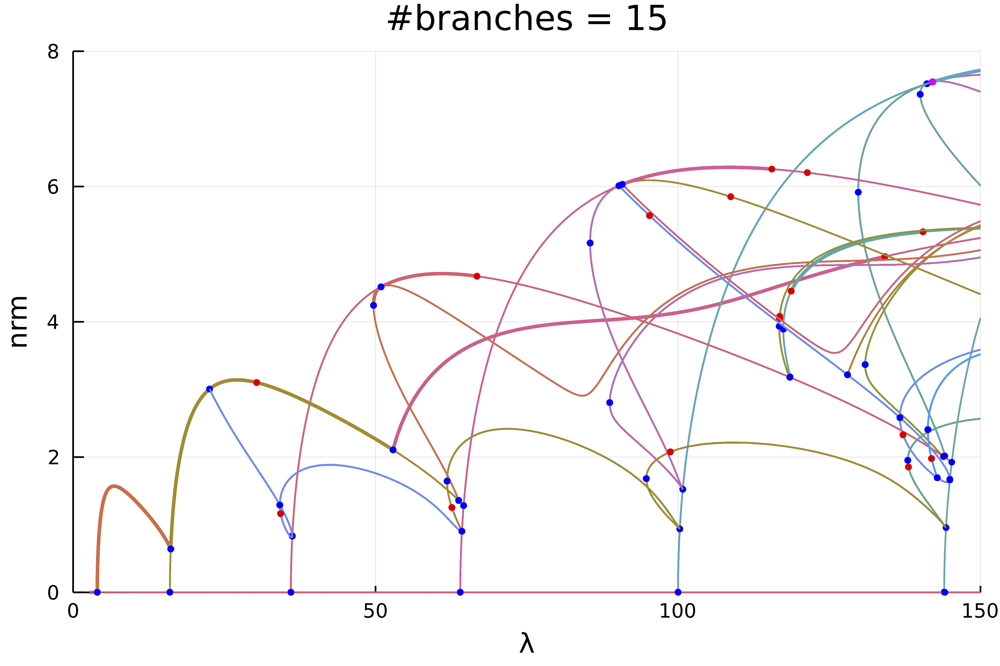

# 1d Kuramoto–Sivashinsky Equation

```@contents
Pages = ["ks1d.md"]
Depth = 3
```

!!! warning "Warning"
    This is work in progress... In particular, there is a combinatorial explosion that I need to address.

!!! unknown "References"
    The following example is exposed in Evstigneev, Nikolay M., and Oleg I. Ryabkov. **Bifurcation Diagram of Stationary Solutions of the 2D Kuramoto-Sivashinsky Equation in Periodic Domains.** Journal of Physics: Conference Series 1730, no. 1 2021

We study the 1d Kuramoto–Sivashinsky equation with Dirichlet boundary conditions:

$$\left(2 u u'+ u''\right)+2\lambda u^{(4)}=0,\ u(0)=u(\pi)=0.$$

We discretize the problem by using $u(x)=\sum_{k=1}^{\infty} u_{k} \sin (k x)$ which gives

$$\left(2\lambda k^4-k^2\right) u_{k}+\frac{k}{2}\left(\sum_{l=1}^{\infty} u_{k+l} u_{k}-\frac{1}{2} \sum_{l+m=k} u_{l} u_{m}\right)=0.$$

This is a good example for the use of automatic bifurcation diagram as we shall see. Let us first encode our problem

```julia
using Revise, LinearAlgebra, Plots
using Parameters, Setfield, ForwardDiff
using BifurcationKit
const  BK = BifurcationKit

# we use this library for plotting
using ApproxFun

function generateLinear(n)
	Δ = [-k^2 for k = 1:n]
	return Δ, Δ.^2
end

function Fks1d(a, p)
	@unpack Δ, Δ2, λ, N = p
	out = (2λ) .* (Δ2 .* a)
	out .+= (Δ .* a)
	for l=1:N
		for m=1:N
			if 0 < l+m <= N
				out[l+m] += l*a[l]*a[m]
			end
			if 0 < m-l <= N
				out[m-l] += l*a[l]*a[m]
			end

			if 0 < -(m-l) <= N
				out[l-m] -= l*a[l]*a[m]
			end
		end
	end

	out .*= -1
	return out
end

# functional jacobian
Jks1d(u, p) = ForwardDiff.jacobian(z -> Fks1d(z,p), u)

# we group the differentials together
jet = BK.getJet(Fks1d, Jks1d)
```

Having defined the model, we chose parameters:

```julia
N = 50
Δ, Δ2 = generateLinear(N)
par_ks = (Δ = Δ, Δ2 = Δ2, λ = 0.75, N = N)
```

and continuation options

```julia
optn = NewtonPar(verbose = false, tol = 1e-9, maxIter = 15)
	optc = ContinuationPar(pMin = 1/150., pMax = 1., maxSteps = 700, newtonOptions = optn,
	dsmax = 0.01, dsmin = 1e-4, ds = -0.001, detectBifurcation = 3, nev = N, nInversion = 8,
	maxBisectionSteps = 30, dsminBisection = 1e-10, plotEveryStep = 50)

kwargscont = (linearAlgo = MatrixBLS(),
	verbosity = 2, plot = true,
	recordFromSolution = (x, p) -> (s = sum(x), u2 = x[3], nrm = norm(x)),
	plotSolution = (x, p; kwargs...) -> plot!(Fun(SinSpace(), x) ; kwargs...),
	normC = norm)
```

## Computation of the bifurcation diagram

```julia
# function to adapt continuation option to recursion level
function optrec(x, p, l; opt = optc)
	level = l
	if level <= 2
		return setproperties(opt;  dsmax = 0.005, maxSteps = 2000, 
		detectBifurcation = 3, detectLoop = true, nInversion = 6)
	else
		return setproperties(opt;  dsmax = 0.005, maxSteps = 2000, 
		detectBifurcation = 3, detectLoop = true, nInversion = 6)
	end
end

# we now compute the bifurcation diagram
# that is the connected component of (0,0)
diagram = @time bifurcationdiagram(jet...,
		zeros(N), par_ks, (@lens _.λ), 4, optrec;
		kwargscont..., verbosity = 0,
		)
```

Plotting the result can be done using

```julia
plot(diagram; code = (), plotfold = false,  markersize = 3, putspecialptlegend = false,
	 plotcirclesbif = true, applytoX = x->2/x, vars = (:param, :nrm), 
	 xlim = (0,150), ylim=(0,8))
title!("#branches = $(size(diagram, code))")
```


