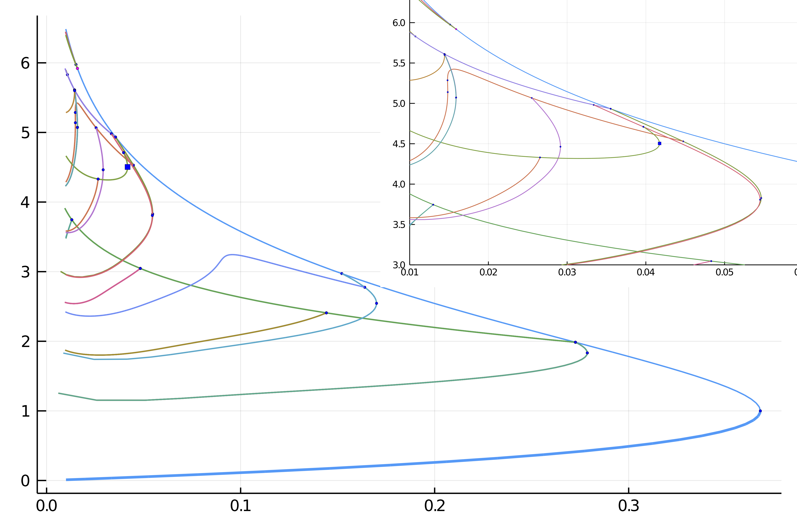

# Automatic diagram of 2d Bratu–Gelfand problem (Intermediate)

```@contents
Pages = ["mittelmannAuto.md"]
Depth = 3
```

!!! unknown "References"
    The following example is exposed in Farrell, Patrick E., Casper H. L. Beentjes, and Ásgeir Birkisson. **The Computation of Disconnected Bifurcation Diagrams.** ArXiv:1603.00809 [Math], March 2, 2016.

        
We consider the problem of Mittelmann:

$$\Delta u +NL(\lambda,u) = 0$$

with Neumann boundary condition on $\Omega = (0,1)^2$ and where $NL(\lambda,u)\equiv-10(u-\lambda e^u)$. This is a good example to show how automatic branch switching works and also nonlinear deflation.

We start with some imports:

```julia
using Revise
using DiffEqOperators, ForwardDiff
using BifurcationKit, LinearAlgebra, Plots, SparseArrays, Parameters, Setfield
const BK = BifurcationKit

# define the sup norm
norminf = x -> norm(x, Inf)

# some plotting function to simplify our life
plotsol!(x, nx = Nx, ny = Ny; kwargs...) = heatmap!(reshape(x, nx, ny); color = :viridis, kwargs...)
plotsol(x, nx = Nx, ny = Ny; kwargs...) = (plot();plotsol!(x, nx, ny; kwargs...))
```
and with the discretization of the problem

```julia
function Laplacian2D(Nx, Ny, lx, ly, bc = :Neumann)
	hx = 2lx/Nx
	hy = 2ly/Ny
	D2x = CenteredDifference(2, 2, hx, Nx)
	D2y = CenteredDifference(2, 2, hy, Ny)

	Qx = Neumann0BC(hx)
	Qy = Neumann0BC(hy)

	D2xsp = sparse(D2x * Qx)[1]
	D2ysp = sparse(D2y * Qy)[1]
	A = kron(sparse(I, Ny, Ny), D2xsp) + kron(D2ysp, sparse(I, Nx, Nx))
	return A
end

ϕ(u, λ)  = -10(u-λ*exp(u))
dϕ(u, λ) = -10(1-λ*exp(u))

function NL!(dest, u, p)
	@unpack λ = p
	dest .= ϕ.(u, λ)
	return dest
end

NL(u, p) = NL!(similar(u), u, p)

function Fmit!(f, u, p)
	mul!(f, p.Δ, u)
	f .= f .+ NL(u, p)
	return f
end

Fmit(u, p) = Fmit!(similar(u), u, p)
```

It will also prove useful to have the jacobian of our functional: 

```julia
function JFmit(x,p)
	J = p.Δ
	dg = dϕ.(x, p.λ)
	return J + spdiagm(0 => dg)
end
```

We need to pass the parameters associated to this problem:

```julia
Nx = 200
Ny = 100
lx = 0.5
ly = 0.5

Δ = Laplacian2D(Nx, Ny, lx, ly)
par_mit = (λ = .05, Δ = Δ)

# initial guess f for newton
sol0 = zeros(Nx, Ny) |> vec
```

To compute the eigenvalues, we opt for the shift-invert strategy with shift `=0.5`

```julia
# eigensolver
eigls = EigArpack(0.5, :LM)

# options for Newton solver
opt_newton = BK.NewtonPar(tol = 1e-8, verbose = true, eigsolver = eigls, maxIter = 20)

# options for continuation
opts_br = ContinuationPar(dsmin = 0.001, dsmax = 0.05, ds = 0.01, pMax = 3.5, pMin = 0.025,
	detectBifurcation = 3, nev = 30, plotEveryNsteps = 10, newtonOptions = (@set opt_newton.verbose = true), 
	maxSteps = 100, precisionStability = 1e-6, nInversion = 4, dsminBisection = 1e-7, maxBisectionSteps = 25)
```	 
Note that we put the option `detectBifurcation = 2` to detect bifurcations precisely with a bisection method. Indeed, we need to locate these branch points precisely to be able to call automatic branch switching.

## Automatic bifurcation diagram

