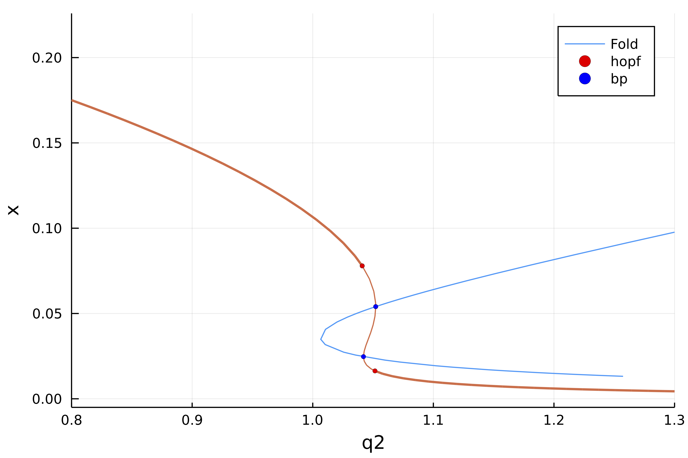

# CO-oxydation (codim 2)

In this tutorial, we study the following ODE model of CO-oxydation (see [^Govaerts]). The goal of the tutorial is to show in a simple example how to perform codimension 2 bifurcation detection.

$$\left\{\begin{array}{l}\dot{x}=2 q_{1} z^{2}-2 q_{5} x^{2}-q_{3} x y \\ \dot{y}=q_{2} z-q_{6} y-q_{3} x y \\ \dot{s}=q_{4} z-k q_{4} s\end{array}\right.\tag{E}$$
Where $z=1-x-y-s$.


We start with some imports that are useful in the following.

```julia
using Revise, Test, ForwardDiff, Parameters, Setfield, Plots
using BifurcationKit
const BK = BifurcationKit

# automatic differentiation
D(f, x, p, dx) = ForwardDiff.derivative(t->f(x .+ t .* dx, p), 0.)

# define the sup norm
norminf = x -> norm(x, Inf)
```

## Problem setting

We can now encode the vector field (E) in a function and use automatic differentiation to compute its various derivatives.

```julia
# vector field of the problem
function COm(u, p)
	@unpack q1,q2,q3,q4,q5,q6,k = p
	x, y, s = u
	z = 1-x-y-s
	out = similar(u)
	out[1] = 2q1 * z^2 - 2q5 * x^2 - q3 * x * y
	out[2] = q2 * z - q6 * y - q3 * x * y
	out[3] = q4 * z - k * q4 * s
	out
end
dCOm = (z, p) -> ForwardDiff.jacobian(x -> COm(x, p), z)

# we group the differentials together
d1COm(x,p,dx1) = ForwardDiff.derivative(t -> COm(x .+ t .* dx1, p), 0.)
d2COm(x,p,dx1,dx2) = ForwardDiff.derivative(t -> d1COm(x .+ t .* dx2, p, dx1), 0.)
d3COm(x,p,dx1,dx2,dx3) = ForwardDiff.derivative(t -> d2COm(x .+ t .* dx3, p, dx1, dx2), 0.)
jet  = (COm, dCOm, d2COm, d3COm)

# parameters used in the model
par_com = (q1 = 2.5, q2 = 0.6, q3=10., q4 = 0.0675,q5=1.,q6=0.1,k=0.4)

# initial condition
z0 = [0.07,0.2,05]
```

## Continuation

Once the problem is set up, we can continue the state and detect codim bifurcations. This is achieved as follows:

```julia
pts_br = ContinuationPar(pMin = 0.6, pMax = 1.9, ds = 0.002, dsmax = 0.01, nInversion = 6, 
	detectBifurcation = 3, maxBisectionSteps = 25, nev = 2, maxSteps = 20000)
br, = @time continuation(jet[1], jet[2], z0, par_com, (@lens _.q2), opts_br;
	printSolution = (x, p) -> (x = x[1], y = x[2]),
	plot = true, verbosity = 3, normC = norminf)
```

And you should get from `plot(br)`:


## Continuation of Fold points

We follow the Fold points in the parameter plane $(q_2, k)$ as follows. We tell the solver to consider `br.bifpint[2]` and continue it. 

```julia
sn_codim2, = continuation(jet[1:2]..., br, 2, (@lens _.k),
	ContinuationPar(opts_br, pMax = 2.2, pMin = 0., detectBifurcation = 0, ds = -0.001, dsmax = 0.05);
	normC = norminf,
	# we save the first component for plotting
	printSolution = (u,p; kw...) -> (x = u.u[1] ),
	updateMinAugEveryStep = 1,
	bothside=true,
	bdlinsolver = MatrixBLS())
	
plot(sn_codim2.q2, sn_codim2.x, label = "Fold");plot!(br,xlims=(0.5,1.3))
```



## Continuation of Hopf points

We tell the solver to consider `br.bifpint[1]` and continue it. 

```julia
hp_codim2, = continuation(jet[1:2]..., br, 1, (@lens _.k), 
	ContinuationPar(opts_br, pMin = 0., pMax = 2.8, detectBifurcation = 0, ds = -0.001, dsmax = 0.1) ;
	startWithEigen = true,
	normC = norminf,
	# we save the first component for plotting
	printSolution = (u,p; kw...) -> (x = u.u[1] ),
	updateMinAugEveryStep = 1,
	bothside = true,
	bdlinsolver = MatrixBLS(),
	)
	
# plotting
plot(br)
plot!(sn_codim2.q2, sn_codim2.x, label = "SN",)
plot!(hp_codim2.q2, hp_codim2.x, label = "Hopf", plotfold = false, xlims=(0.5,1.5))
```	


## References

[^Govaerts]: > Govaerts, Willy J. F. Numerical Methods for Bifurcations of Dynamical Equilibria. Philadelphia, Pa: Society for Industrial and Applied Mathematics, 2000.

