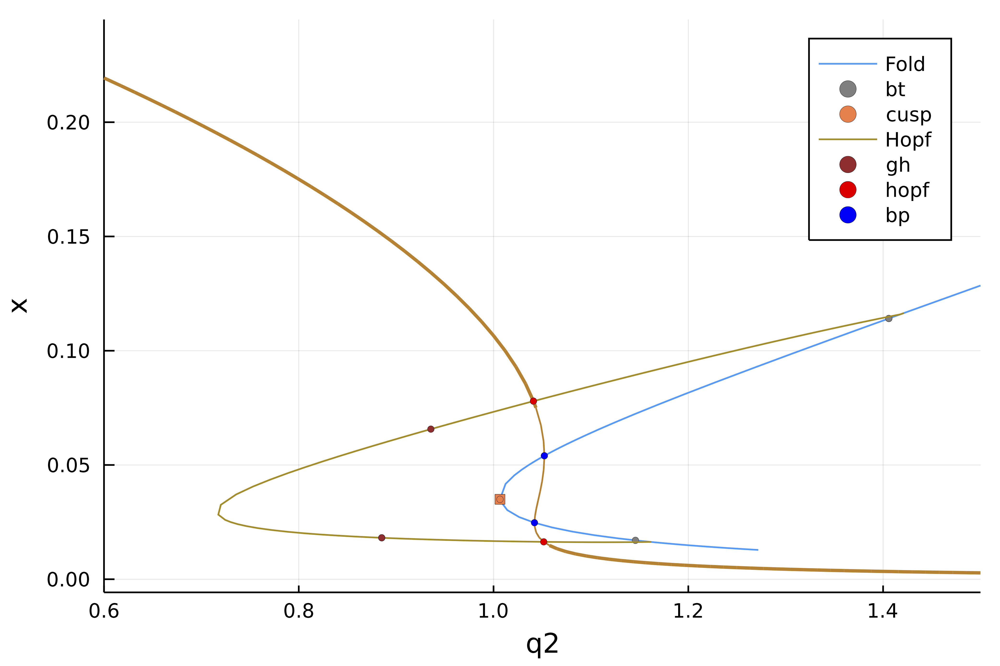

# CO-oxydation (codim 2)

```@contents
Pages = ["tutorialCO.md"]
Depth = 3
```

In this tutorial, we study the Bykov–Yablonskii–Kim
model of CO-oxydation (see [^Govaerts]). The goal of the tutorial is to show in a simple example how to perform codimension 2 bifurcation detection.

$$\left\{\begin{array}{l}\dot{x}=2 q_{1} z^{2}-2 q_{5} x^{2}-q_{3} x y \\ \dot{y}=q_{2} z-q_{6} y-q_{3} x y \\ \dot{s}=q_{4} z-k q_{4} s\end{array}\right.\tag{E}$$

where $z=1-x-y-s$.

We start with some imports that are useful in the following.

```@example TUTCO
using Revise, ForwardDiff, Parameters, Setfield, Plots, LinearAlgebra
using BifurcationKit
const BK = BifurcationKit

# define the sup norm
norminf(x) =  norm(x, Inf)
nothing # hide
```

## Problem setting

We can now encode the vector field (E) in a function and use automatic differentiation to compute its various derivatives.

```@example TUTCO
# vector field of the problem
function COm(u, p)
	@unpack q1,q2,q3,q4,q5,q6,k = p
	x, y, s = u
	z = 1-x-y-s
	out = similar(u)
	out[1] = 2q1 * z^2 - 2q5 * x^2 - q3 * x * y
	out[2] = q2 * z - q6 * y - q3 * x * y
	out[3] = q4 * z - k * q4 * s
	out
end

# jacobian
dCOm(z, p) = ForwardDiff.jacobian(x -> COm(x, p), z)

# we group the differentials together
jet = BK.getJet(COm, dCOm)

# parameters used in the model
par_com = (q1 = 2.5, q2 = 0.6, q3 = 10., q4 = 0.0675, q5 = 1., q6 = 0.1, k = 0.4)

# initial condition
z0 = [0.07,0.2,05]
nothing # hide
```

## Continuation and codim 1 bifurcations

Once the problem is set up, we can continue the state w.r.t. $q_2$ to and detect codim 1 bifurcations. This is achieved as follows:

```@example TUTCO
# continuation parameters
opts_br = ContinuationPar(pMin = 0.6, pMax = 1.9, ds = 0.002, dsmax = 0.01,
	# options to detect codim 1 bifurcations using bisection
	detectBifurcation = 3,
	# Optional: bisection options for locating bifurcations
	nInversion = 6, maxBisectionSteps = 25,
	# number of eigenvalues
	nev = 3)

# compute the branch of solutions
br, = continuation(jet[1], jet[2], z0, par_com, (@lens _.q2), opts_br;
	recordFromSolution = (x, p) -> (x = x[1], y = x[2]),
	plot = true, verbosity = 3, normC = norminf)

# plot the branch
scene = plot(br, xlims=(0.8,1.8))
```

## Continuation of Fold points

We follow the Fold points in the parameter plane $(q_2, k)$. We tell the solver to consider `br.specialpoint[2]` and continue it.

```@example TUTCO
sn_codim2, = continuation(jet[1:2]..., br, 2, (@lens _.k),
	ContinuationPar(opts_br, pMax = 2.2, pMin = 0., ds = -0.001, dsmax = 0.05);
	normC = norminf,
	# detection of codim 2 bifurcations with bisection
	detectCodim2Bifurcation = 2,
	# we save the first component for plotting
	recordFromSolution = (u,p; kw...) -> (x = u.u[1] ),
	# we update the Fold problem at every continuation step
	updateMinAugEveryStep = 1,
	# compute both sides of the initial condition
	bothside=true,
	# use this linear bordered solver, better for ODEs
	bdlinsolver = MatrixBLS())

scene = plot(sn_codim2, vars=(:q2, :x), branchlabel = "Fold")
plot!(scene, br, xlims=(0.8,1.8))
```

## Continuation of Hopf points

We tell the solver to consider `br.bifpint[1]` and continue it.

```julia
hp_codim2, = continuation(jet[1:2]..., br, 1, (@lens _.k),
	ContinuationPar(opts_br, pMin = 0., pMax = 2.8,
		ds = -0.001, dsmax = 0.05) ;
	normC = norminf,
	# detection of codim 2 bifurcations with bisection
	detectCodim2Bifurcation = 2,
	# this is required to detect the bifurcations
	d2F = jet[3], d3F = jet[4],
	# tell to start the Hopf problem using eigen elements: compute left eigenvector
	startWithEigen = true,
	# we save the first component for plotting
	recordFromSolution = (u,p; kw...) -> (x = u.u[1] ),
	# we update the Hopf problem at every continuation step
	updateMinAugEveryStep = 1,
	# compute both sides of the initial condition
	bothside = true,
	# use this linear bordered solver, better for ODEs
	bdlinsolver = MatrixBLS(),
	)

# plotting
scene = plot(sn_codim2, vars=(:q2, :x), branchlabel = "Fold")
plot!(scene, hp_codim2, vars=(:q2, :x), branchlabel = "Hopf")
plot!(scene, br, xlims=(0.6,1.5))
```



## References

[^Govaerts]: > Govaerts, Willy J. F. Numerical Methods for Bifurcations of Dynamical Equilibria. Philadelphia, Pa: Society for Industrial and Applied Mathematics, 2000.
