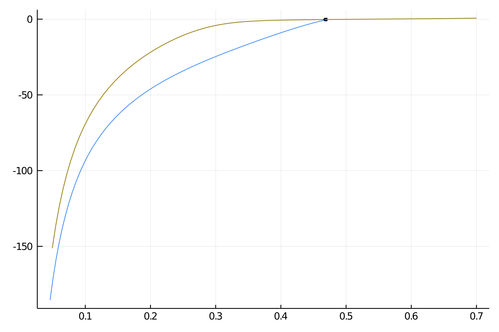
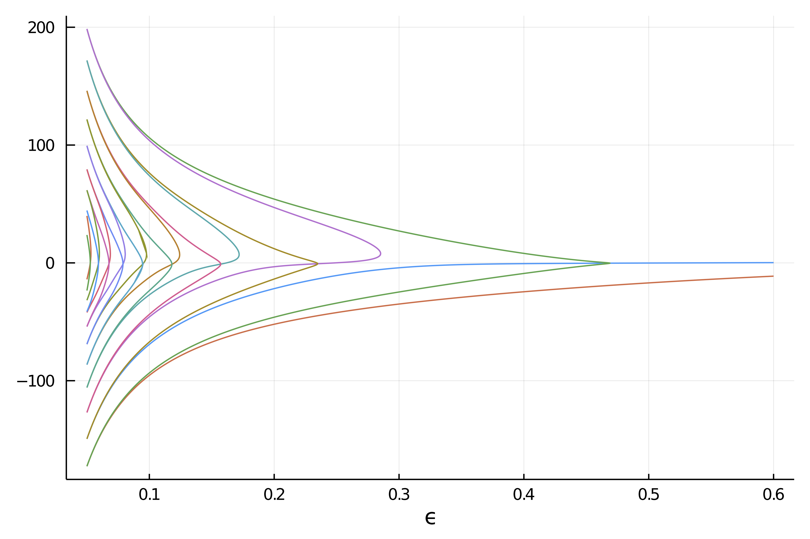

# Deflated Continuation in the Carrier Problem

!!! unknown "References"
    Chapman, S. J., and P. E. Farrell. **Analysis of Carrier’s Problem.** ArXiv:1609.08842 [Math], September 28, 2016. http://arxiv.org/abs/1609.08842.

In this example, we study the following singular perturbation problem:

$$\epsilon^{2} y^{\prime \prime}+2\left(1-x^{2}\right) y+y^{2}=1, \quad y(-1)=y(1)=0\tag{E}.$$

It is a remarkably difficult problem which presents many disconnected branches which are not amenable to the classical continuation methods. We thus use the recently developed *deflated continuation method* which builds upon the Deflated Newton (see [Deflated problems](@ref)) technics to find solutions which are different from a set of already known solutions.

We start with some import

```julia
using Revise
using LinearAlgebra, Parameters, Setfield, SparseArrays, BandedMatrices

using BifurcationKit, Plots
const BK = BifurcationKit
```

and a discretization of the problem

```julia
function F_carr(x, p)
	@unpack ϵ, X, dx = p
	f = similar(x)
	n = length(x)
	f[1] = x[1]
	f[n] = x[n]
	for i=2:n-1
		f[i] = ϵ^2 * (x[i-1] - 2 * x[i] + x[i+1]) / dx^2 +
			2 * (1 - X[i]^2) * x[i] + x[i]^2-1
	end
	return f
end

function Jac_carr(x, p)
	@unpack ϵ, X, dx = p
	n = length(x)
	J = BandedMatrix{Float64}(undef, (n,n), (1,1))
	J[band(-1)] .= ϵ^2/dx^2    									# set the diagonal band
	J[band(1)]  .= ϵ^2/dx^2										# set the super-diagonal band
	J[band(0)]  .= (-2ϵ^2 /dx^2) .+ 2 * (1 .- X.^2) .+ 2 .* x   # set the second super-diagonal band
	J[1, 1] = 1.0
	J[n, n] = 1.0
	J[1, 2] = 0.0
	J[n, n-1] = 0.0
	J
end
```

We can now use Newton to find solutions:

```julia
N = 200
X = LinRange(-1,1,N)
dx = X[2] - X[1]
par_car = (ϵ = 0.7, X = X, dx = dx)
sol = -(1 .- par_car.X.^2)


optnew = NewtonPar(tol = 1e-8, verbose = true)
	out, = @time newton(F_carr, Jac_carr, sol,
		(@set par_car.ϵ = 0.6), optnew, normN = x -> norm(x, Inf64))
	plot(out, label="Solution")
```

## First try with automatic bifurcation diagram

We can start by using our Automatic bifurcation method.

```julia
jet = BK.getJet(F_carr, Jac_carr)

optcont = ContinuationPar(dsmin = 0.001, dsmax = 0.05, ds= -0.01, pMin = 0.05, plotEveryStep = 10, newtonOptions = NewtonPar(tol = 1e-8, maxIter = 20, verbose = true), maxSteps = 300, detectBifurcation = 3, nev = 40)

diagram = bifurcationdiagram(jet..., 0*out, par_car,
	(@lens _.ϵ), 2,
	(arg...) -> @set optcont.newtonOptions.verbose = false;
	recordFromSolution = (x, p) -> (x[2] - x[1]) * sum(x.^2),
	plot = true)
```

However, this is a bit disappointing as we only find two branches.


## Second try with deflated continuation

```julia
# deflation operator to hold solutions
deflationOp = DeflationOperator(2, dot, 1.0, [out])

# parameter values for the problem
par_def = @set par_car.ϵ = 0.6

# newton options
optdef = setproperties(optnew; tol = 1e-7, maxIter = 200)

# function to encode a perturbation of the old solutions
function perturbsol(sol, p, id)
	# we use this sol0 for the boundary conditions
	sol0 = @. exp(-.01/(1-par_car.X^2)^2)
	solp = 0.02*rand(length(sol))
	return sol .+ solp .* sol0
end

# call the deflated continuation method
br, = @time continuation(
	F_carr, Jac_carr,
	par_def, (@lens _.ϵ),
	setproperties(optcont; ds = -0.00021, dsmin=1e-5, maxSteps = 20000,
		pMax = 0.7, pMin = 0.05, detectBifurcation = 0, plotEveryStep = 40,
		newtonOptions = setproperties(optnew; tol = 1e-9, maxIter = 100, verbose = false)),
	deflationOp;
	perturbSolution = perturbsol,
	recordFromSolution = (x, p) -> (x[2]-x[1]) * sum(x.^2),
	normN = x -> norm(x, Inf),
	)

plot(br...)
```

We obtain the following result which is remarkable because it contains many more disconnected branches which we did not find in the first try.


