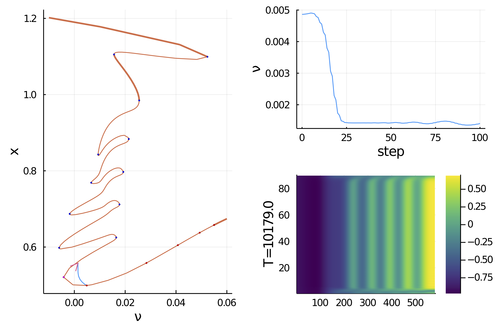

# 1d Langmuir–Blodgett transfer model (advanced)

In this tutorial, we try to replicate some of the results of the amazing paper [^Köpf]. This example is quite a marvel in the realm of bifurcation analysis, featuring a harp-like bifurcation diagram. The equations of the thin film are as follows:

$$\partial_{t} c=-\partial_{x}^{2}\left[\partial_{x}^{2} c-c^{3}+c-\mu \zeta(x)\right]-V \partial_{x} c$$

with boundary conditions

$$c(0)=c_{0}, \quad \partial_{x x} c(0)=\partial_{x} c(L)=\partial_{x x} c(L)=0$$

and where

$$\zeta(x)=-\frac{1}{2}\left[1+\tanh \left(\frac{x-x_{s}}{l_{s}}\right)\right].$$

As can be seen in the reference above, the bifurcation diagram is significantly more involved as $L$ increases. So we set up for the "simple" case $L=50$.

```@example TUTLangmuir
using Revise
using Parameters, Setfield, SparseArrays
using BifurcationKit, LinearAlgebra, Plots, ForwardDiff
const BK = BifurcationKit

# norms
norminf(x) = norm(x, Inf)
normL2(x; r = sqrt(par.Δx / L)) = norm(x, 2) * r
nothing #hide
```

Let us define the parameters of the model

```@example TUTLangmuir
# domain size
L = 50.0

# number of unknowns
N = 390*3/2 |> Int
Δx = L/(N+1)
X = ((1:N) |> collect) .* Δx

# define the (laplacian of) g function
xs = 10.0; ls = 2.0
Δg = @. tanh((X - xs)/ls) * (1 - tanh((X - xs)/ls)^2)/ls^2

# define the parameters of the model
par = (N = N, Δx = Δx, c0 = -0.9, σ = 1.0, μ = 0.5, ν = 0.08, Δg = Δg)

nothing #hide
```

## Encoding the PDE

```@example TUTLangmuir
# function to enforce the boundary condition
function putBC!(c, c0, N)
	# we put boundary conditions using ghost points
	# this boundary condition u''(0) = 0 = c1 -2c0 + c-1 gives c-1:
	c[1] = 2c0-c[3]
	# c(0) = c0, we would like to write x[0]
	c[2] = c0
	# the boundary conditions u'(L) = u''(L) = 0 imply the ghost points values.
	# c'(L) = 0 = cN+2 - cN  and c''(L) = 0 = cN+2 -2cN+1 + cN
	c[N+3] = c[N+2]
	c[N+4] = c[N+2]
	return c
end

# implementation of the right hand side of the PDE
function Flgvf!(out, x, p, t = 0.)
	@unpack c0, N, Δx, σ, μ, Δg, ν = p
	dx4 = Δx^4
	dx2 = Δx^2
	# we declare the residual
	# we enforce the BC
	c = similar(x, length(x) + 4)
	c[3:N+2] .= x
	putBC!(c, c0, N)

	for i=3:N+2
		out[i-2] = -(σ * (c[i-2] - 4c[i-1] + 6c[i] - 4c[i+1] + c[i+2]) / dx4 +
					(c[i-1]   - 2c[i]   + c[i+1])   / (dx2) -
					(c[i-1]^3 - 2c[i]^3 + c[i+1]^3) / (dx2) -
					Δg[i-2] * μ +
					ν * (c[i+1] - c[i-1]) / (2Δx)
					)
	end
	return out
end
Flgvf(x, p, t = 0) = Flgvf!(similar(x), x, p, t)

# compute the jacobian of the PDE at position x
@views function JanaSP(x, p)
	# 63.446 μs (61 allocations: 137.97 KiB) pour N = 400
	# 62.807 μs (44 allocations: 168.58 KiB) pour sparse(Jana(x, p))
	@unpack N, Δx, σ, ν = p
	d0  = @. (-6σ/ Δx^4 + 2/ Δx^2*(1-3x^2))
	d0[1] += σ/ Δx^4
	d0[end] = -(3σ/ Δx^4 - 1/ Δx^2*(1-3x[N]^2)     + ν/ (2Δx))
	d1   = @.  (4σ/ Δx^4 - 1/ Δx^2*(1-3x[2:N]^2)   - ν/ (2Δx))
	dm1  = @.  (4σ/ Δx^4 - 1/ Δx^2*(1-3x[1:N-1]^2) + ν/ (2Δx))
	d1[end] -= σ/ Δx^4
	d2  = @.  (-σ/ Δx^4) * ones(N-2)
	J = spdiagm(  0 => d0,
				  1 => d1,
				 -1 => dm1,
				  2 => d2,
				 -2 => d2)
	return J
end

# It will prove useful to have access to higher derivatives as well
# jet to compute the normal form
jet  = BK.getJet(Flgvf, JanaSP)

nothing #hide
```


## Continuation of stationary states

We call the Krylov-Newton method to find a stationary solution. Note that for this to work, the guess has to satisfy the boundary conditions approximately.

```@example TUTLangmuir
# newton iterations to refine the guess
opt_new = NewtonPar(tol = 1e-9, verbose = true, maxIter = 50)
out, = newton(Flgvf, JanaSP, 0X .-0.9, par, opt_new)
out, = @time newton(Flgvf, JanaSP, 0X .-0.9, par, opt_new)
nothing #hide
```

```@example TUTLangmuir
scene = plot(X, out)
```

We then continue the previous guess and find this very nice folded structure with many Hopf bifurcation points.

```@example TUTLangmuir
# careful here, in order to use Arpack.eig, you need rather big space
# or compute ~100 eigenvalues
opts_cont = ContinuationPar(
	dsmin = 1e-5, dsmax = 0.04, ds= -0.001, pMin = -0.01, pMax = 10.1,
	# we adjust theta so that the continuation steps are larger
	theta = 0.4, a = 0.75, plotEveryStep = 30, maxSteps = 600,
	newtonOptions = setproperties(opt_new; tol = 1e-9, maxIter = 10, verbose = false),
	nev = 10, saveEigenvectors = true, precisionStability = 1e-5, detectBifurcation = 3,
	dsminBisection = 1e-8, maxBisectionSteps = 15, nInversion = 6, tolBisectionEigenvalue = 1e-9, saveSolEveryStep = 50)

# we opt for a fastt Shift-Invert eigen solver
@set! opts_cont.newtonOptions.eigsolver = EigArpack(0.1, :LM)

br, u1, = @time continuation(
	Flgvf, JanaSP,
	out, (@set par.ν = 0.06), (@lens _.ν ), opts_cont,
	# we form a sparse matrix for the bordered linear problem
	linearAlgo = MatrixBLS(),
	plot = true, verbosity = 2,
	recordFromSolution = (x, p) -> normL2(x),
	plotSolution = (x, p; kwargs...) -> plot!(X, x, subplot = 3, xlabel = "Nx = $(length(x))", label = ""),
	normC = normL2)

scene = plot(br, title="N=$N")		
```

```@example TUTLangmuir
plot(layout = grid(4, 3))
for (ii, s) in pairs(br.sol)
	plot!(X, s.x, xlabel = "ν = $(round(s.p,digits=3))", subplot = ii, label="",tickfont = (7, :black), ylims=(-1,1.5))
end
title!("")
```

## Continuation of Hopf and Fold points

Let us study the continuation of Hopf and Fold points and show that they merge at a **Bogdanov-Takens** bifurcation point:

```@example TUTLangmuir
# compute branch of Fold points from 7th bifurcation point on br
sn_codim2, = continuation(jet[1:2]..., br, 7, (@lens _.Δx),
	ContinuationPar(opts_cont, pMin = -2, pMax = 0.12, ds = -0.01, dsmax = 0.01, precisionStability = 1e-8, maxSteps = 325, nev=23) ;
	plot = true, verbosity = 3,
	# start the problem with information from eigen elements
	startWithEigen = true,
	# this improves tracking the Fold points
	d2F = jet[3],
	# detection of codim 2 bifurcations with bisection
	detectCodim2Bifurcation = 2,
	# we update the Fold problem at every continuation step
	updateMinAugEveryStep = 1,
	# compute both sides of the initial condition
	bothside = true
	)

# compute branch of Hopf points from 5th bifurcation point on br
hp_codim2, = continuation(jet[1:2]..., br, 5, (@lens _.Δx), ContinuationPar(opts_cont, pMax = 0.1, ds = -0.01, dsmax = 0.01, maxSteps = 230, precisionStability = 1e-8) ;
	plot = true, verbosity = 3,
	# start the problem with information from eigen elements
	startWithEigen = true,
	# we update the Hopf problem at every continuation step
	updateMinAugEveryStep = 1,
	# detection of codim 2 bifurcations with bisection
	detectCodim2Bifurcation = 2,
	# this is required to detect the bifurcations
	d2F = jet[3], d3F = jet[4],
	)

# plot the branches
plot(sn_codim2, hp_codim2, branchlabel = ["Fold", "Hopf"], plotcirclesbif=true, legend = :bottomright)
```

## Continuation of periodic orbits (FD)

We would like to compute the branches of periodic solutions from the Hopf points. We do this automatic branch switching as follows

```julia
# parameters for newton
opt_po = NewtonPar(tol =  1e-10, verbose = true, maxIter = 50)

# parameters for continuation
opts_po_cont = ContinuationPar(dsmin = 1e-5, dsmax = 0.35, ds= 0.001,
	pMax = 1.0, maxSteps = 100, theta = 0.75,
	newtonOptions = setproperties(opt_po; maxIter = 15, tol = 1e-6), plotEveryStep = 1)

M = 100 # numbr of time sections
br_potrap, utrap = continuation(
	# arguments for branch switching
	jet..., br, 5,
	# arguments for continuation
	opts_po_cont, PeriodicOrbitTrapProblem(M = M);
	# parameter value used for branching
	δp = 1e-5,
	# use deflated Newton to find non-trivial solutions
	usedeflation = true,
	# algorithm to solve linear associated with periodic orbit problem
	linearPO = :FullSparseInplace,
	# tangent algorithm along the branch
	tangentAlgo = BorderedPred(),
	verbosity = 3, plot = true,
	updateSectionEveryStep = 1,
	recordFromSolution = (x, p) -> normL2T(x[1:end-1], M = M),
	plotSolution  = (x, p; kwargs...) -> begin
			heatmap!(reshape(x[1:end-1], N, M)'; ylabel="T=$(round(x[end]))", color=:viridis, kwargs...)
			plot!(br, subplot=1, label="")
		end,
	normC = norminf)
```
 and we obtain the following graph. It is interesting to note that the periodic solutions converge to an homoclinic orbit here with a very large period.


We can do this for the other Hopf points as well. Note that, we have to increase the number of time sections `M` to improve the convergence to the homoclinic orbits.


Here are some examples of periodic solutions.


[^Köpf]:> Köpf and Thiele, **Emergence of the Bifurcation Structure of a Langmuir–Blodgett Transfer Model.**, 2014
