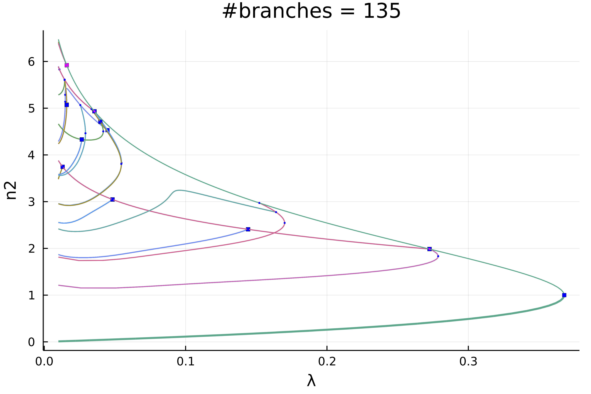
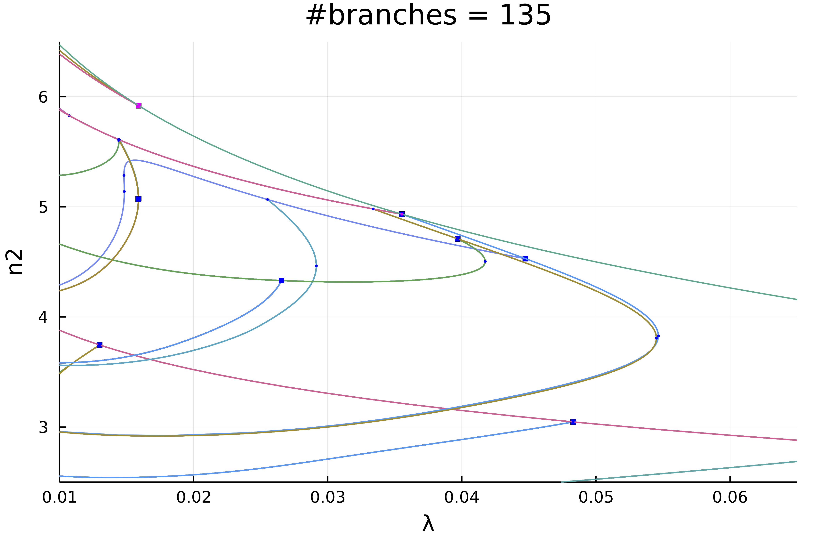
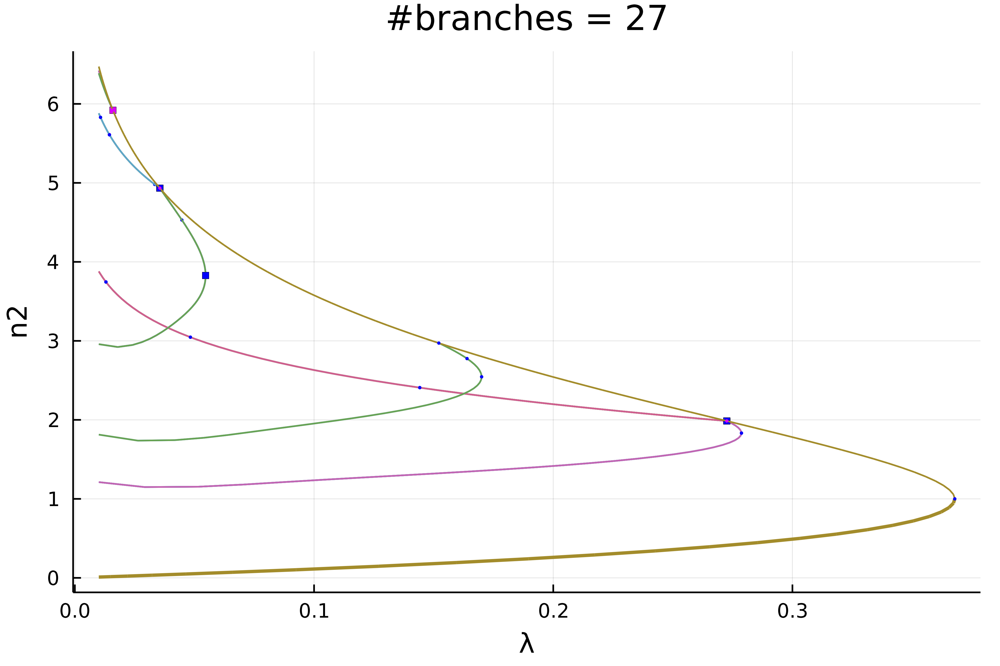
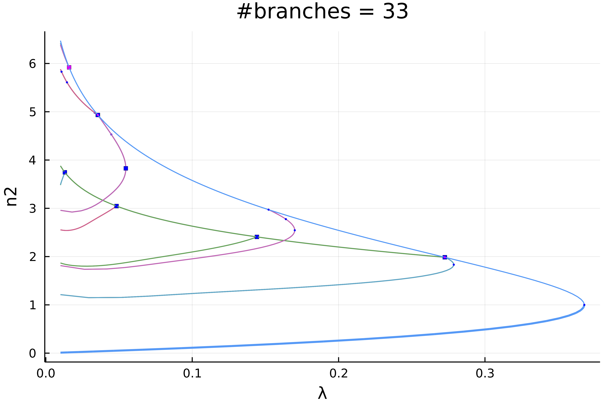

# Automatic diagram of 2d Bratu–Gelfand problem (Intermediate)

```@contents
Pages = ["mittelmannAuto.md"]
Depth = 3
```

!!! unknown "References"
    The following example is exposed in Farrell, Patrick E., Casper H. L. Beentjes, and Ásgeir Birkisson. **The Computation of Disconnected Bifurcation Diagrams.** ArXiv:1603.00809 [Math], March 2, 2016. . It is also treated in Michiel Wouters. **Automatic Exploration Techniques for the Numerical Continuation of Large–Scale Nonlinear Systems**, 2019.


We consider the problem of Mittelmann:

$$\Delta u +NL(\lambda,u) = 0$$

with Neumann boundary condition on $\Omega = (0,1)^2$ and where $NL(\lambda,u)\equiv-10(u-\lambda e^u)$. This is a good example to show how automatic bifurcation diagram computation works.

We start with some imports:

```julia
using Revise
using DiffEqOperators, ForwardDiff
using BifurcationKit, LinearAlgebra, Plots, SparseArrays, Parameters, Setfield
const BK = BifurcationKit

# define the sup norm
norminf(x) = norm(x, Inf)
norm2(x) = norm(x) / sqrt(length(x))
normbratu(x) = norm(x .* w) / sqrt(length(x)) # the weight w is defined below

# some plotting functions to simplify our life
plotsol!(x, nx = Nx, ny = Ny; kwargs...) = heatmap!(reshape(x, nx, ny); color = :viridis, kwargs...)
plotsol(x, nx = Nx, ny = Ny; kwargs...) = (plot();plotsol!(x, nx, ny; kwargs...))
```
and with the discretization of the problem

```julia
function Laplacian2D(Nx, Ny, lx, ly, bc = :Neumann)
	hx = 2lx/Nx
	hy = 2ly/Ny
	D2x = CenteredDifference(2, 2, hx, Nx)
	D2y = CenteredDifference(2, 2, hy, Ny)

	Qx = Neumann0BC(hx)
	Qy = Neumann0BC(hy)

	D2xsp = sparse(D2x * Qx)[1]
	D2ysp = sparse(D2y * Qy)[1]
	A = kron(sparse(I, Ny, Ny), D2xsp) + kron(D2ysp, sparse(I, Nx, Nx))
	return A
end

ϕ(u, λ)  = -10(u-λ*exp(u))
dϕ(u, λ) = -10(1-λ*exp(u))

function NL!(dest, u, p)
	@unpack λ = p
	dest .= ϕ.(u, λ)
	return dest
end

NL(u, p) = NL!(similar(u), u, p)

function Fmit!(f, u, p)
	mul!(f, p.Δ, u)
	f .= f .+ NL(u, p)
	return f
end

Fmit(u, p) = Fmit!(similar(u), u, p)
```

It will also prove useful to have the jacobian of our functional and the other derivatives:

```julia
function JFmit(x,p)
	J = p.Δ
	dg = dϕ.(x, p.λ)
	return J + spdiagm(0 => dg)
end

jet = BK.getJet(Fmit, JFmit)
```

We need to pass the parameters associated to this problem:

```julia
Nx = 30
Ny = 30
lx = 0.5
ly = 0.5

# weight for normbratu
const w = (lx .+ LinRange(-lx,lx,Nx)) * (LinRange(-ly,ly,Ny))' |> vec
w .-= minimum(w)


Δ = Laplacian2D(Nx, Ny, lx, ly)

# parameters associated with the PDE
par_mit = (λ = .01, Δ = Δ)

# initial condition
sol0 = 0*ones(Nx, Ny) |> vec
```

To compute the eigenvalues, we opt for the solver in `KrylovKit.jl`

```julia
# eigensolver
eigls = EigKrylovKit(dim = 70)

# options for Newton solver
opt_newton = NewtonPar(tol = 1e-8, verbose = true, eigsolver = eigls, maxIter = 20)

# options for continuation, we want to locate very precisely the
# bifurcation points, so we tune the bisection accordingly
opts_br = ContinuationPar(dsmin = 0.0001, dsmax = 0.04, ds = 0.005, pMax = 3.5, pMin = 0.01, detectBifurcation = 3, nev = 50, plotEveryStep = 10, newtonOptions = (@set opt_newton.verbose = false), maxSteps = 251, precisionStability = 1e-6, nInversion = 6, dsminBisection = 1e-7, maxBisectionSteps = 25, tolBisectionEigenvalue = 1e-19)
```	 

Note that we put the option `detectBifurcation = 3` to detect bifurcations precisely with a **bisection** method. Indeed, we need to locate these branch points precisely to be able to call automatic branch switching.

In order to have an output like Auto07p, we provide the finaliser (see arguments of [`continuation`](@ref))

```julia
function finSol(z, tau, step, br; k...)
	if length(br.specialpoint)>0
		if br.specialpoint[end].step == step
			BK._show(stdout, br.specialpoint[end], step)
		end
	end
	return true
end
```

## Automatic bifurcation diagram

In order to avoid spurious branch switching, we use a callback (see [`continuation`](@ref)) to reject specific continuation steps where the jump in parameters is too large or when the residual is too large:

```julia
function cb(x,f,J,res,it,itl,optN; kwargs...)
	_x = get(kwargs, :z0, nothing)
	fromNewton = get(kwargs, :fromNewton, false)
	if ~fromNewton
		return (norm(_x.u - x) < 20.5 && abs(_x.p - kwargs[:p]) < 0.05)
	end
	true
end
```

Finally, before calling the automatic `bifurcationdiagram`, we need to provide a function to adjust the continuation parameters as function of the branching level (Note that this function can be constant).

```julia
function optionsCont(x,p,l; opt0 = opts_br)
	if l == 1
		return opt0
	elseif l==2
		return setproperties(opt0 ;detectBifurcation = 3,ds = 0.001, a = 0.75)
	else
		return setproperties(opt0 ;detectBifurcation = 3,ds = 0.00051, dsmax = 0.01)
	end
end
```

We are then ready to compute the bifurcation diagram. If we choose a level 5 of recursion like

```julia
diagram = @time bifurcationdiagram(jet...,
	sol0, par_mit, (@lens _.λ),
	# important argument: this is the maximal
	# recursion level
	5,
	optionsCont;
	verbosity = 0, plot = true,
	recordFromSolution = (x, p) -> (n2 = norm2(x), nw = normbratu(x), n∞ = norminf(x)),
	callbackN = cb,
	usedeflation = true,
	finaliseSolution = finSol,
	plotSolution = (x, p; kwargs...) -> plotsol!(x ; kwargs...),
	normC = norminf)
```
this gives using `plot(diagram; plotfold = false, putspecialptlegend=false, markersize=2, title = "#branches = $(size(diagram))")`:



We can zoom in on the left part to get



Actually, this plot is misleading because of the symmetries. If we chose a weighted norm which breaks those symmetries and use it to print the solution, we get

```julia
plot(diagram; plotfold = false, putspecialptlegend=false, markersize=2,
	title = "#branches = $(size(diagram))", vars = (:param, :nw))
```


We can make more sense of these spaghetti by only plotting the first two levels of recursion

```julia
plot(diagram; level = (1, 2), plotfold = false, putspecialptlegend=false, markersize=2, vars = (:param, :nw))
```


## Interactive exploration

We can see that the non-simple 2d branch points (magenta points) have produced non trivial branches. For example, we can look at the second bifurcation point (the first is the fold) which is composed of 8 branches

`plot(getBranchesFromBP(diagram, 2); plotfold = false, legend = false, vars = (:param, :nw))`


## Interactive computation

Let's say you have been cautious and did not launch a deep bifurcation diagram computation by using a small recursion level 2:

```julia
diagram = bifurcationdiagram(jet...,
	sol0, par_mit, (@lens _.λ),
	# here the recursion level is
	2,
	optionsCont;
	verbosity = 0, plot = true,
	recordFromSolution = (x, p) -> (n2 = norm2(x), nw = normbratu(x), n∞ = norminf(x)),
	callbackN = cb,
	tangentAlgo = BorderedPred(),
	usedeflation = true,
	finaliseSolution = finSol,
	plotSolution = (x, p; kwargs...) -> plotsol!(x ; kwargs...),
	normC = norminf)
```

You would end up with this diagram



How can we complete this diagram without recomputing it from scratch? It is easy! For example, let us complete the magenta branches as follow

```julia
bifurcationdiagram!(jet...,
	# this improves the first branch on the violet curve. Note that
	# for symmetry reasons, the first bifurcation point
	# has 8 branches
	getBranch(diagram, (1,)), 6, optionsCont;
	verbosity = 0, plot = true,
	recordFromSolution = (x, p) -> (n2 = norm2(x), nw = normbratu(x), n∞ = norminf(x)),
	callbackN = cb,
	finaliseSolution = finSol,
	usedeflation = true,
	plotSolution = (x, p; kwargs...) -> plotsol!(x ; kwargs...),
	normC = norminf)
```

This gives the following diagram. Using this call, you can pinpoint the particular location where to refine the diagram.


