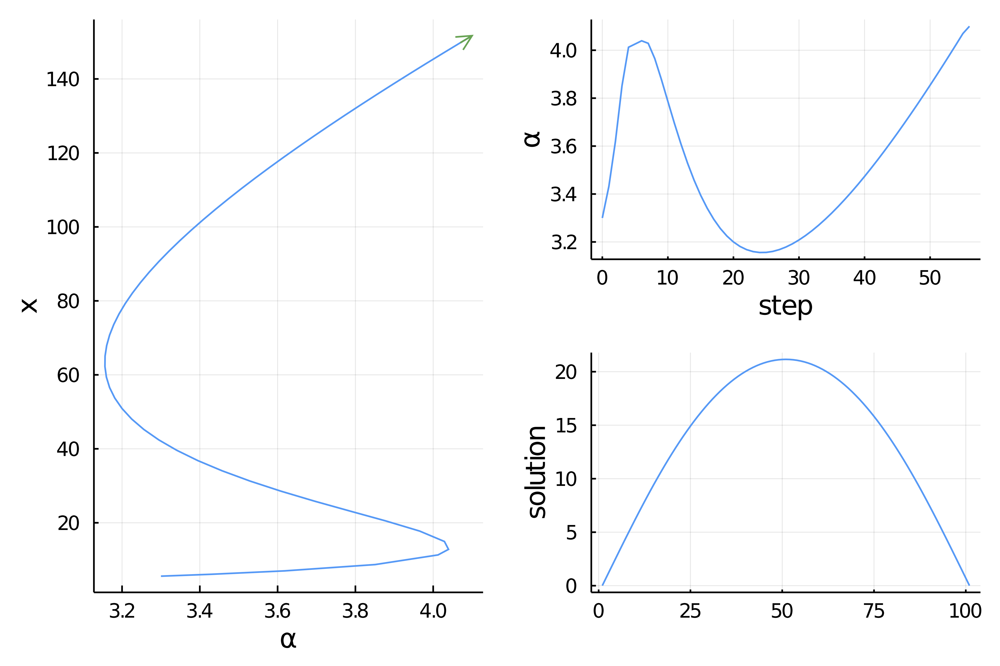

# Temperature model with `ApproxFun`


We reconsider the first example by relying on **spectral collocations** using the package `ApproxFun.jl` which allows very precise function approximation. 

> This is one example where the state space, the space of solutions to the nonlinear equation, is not a subtype of `AbstractArray`. See [Requested methods for Custom State](@ref) for more informations.

We start with some imports:

```julia 
using ApproxFun, LinearAlgebra, Parameters

using PseudoArcLengthContinuation, Plots
const PALC = PseudoArcLengthContinuation
```

We then need to add some methods not available in `ApproxFun` because the state space is not a subtype of `AbstractArray`:

```julia
# specific methods for ApproxFun
import Base: eltype, similar, copyto!, length
import LinearAlgebra: mul!, rmul!, axpy!, axpby!, dot, norm

similar(x::ApproxFun.Fun, T) = (copy(x))
similar(x::ApproxFun.Fun) = copy(x)
mul!(w::ApproxFun.Fun, v::ApproxFun.Fun, α) = (w .= α * v)

eltype(x::ApproxFun.Fun) = eltype(x.coefficients)
length(x::ApproxFun.Fun) = length(x.coefficients)

dot(x::ApproxFun.Fun, y::ApproxFun.Fun) = sum(x * y)

axpy!(a::Float64, x::ApproxFun.Fun, y::ApproxFun.Fun) = (y .= a * x + y)
axpby!(a::Float64, x::ApproxFun.Fun, b::Float64, y::ApproxFun.Fun) = (y .= a * x + b * y)
rmul!(y::ApproxFun.Fun, b::Float64) = (y.coefficients .*= b; y)
rmul!(y::ApproxFun.Fun, b::Bool) = b == true ? y : (y.coefficients .*= 0; y)

copyto!(x::ApproxFun.Fun, y::ApproxFun.Fun) = ( (x.coefficients = copy(y.coefficients);x))
```

We can easily write our functional with boundary conditions in a convenient manner using `ApproxFun`:

```julia
N(x; a = 0.5, b = 0.01) = 1 + (x + a*x^2)/(1 + b*x^2)
dN(x; a = 0.5, b = 0.01) = (1-b*x^2+2*a*x)/(1+b*x^2)^2

function F_chan(u, alpha::Float64, beta = 0.01)
	return [Fun(u(0.), domain(u)) - beta,
		Fun(u(1.), domain(u)) - beta,
		Δ * u + alpha * N(u, b = beta)]
end

function Jac_chan(u, alpha, beta = 0.01)
	return [Evaluation(u.space, 0.),
		Evaluation(u.space, 1.),
		Δ + alpha * dN(u, b = beta)]
end
```

We want to call a Newton solver. We first need an initial guess and the Laplacian operator:

```julia
sol = Fun(x -> x * (1-x), Interval(0.0, 1.0))
const Δ = Derivative(sol.space, 2)
```

Finally, we need to provide some parameters for the Newton iterations. This is done by calling

```julia
optnewton = NewtonPar(tol = 1e-12, verbose = true)
```

We call the Newton solver:

```julia
out, _, _ = @time PALC.newton(
			x -> F_chan(x, 3.0),
			u -> Jac_chan(u, 3.0),
			sol, optnewton, normN = x -> norm(x, Inf64))
```
and you should see

```
 Newton Iterations 
   Iterations      Func-count      f(x)      Linear-Iterations

        0                1     1.5707e+00         0
        1                2     1.1546e-01         1
        2                3     8.0149e-04         1
        3                4     3.9038e-08         1
        4                5     7.9049e-13         1
  0.086784 seconds (354.58 k allocations: 14.264 MiB)
```

We can also perform numerical continuation with respect to the parameter $\alpha$. Again, we need to provide some parameters for the continuation:

```julia
optcont = ContinuationPar(dsmin = 0.0001, dsmax = 0.05, ds= 0.005, pMax = 4.1, plotEveryNsteps = 10, newtonOptions = NewtonPar(tol = 1e-8, maxIter = 20, verbose = true), maxSteps = 200)
```

We provide a callback function to check how the `ApproxFun` solution vector grows during the continuation:

```julia
function finalise_solution(z, tau, step, contResult)
	printstyled(color=:red,"--> AF length = ", (z, tau) .|> length ,"\n")
	true
end
```

Then, we can call the continuation routine

```julia
br, _ = @time continuation(
		(x, p) ->   F_chan(x, p),
		(x, p) -> Jac_chan(x, p),
		out, 3.0, optcont,
		plot = true,
		plotSolution = (x, p; kwargs...) -> plot!(x; label = "l = $(length(x))", kwargs...),
		verbosity = 2,
		normC = x -> norm(x, Inf64))
```
and you should see

