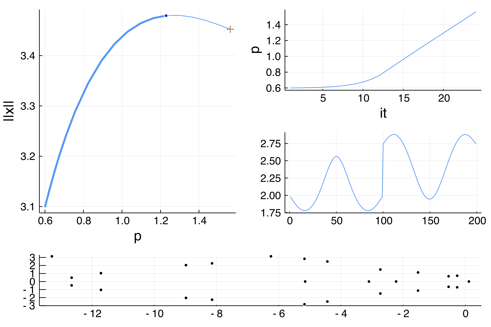

# Brusselator 1d (advanced user)

```@contents
Pages = ["tutorials3b.md"]
Depth = 3
```

!!! unknown "References"
    This example is taken from **Numerical Bifurcation Analysis of Periodic Solutions of Partial Differential Equations,** Lust, 1997.

!!! info "Goal"
    The goal of this tutorial is to show similar computations as in the previous tutorial but without using the automatic branch switching tools. This is for the experienced used who wants to dive more in the internals of the package.    

We look at the Brusselator in 1d. The equations are as follows

$$\begin{aligned} \frac { \partial X } { \partial t } & = \frac { D _ { 1 } } { l ^ { 2 } } \frac { \partial ^ { 2 } X } { \partial z ^ { 2 } } + X ^ { 2 } Y - ( β + 1 ) X + α \\ \frac { \partial Y } { \partial t } & = \frac { D _ { 2 } } { l ^ { 2 } } \frac { \partial ^ { 2 } Y } { \partial z ^ { 2 } } + β X - X ^ { 2 } Y \end{aligned}$$

with Dirichlet boundary conditions

$$\begin{array} { l } { X ( t , z = 0 ) = X ( t , z = 1 ) = α } \\ { Y ( t , z = 0 ) = Y ( t , z = 1 ) = β / α } \end{array}$$

These equations have been introduced to reproduce an oscillating chemical reaction. There is an obvious equilibrium $(α, β / α)$. Here, we consider bifurcations with respect to the parameter $l$.

We start by writing the PDE

```julia
using Revise
using BifurcationKit, LinearAlgebra, Plots, SparseArrays, Setfield, Parameters
const BK = BifurcationKit

f1(u, v) = u * u * v
norminf = x -> norm(x, Inf)

function Fbru(x, p)
	@unpack α, β, D1, D2, l = p
	f = similar(x)
	n = div(length(x), 2)
	h = 1.0 / n; h2 = h*h
	c1 = D1 / l^2 / h2
	c2 = D2 / l^2 / h2

	u = @view x[1:n]
	v = @view x[n+1:2n]

	# Dirichlet boundary conditions
	f[1]   = c1 * (α      - 2u[1] + u[2] ) + α - (β + 1) * u[1] + f1(u[1], v[1])
	f[end] = c2 * (v[n-1] - 2v[n] + β / α)			 + β * u[n] - f1(u[n], v[n])

	f[n]   = c1 * (u[n-1] - 2u[n] +  α  )  + α - (β + 1) * u[n] + f1(u[n], v[n])
	f[n+1] = c2 * (β / α  - 2v[1] + v[2])			 + β * u[1] - f1(u[1], v[1])

	for i=2:n-1
		  f[i] = c1 * (u[i-1] - 2u[i] + u[i+1]) + α - (β + 1) * u[i] + f1(u[i], v[i])
		f[n+i] = c2 * (v[i-1] - 2v[i] + v[i+1])			  + β * u[i] - f1(u[i], v[i])
	end
	return f
end
```

For computing periodic orbits, we will need a Sparse representation of the Jacobian:

```julia
function Jbru_sp(x, p)
	@unpack α, β, D1, D2, l = p
	# compute the Jacobian using a sparse representation
	n = div(length(x), 2)
	h = 1.0 / n; h2 = h*h

	c1 = D1 / p.l^2 / h2
	c2 = D2 / p.l^2 / h2

	u = @view x[1:n]
	v = @view x[n+1:2n]

	diag   = zeros(eltype(x), 2n)
	diagp1 = zeros(eltype(x), 2n-1)
	diagm1 = zeros(eltype(x), 2n-1)

	diagpn = zeros(eltype(x), n)
	diagmn = zeros(eltype(x), n)

	@. diagmn = β - 2 * u * v
	@. diagm1[1:n-1] = c1
	@. diagm1[n+1:end] = c2

	@. diag[1:n]    = -2c1 - (β + 1) + 2 * u * v
	@. diag[n+1:2n] = -2c2 - u * u

	@. diagp1[1:n-1] = c1
	@. diagp1[n+1:end] = c2

	@. diagpn = u * u
	return spdiagm(0 => diag, 1 => diagp1, -1 => diagm1, n => diagpn, -n => diagmn)
end
```

!!! tip "Tip"
    We could have used `DiffEqOperators.jl` like for the Swift-Hohenberg tutorial.

We shall now compute the equilibria and their stability.

```julia
n = 500

# parameters of the Brusselator model and guess for the stationary solution
par_bru = (α = 2., β = 5.45, D1 = 0.008, D2 = 0.004, l = 0.3)
sol0 = vcat(par_bru.α * ones(n), par_bru.β/par_bru.α * ones(n))
```

For the eigensolver, we use a Shift-Invert algorithm (see [Eigen solvers (Eig)](@ref))

```julia
eigls = EigArpack(1.1, :LM)
```

We continue the trivial equilibrium to find the Hopf points

```julia
opt_newton = NewtonPar(eigsolver = eigls, verbose = false)
opts_br_eq = ContinuationPar(dsmin = 0.001, dsmax = 0.01, ds = 0.001,
	pMax = 1.9, detectBifurcation = 3, nev = 21, plotEveryStep = 50,
	newtonOptions = NewtonPar(eigsolver = eigls, tol = 1e-9), maxSteps = 1060)

	br, = @time continuation(Fbru, Jbru_sp, sol0, par_bru, (@lens _.l),
		opts_br_eq, verbosity = 0,
		plot = true,
		printSolution = (x,p) -> x[div(n,2)], normC = norminf)
```

We obtain the following bifurcation diagram with 3 Hopf bifurcation points


## Normal form computation

We can compute the normal form of the Hopf points as follows

```julia
using ForwardDiff
function D(f, x, p, dx)
	return ForwardDiff.derivative(t->f(x .+ t .* dx, p), 0.)
end
d1Fbru(x,p,dx1) = D((z, p0) -> Fbru(z, p0), x, p, dx1)
d2Fbru(x,p,dx1,dx2) = D((z, p0) -> d1Fbru(z, p0, dx1), x, p, dx2)
d3Fbru(x,p,dx1,dx2,dx3) = D((z, p0) -> d2Fbru(z, p0, dx1, dx2), x, p, dx3)

# we group the differentials together
jet  = (Fbru, Jbru_sp, d2Fbru, d3Fbru)

hopfpt = computeNormalForm(jet..., br, 1)
```
and you should get

```julia
julia> hopfpt
SuperCritical - Hopf bifurcation point at l ≈ 0.512353005225085.
Period of the periodic orbit ≈ 2.9370202332411925
Normal form z⋅(a⋅δp + b⋅|z|²): 
(a = 0.8770732861140638 + 0.5671547647542317im, b = -0.0009380187660555578 + 0.0009391565464102912im)
```

## Continuation of Hopf points

We use the bifurcation points guesses located in `br.specialpoint` to turn them into precise bifurcation points. For the second one, we have

```julia
# index of the Hopf point in br.specialpoint
ind_hopf = 2
hopfpoint, _, flag = @time newton(Fbru, Jbru_sp,
	br, ind_hopf; normN = norminf)
flag && printstyled(color=:red, "--> We found a Hopf Point at l = ", hopfpoint.p[1], ", ω = ", hopfpoint.p[2], ", from l = ", br.specialpoint[ind_hopf].param, "\n")
```

which produces

```julia
--> We found a Hopf Point at l = 1.0239851696548035, ω = 2.1395092895339842, from l = 1.0353910524340078
```

We now perform a Hopf continuation with respect to the parameters `l, β`

!!! tip "Tip"
    You don't need to call `newton` first in order to use `continuation`.

```julia
optcdim2 = ContinuationPar(dsmin = 0.001, dsmax = 0.05, ds= 0.01, pMax = 6.5, pMin = 0.0, newtonOptions = opt_newton)
br_hopf, = @time continuation(Fbru, Jbru_sp,
	br, ind_hopf, (@lens _.β),
	optcdim2, verbosity = 2, 
	normC = norminf)
```

which gives using `plot(br_hopf)`


!!! tip "Performance"
    You can really speed this up by passing the second differential. In this case, we have `d2Fbru` above from `ForwardDiff` but it does not like `Complex` arguments. You can then pass the following argument which circumvents the problem of using `ForwardDiff`: `d2F = (x,p,dx1,dx2) -> BK.BilinearMap((_dx1, _dx2) -> d2Fbru(x,p,_dx1,_dx2))(dx1,dx2)`

## Continuation of periodic orbits (Finite differences)

Here, we perform continuation of periodic orbits branching from the Hopf bifurcation points.We need an educated guess for the periodic orbit which is given by `guessFromHopf`:

```julia
# number of time slices
M = 51

l_hopf, Th, orbitguess2, hopfpt, vec_hopf = guessFromHopf(br, ind_hopf,
	opts_br_eq.newtonOptions.eigsolver,
	M, 2.7; phase = 0.25)
```
We wish to make two remarks at this point. The first is that an initial guess is composed of a space time solution and of the guess for the period `Th` of the solution. Note that the argument `2.7` is a guess for the amplitude of the orbit.

```julia
# orbit initial guess from guessFromHopf, is not a vector, so we reshape it
orbitguess_f2 = reduce(vcat, orbitguess2)
orbitguess_f = vcat(vec(orbitguess_f2), Th) |> vec
```

The second remark concerns the phase `0.25` written above. To account for the additional unknown (*i.e.* the period), periodic orbit localisation using Finite Differences requires an additional constraint (see [Periodic orbits based on trapezoidal rule](@ref) for more details). In the present case, this constraint is

$$< u(0) - u_{hopf}, \phi> = 0$$

where `u_{hopf}` is the equilibrium at the Hopf bifurcation and $\phi$ is `real.(vec_hopf)` where `vec_hopf` is the eigenvector. This is akin to a Poincaré section. We do not put any constraint on $u(t)$ albeit this is possible (see [Periodic orbits based on trapezoidal rule](@ref).

The phase of the periodic orbit is set so that the above constraint is satisfied. We shall now use Newton iterations to find a periodic orbit.

Given our initial guess, we create a (family of) problem which encodes the functional associated to finding Periodic orbits based on trapezoidal rule (see [Periodic orbits based on trapezoidal rule](@ref) for more information):

```julia
poTrap = PeriodicOrbitTrapProblem(
	Fbru,    				# pass the vector field
	Jbru_sp, 				# pass the jacobian of the vector field
	real.(vec_hopf),		# used to set ϕ, see the phase constraint
	hopfpt.u,           # used to set uhopf, see the phase constraint
	M, 2n)			          # number of time slices
```

To evaluate the functional at `x`, you call it like a function: `poTrap(x, par)` for the parameter `par`.

!!! note "Using the functional for deflation, Fold of limit cycles..."
    The functional `poTrap` gives you access to the underlying methods to call a regular `newton`. For example the functional is `x -> poTrap(x, par)` at parameter `par`. The (sparse) Jacobian at `(x,p)` is computed like this `poTrap(Val(:JacFullSparse), x, p)` while the Matrix Free version is `dx -> poTrap((x, p, dx)`. This also allows you to call the newton deflated method (see [Deflated problems](@ref)) or to locate Fold point of limit cycles see [`PeriodicOrbitTrapProblem`](@ref). You can also use preconditioners. In the case of more computationally intense problems (like the 2d Brusselator), this might be mandatory as using LU decomposition for the linear solve will use too much memory. See also the example [Complex Ginzburg-Landau 2d](@ref)

For convenience, we provide a simplified newton / continuation methods for periodic orbits. One has just to pass a [`PeriodicOrbitTrapProblem`](@ref).

```julia
# we use the linear solver LSFromBLS to speed up the computations
opt_po = NewtonPar(tol = 1e-10, verbose = true, maxIter = 14, linsolver = BK.LSFromBLS())
	outpo_f, _, flag = @time newton(poTrap, orbitguess_f, (@set par_bru.l = l_hopf + 0.01), 		opt_po, normN = norminf,
		linearPO = :FullSparseInplace,
		callback = (x, f, J, res, itlin, iteration, options; kwargs...) -> (println("--> amplitude = ", BK.amplitude(x, n, M; ratio = 2));true))
flag && printstyled(color=:red, "--> T = ", outpo_f[end], ", amplitude = ", BK.amplitude(outpo_f, n, M; ratio = 2),"\n")
# plot of the periodic orbit
BK.plotPeriodicPOTrap(outpo_f, n, M; ratio = 2)
```

and obtain

```julia
Newton Iterations      f(x)      Linear Iterations

          0          1.5184e-03             0
--> amplitude = 0.22182446481949203
          1          3.2748e-03             2
--> amplitude = 0.5042141710317618
          2          4.4409e-04             2
--> amplitude = 0.41320367911246847
          3          8.5523e-05             2
--> amplitude = 0.36741372418160223
          4          4.9208e-06             2
--> amplitude = 0.3560261988596807
          5          1.6632e-08             2
--> amplitude = 0.35535508808242433
          6          2.4921e-13             2
--> amplitude = 0.3553527952167588
--> amplitude = 0.3553527952167588
  4.384568 seconds (868.10 k allocations: 2.456 GiB, 10.67% gc time)
```

and


Finally, we can perform continuation of this periodic orbit using the specialized call `continuationPOTrap`

```julia
opt_po = @set opt_po.eigsolver = EigArpack(; tol = 1e-5, v0 = rand(2n))
opts_po_cont = ContinuationPar(dsmin = 0.001, dsmax = 0.03, ds= 0.01,
	pMax = 3.0, maxSteps = 30,
	newtonOptions = opt_po, nev = 5, precisionStability = 1e-8, detectBifurcation = 0)
br_po, = @time continuation(poTrap,
	outpo_f, (@set par_bru.l = l_hopf + 0.01), (@lens _.l),
	opts_po_cont;
	linearPO = :FullSparseInplace,
	verbosity = 2,	plot = true,
	plotSolution = (x, p;kwargs...) -> heatmap!(reshape(x[1:end-1], 2*n, M)'; ylabel="time", color=:viridis, kwargs...),
	normC = norminf)
```

to obtain the period of the orbit as function of `l`


## Deflation for periodic orbit problems
Looking for periodic orbits branching of bifurcation points, it is very useful to use `newton` algorithm with deflation. We thus define a deflation operator (see previous example)

```Julia
deflationOp = DeflationOperator(2.0, (x,y) -> dot(x[1:end-1], y[1:end-1]),1.0, [zero(orbitguess_f)])
```

which allows to find periodic orbits different from `orbitguess_f `. Note that the `dot` product removes the last component, *i.e.* the period of the cycle is not considered during this particular deflation. We can now use

```Julia
outpo_f, hist, flag = @time newton(poTrap,
	orbitguess_f, (@set par_bru.l = l_hopf + 0.01), opt_po, deflationOp; linearPO = :FullSparseInplace, normN = norminf)
```

## Floquet coefficients

A basic method for computing Floquet cofficients based on the eigenvalues of the monodromy operator is available (see [`FloquetQaD`](@ref)). It is precise enough to locate bifurcations. Their computation is triggered like in the case of a regular call to `continuation`:

```Julia
opt_po = @set opt_po.eigsolver = DefaultEig()
opts_po_cont = ContinuationPar(dsmin = 0.001, dsmax = 0.04, ds= -0.01, pMax = 3.0, maxSteps = 200, saveSolEveryStep = 1, newtonOptions = opt_po, nev = 5, precisionStability = 1e-6, detectBifurcation = 3)
br_po, = @time continuation(poTrap,
	outpo_f, (@set par_bru.l = l_hopf + 0.01), (@lens _.l),
	opts_po_cont; verbosity = 3, plot = true,
	linearPO = :FullSparseInplace,
	plotSolution = (x, p;kwargs...) -> heatmap!(reshape(x[1:end-1], 2*n, M)'; ylabel="time", color=:viridis, kwargs...), normC = norminf)
```

A more complete diagram can be obtained combining the methods (essentially deflation and Floquet) described above. It shows the period of the periodic orbits as function of `l`. See `example/brusselator.jl` for more information.


!!! danger "Floquet multipliers computation"
    The computation of Floquet multipliers is necessary for the detection of bifurcations of periodic orbits (which is done by analyzing the Floquet exponents obtained from the Floquet multipliers). Hence, the eigensolver needs to compute the eigenvalues with largest modulus (and not with largest real part which is their default behavior). This can be done by changing the option `which = :LM` of the eigensolver. Nevertheless, note that for most implemented eigensolvers in the current Package, the proper option is set when the computation of Floquet multipliers is requested.

!!! tip "Performances"
    This example is clearly not optimized because we wanted to keep it simple. We can use a Matrix-Free version of the functional and preconditioners to speed this up. Floquet multipliers could also be computed in a Matrix-Free manner. See `examples/brusselator.jl` for more efficient methods. See also [Complex Ginzburg-Landau 2d](@ref) for a more advanced example where we introduce those methods.

## Continuation of periodic orbits (Standard Shooting)

> Note that what follows is not really optimized on the `DifferentialEquations.jl` side. Indeed, we do not use automatic differentiation, we do not pass the sparsity pattern,...

We now turn to a different method based on the flow of the Brusselator. To compute this flow (time stepper), we need to be able to solve the differential equation (actually a PDE) associated to the vector field `Fbru`. We will show how to do this with an implicit method `Rodas4P` from `DifferentialEquations.jl`. Note that the user can pass its own time stepper but for convenience, we use the ones in `DifferentialEquations.jl`. More information regarding the shooting method is contained in [Periodic orbits based on the shooting method](@ref). To define the flow, it is better to have an **inplace** version of the vector field:

```julia
function Fbru!(f, x, p)
	@unpack α, β, D1, D2, l = p
	n = div(length(x), 2)
	h = 1.0 / n; h2 = h*h
	c1 = D1 / l^2 / h2
	c2 = D2 / l^2 / h2

	u = @view x[1:n]
	v = @view x[n+1:2n]

	# Dirichlet boundary conditions
	f[1]   = c1 * (α	  - 2u[1] + u[2] ) + α - (β + 1) * u[1] + f1(u[1], v[1])
	f[end] = c2 * (v[n-1] - 2v[n] + β / α)			 + β * u[n] - f1(u[n], v[n])

	f[n]   = c1 * (u[n-1] - 2u[n] +  α   ) + α - (β + 1) * u[n] + f1(u[n], v[n])
	f[n+1] = c2 * (β / α  - 2v[1] + v[2])			 + β * u[1] - f1(u[1], v[1])

	for i=2:n-1
		  f[i] = c1 * (u[i-1] - 2u[i] + u[i+1]) + α - (β + 1) * u[i] + f1(u[i], v[i])
		f[n+i] = c2 * (v[i-1] - 2v[i] + v[i+1])			  + β * u[i] - f1(u[i], v[i])
	end
	return f
end

function Fbru(x, p)
	f = similar(x)
	Fbru!(f, x, p)
end
```

We then recompute the locus of the Hopf bifurcation points using the same method as above.

```julia
n = 100

# different parameters to define the Brusselator model and guess for the stationary solution
par_bru = (α = 2., β = 5.45, D1 = 0.008, D2 = 0.004, l = 0.3)
sol0 = vcat(par_bru.α * ones(n), par_bru.β/par_bru.α * ones(n))

eigls = EigArpack(1.1, :LM)
opts_br_eq = ContinuationPar(dsmin = 0.001, dsmax = 0.00615, ds = 0.0061, pMax = 1.9,
	detectBifurcation = 3, nev = 21, plotEveryStep = 50,
	newtonOptions = NewtonPar(eigsolver = eigls, tol = 1e-9), maxSteps = 1060)

br, = @time continuation(Fbru, Jbru_sp,
	sol0, par_bru, (@lens _.l), opts_br_eq, verbosity = 0,
	plot = false,
	printSolution = (x, p)->x[div(n,2)], normC = norminf)
```

We need to create a guess for the periodic orbit. We proceed as previously:

```julia
# number of time slices
M = 10

# index of the Hopf point in the branch br
ind_hopf = 1

l_hopf, Th, orbitguess2, hopfpt, vec_hopf = BK.guessFromHopf(br, ind_hopf,
	opts_br_eq.newtonOptions.eigsolver, M, 22*0.075)
#
orbitguess_f2 = reduce(hcat, orbitguess2)
orbitguess_f = vcat(vec(orbitguess_f2), Th) |> vec
```

Let us now initiate the Standard Shooting method. To this aim, we need to provide a guess of the periodic orbit at times $T/M_{sh}$ where $T$ is the period of the cycle and $M_{sh}$ is the number of slices along the periodic orbits. If $M_{sh} = 1$, this the Standard Simple Shooting and the Standard Multiple one otherwise. See [`ShootingProblem`](@ref) for more information.

```julia
dM = 3
orbitsection = Array(orbitguess_f2[:, 1:dM:M])

# the last component is an estimate of the period of the cycle.
initpo = vcat(vec(orbitsection), 3.0)
```

Finally, we need to build a problem which encodes the Shooting functional. This done as follows where we first create the time stepper. For performance reasons, we rely on `SparseDiffTools `

```julia
using DifferentialEquations, DiffEqOperators, SparseDiffTools, SparseArrays, DiffEqDiffTools

FOde(f, x, p, t) = Fbru!(f, x, p)

u0 = sol0 .+ 0.01 .* rand(2n)

# parameter close to the Hopf bifurcation point
par_hopf = (@set par_bru.l = l_hopf + 0.01)

jac_prototype = Jbru_sp(ones(2n), @set par_bru.β = 0)
jac_prototype.nzval .= ones(length(jac_prototype.nzval))
_colors = matrix_colors(jac_prototype)
vf = ODEFunction(FOde; jac_prototype = jac_prototype, colorvec = _colors)
probsundials = ODEProblem(vf,  sol0, (0.0, 520.), par_bru)
```

We create the parallel standard shooting problem:

```julia
# this encodes the functional for the Shooting problem
probSh = ShootingProblem(
	# pass the vector field and parameter (to be passed to the vector field)
	Fbru, par_hopf,

	# we pass the ODEProblem encoding the flow and the time stepper
	probsundials, Rodas4P(),

	# this is for the phase condition, you can pass your own section as well
	[orbitguess_f2[:,ii] for ii=1:dM:M];

	# enable threading
	parallel = true,

	# these are options passed to the ODE time stepper
	atol = 1e-10, rtol = 1e-8)
```

We are now ready to call `newton`

```julia
ls = GMRESIterativeSolvers(reltol = 1e-7, N = length(initpo), maxiter = 100, verbose = false)
optn_po = NewtonPar(verbose = true, tol = 1e-9,  maxIter = 20, linsolver = ls)
outpo, = @time newton(probSh,
	initpo, par_hopf, optn_po;
	normN = norminf)
plot(initpo[1:end-1], label = "Init guess")
plot!(outpo[1:end-1], label = "sol")
```

which gives (note that we did not have a really nice guess...)

```julia
  Newton Iterations      f(x)      Linear Iterations

          0          1.8260e-01             0
          1          1.1913e-01            49
          2          7.4174e-03            43
          3          3.0445e-04            49
          4          1.5705e-04            47
          5          1.0346e-06            49
          6          2.4545e-08            50
          7          7.2087e-11            50
  5.336648 seconds (2.73 M allocations: 4.784 GiB, 3.55% gc time)
```

and


Note that using Simple Shooting, the convergence is much faster. Indeed, running the code above with `dM = 10` gives:

```julia

 Newton Iterations      f(x)      Linear Iterations

          0          8.1464e-03             0
          1          2.9785e-03             6
          2          4.7400e-03             6
          3          2.7021e-03             7
          4          1.6648e+00             8
          5          3.1953e-01             5
          6          1.8953e-01             5
          7          4.0122e-02             6
          8          1.0293e-02             7
          9          2.7078e-03             7
         10          4.6741e-04             7
         11          1.9485e-05             7
         12          1.2012e-07             7
         13          4.2622e-09             8
         14          7.3854e-12             8
  0.901249 seconds (314.81 k allocations: 796.430 MiB, 2.70% gc time)
```

!!! info "Convergence and speedup"
    The convergence is much worse for the multiple shooting than for the simple one. This is reflected above in the number of linear iterations made during the newton solve. The reason for this is because of the cyclic structure of the jacobian which impedes GMRES from converging fast. This can only be resolved with an improved GMRES which we'll provide in the future.


Finally, we can perform continuation of this periodic orbit using a specialized version of `continuation`:

```julia
# note the eigensolver computes the eigenvalues of the monodromy matrix. Hence
# the dimension of the state space for the eigensolver is 2n
opts_po_cont = ContinuationPar(dsmin = 0.001, dsmax = 0.05, ds= 0.01, pMax = 1.5,
	maxSteps = 500, newtonOptions = (@set optn_po.tol = 1e-7), nev = 25,
	precisionStability = 1e-8, detectBifurcation = 0)

br_po, = @time continuation(probSh,	outpo, par_hopf, (@lens _.l),
	opts_po_cont; verbosity = 2,
	# specific bordered linear solver
	linearAlgo = MatrixFreeBLS(@set ls.N = ls.N+1),
	plot = true,
	plotSolution = (x, p; kwargs...) -> BK.plotPeriodicShooting!(x[1:end-1], length(1:dM:M); kwargs...),
	printSolution = (u, p) -> u[end], normC = norminf)
```

We can observe that simple shooting is faster but the Floquet multipliers are less accurate than for multiple shooting. Also, when the solution is very unstable, simple shooting can have spurious branch switching. Finally, note the $0=\log 1$ eigenvalue of the monodromy matrix in the graph below.


## Continuation of periodic orbits (Poincaré Shooting)

We now turn to another Shooting method, namely the Poincaré one. We can provide this method thanks to the unique functionalities of `DifferentialEquations.jl`. More information is provided at [`PoincareShootingProblem`](@ref) and [Periodic orbits based on the shooting method](@ref) but basically, it is a shooting method between Poincaré sections $\Sigma_i$ (along the orbit) defined by hyperplanes. As a consequence, the dimension of the unknowns is $M_{sh}\cdot(N-1)$ where $N$ is the dimension of the phase space. Indeed, each time slice lives in an hyperplane $\Sigma_i$. Additionally, the period $T$ is not an unknown of the method but rather a by-product. However, the method requires the time stepper to find when the flow hits an hyperplane $\Sigma_i$, something called **event detection**.


We show how to use this method, the code is very similar to the case of the Standard Shooting. We first define the functional for Poincaré Shooting Problem

```julia
# sub-sampling factor of a initial guess for the periodic orbit
dM = 5

# vectors to define the hyperplanes Sigma_i
normals = [Fbru(orbitguess_f2[:,ii], par_hopf)/(norm(Fbru(orbitguess_f2[:,ii], par_hopf))) for ii = 1:dM:M]
centers = [orbitguess_f2[:,ii] for ii = 1:dM:M]

# functional to hold the Poincare Shooting Problem
probHPsh = PoincareShootingProblem(
	# vector field and parameter
	Fbru, par_hopf,

	# ODEProblem, ODE solver used to compute the flow
	probsundials, Rodas4P(),

	# parameters for the Poincaré sections
	normals, centers;

	# enable threading
	parallel = true,

	# Parameters passed to the ODE solver
	atol = 1e-10, rtol = 1e-8)
```

Let us now compute an initial guess for the periodic orbit, it must live in the hyperplanes $\Sigma_i$. Fortunately, we provide projections on these hyperplanes.

```julia
# projection of the initial guess on the hyperplanes. We assume that the centers[ii]
# form the periodic orbit initial guess.
initpo_bar = reduce(vcat, BK.projection(probHPsh, centers))
```

We can now call `continuation` to get the first branch.

```julia
# eigen / linear solver
eig = EigKrylovKit(tol= 1e-12, x₀ = rand(2n-1), verbose = 0, dim = 40)
ls = GMRESIterativeSolvers(reltol = 1e-11, N = length(vec(initpo_bar)), maxiter = 500, verbose = false)

# newton options
optn = NewtonPar(verbose = true, tol = 1e-9,  maxIter = 140, linsolver = ls)

# continuation options
opts_po_cont_floquet = ContinuationPar(dsmin = 0.0001, dsmax = 0.05, ds= 0.001,
	pMax = 2.5, maxSteps = 500, nev = 10,
	precisionStability = 1e-5, detectBifurcation = 3, plotEveryStep = 3)
opts_po_cont_floquet = @set opts_po_cont_floquet.newtonOptions =
	NewtonPar(linsolver = ls, eigsolver = eig, tol = 1e-9, verbose = true)

# continuation run
br_po, = @time BK.continuation(probHPsh,
	vec(initpo_bar), par_hopf, (@lens _.l),
	opts_po_cont_floquet; verbosity = 3,
	linearAlgo = MatrixFreeBLS(@set ls.N = ls.N+1),
	plot = true,
	plotSolution = (x, p; kwargs...) -> BK.plot!(x; label="", kwargs...),
	normC = norminf)		
```



We also obtain the following information:

```julia
julia> br_po
Branch number of points: 41
Bifurcation points:
- #  1,    bp at p ≈ 1.20987963 ∈ (1.20128196, 1.20987963), |δp|=9e-03, [converged], δ = ( 1,  0), step =  21, eigenelements in eig[ 22], ind_ev =   1
- #  2,    ns at p ≈ 1.78687615 ∈ (1.77831727, 1.78687615), |δp|=9e-03, [converged], δ = ( 2,  2), step =  30, eigenelements in eig[ 31], ind_ev =   3
- #  3,    pd at p ≈ 1.85103701 ∈ (1.84676466, 1.85103701), |δp|=4e-03, [converged], δ = ( 1,  1), step =  31, eigenelements in eig[ 32], ind_ev =   4
- #  4,    ns at p ≈ 1.87667870 ∈ (1.86813520, 1.87667870), |δp|=9e-03, [converged], δ = ( 2,  2), step =  32, eigenelements in eig[ 33], ind_ev =   6

```
