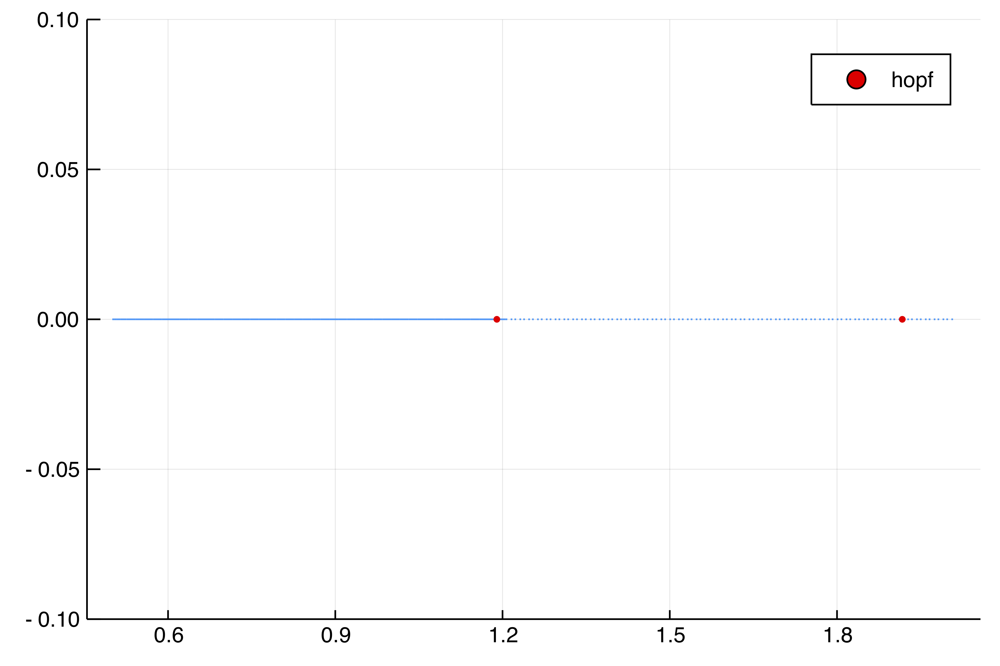
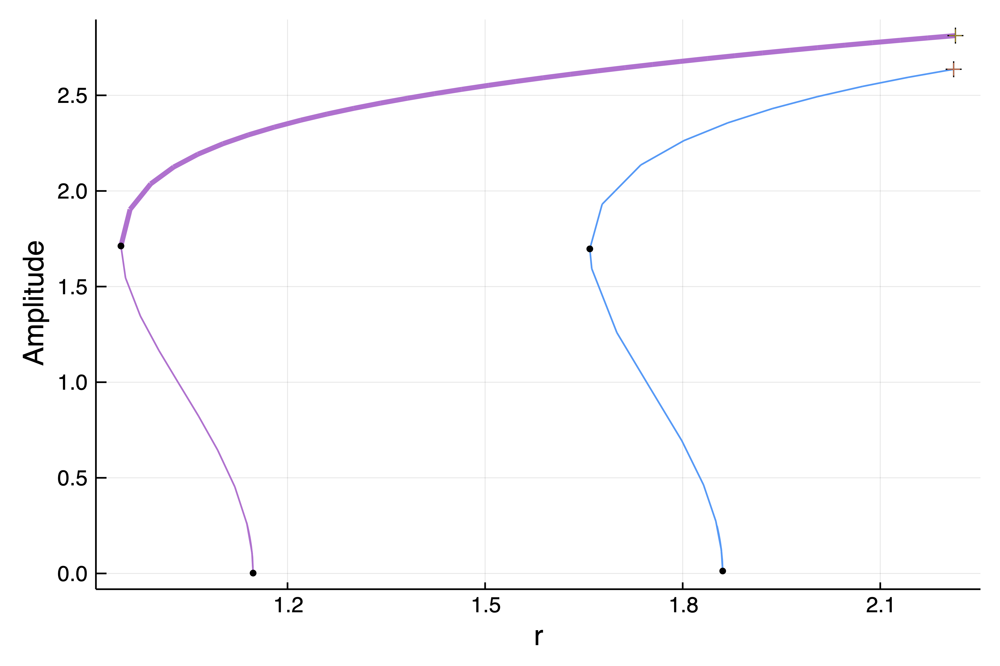

# 2d Ginzburg-Landau equation (finite differences)

```@contents
Pages = ["tutorialsCGL.md"]
Depth = 3
```

> This example is also treated in the MATLAB library [pde2path](http://www.staff.uni-oldenburg.de/hannes.uecker/pde2path/).

We look at the Ginzburg-Landau equations in 2d. The code is very similar to the Brusselator example except that some special care has to be taken in order to cope with the "high" dimensionality of the problem.

Note that we try to be pedagogical here. Hence, we may write "bad" code that we improve later. Finally, we could use all sort of tricks to take advantage of the specificity of the problem. Rather, we stay quite close to the example in the MATLAB library [pde2path](http://www.staff.uni-oldenburg.de/hannes.uecker/pde2path/) (and discussed in **Hopf Bifurcation and Time Periodic Orbits with Pde2path – Algorithms and Applications.**, Uecker, Hannes, Communications in Computational Physics 25, no. 3 (2019)) for fair comparison.


!!! info "Goal"
    We do not use automatic branch switching here. The goal is to show our to use the internals of the package to squeeze most of the performances, use tailored options...


The equations are as follows

$$\partial_{t} u=\Delta u+(r+\mathrm{i} v) u-\left(c_{3}+\mathrm{i} \mu\right)|u|^{2} u-c_{5}|u|^{4} u+\gamma, \quad u=u(t, x) \in \mathbb{C},\quad \gamma\in\mathbb R$$

with Dirichlet boundary conditions. We discretize the square $\Omega = (0,L_x)\times(0,L_y)$ with $2N_xN_y$ points. We start by writing the Laplacian:

```julia
using Revise
using DiffEqOperators, ForwardDiff
using BifurcationKit, LinearAlgebra, Plots, SparseArrays, Parameters, Setfield
const BK = BifurcationKit

norminf(x) = norm(x, Inf)

function Laplacian2D(Nx, Ny, lx, ly)
	hx = 2lx/Nx; hy = 2ly/Ny
	D2x = CenteredDifference(2, 2, hx, Nx)
	D2y = CenteredDifference(2, 2, hy, Ny)

	Qx = Dirichlet0BC(typeof(hx))
	Qy = Dirichlet0BC(typeof(hy))

	D2xsp = sparse(D2x * Qx)[1]
	D2ysp = sparse(D2y * Qy)[1]

	A = kron(sparse(I, Ny, Ny), D2xsp) + kron(D2ysp, sparse(I, Nx, Nx))
	return A
end
```

It is then straightforward to write the vector field

```julia
# this encodes the nonlinearity
function NL(u, p)
	@unpack r, μ, ν, c3, c5, γ = p
	n = div(length(u), 2)
	u1 = @view u[1:n]
	u2 = @view u[n+1:2n]

	ua = u1.^2 .+ u2.^2

	f = similar(u)
	f1 = @view f[1:n]
	f2 = @view f[n+1:2n]

	@. f1 .= r * u1 - ν * u2 - ua * (c3 * u1 - μ * u2) - c5 * ua^2 * u1 + γ
	@. f2 .= r * u2 + ν * u1 - ua * (c3 * u2 + μ * u1) - c5 * ua^2 * u2

	return f
end

function Fcgl(u, p)
	f = similar(u)
	mul!(f, p.Δ, u)
	f .= f .+ NL(u, p)
end
```

and its jacobian:

```julia
function Jcgl(u, p)
	@unpack r, μ, ν, c3, c5, Δ = p

	n = div(length(u), 2)
	u1 = @view u[1:n]
	u2 = @view u[n+1:2n]

	ua = u1.^2 .+ u2.^2

	f1u = zero(u1)
	f2u = zero(u1)
	f1v = zero(u1)
	f2v = zero(u1)

	@. f1u =  r - 2 * u1 * (c3 * u1 - μ * u2) - c3 * ua - 4 * c5 * ua * u1^2 - c5 * ua^2
	@. f1v = -ν - 2 * u2 * (c3 * u1 - μ * u2)  + μ * ua - 4 * c5 * ua * u1 * u2
	@. f2u =  ν - 2 * u1 * (c3 * u2 + μ * u1)  - μ * ua - 4 * c5 * ua * u1 * u2
	@. f2v =  r - 2 * u2 * (c3 * u2 + μ * u1) - c3 * ua - 4 * c5 * ua * u2 ^2 - c5 * ua^2

	jacdiag = vcat(f1u, f2v)

	Δ + spdiagm(0 => jacdiag, n => f1v, -n => f2u)
end
```

We now define the parameters and the stationary solution:

```julia
Nx = 41
Ny = 21
n = Nx * Ny
lx = pi
ly = pi/2

Δ = Laplacian2D(Nx, Ny, lx, ly)
par_cgl = (r = 0.5, μ = 0.1, ν = 1.0, c3 = -1.0, c5 = 1.0, Δ = blockdiag(Δ, Δ), γ = 0.)
sol0 = zeros(2Nx, Ny)
```

and we continue it to find the Hopf bifurcation points. We use a Shift-Invert eigensolver.

```julia
# Shift-Invert eigensolver
eigls = EigArpack(1.0, :LM) # shift = 1.0
opt_newton = NewtonPar(tol = 1e-10, verbose = true, eigsolver = eigls)
opts_br = ContinuationPar(dsmin = 0.001, dsmax = 0.005, ds = 0.001, pMax = 2., detectBifurcation = 3, nev = 5, plotEveryStep = 50, newtonOptions = opt_newton, maxSteps = 1060)

br, = continuation(Fcgl, Jcgl, vec(sol0), par_cgl, (@lens _.r), opts_br, verbosity = 0)
```

which gives

```julia
Branch number of points: 216
Branch of Equilibrium
Bifurcation points:
 (ind_ev = index of the bifurcating eigenvalue e.g. `br.eig[idx].eigenvals[ind_ev]`)
- #  1,  hopf at p ≈ +1.14777610 ∈ (+1.14766562, +1.14777610), |δp|=1e-04, [converged], δ = ( 2,  2), step =  94, eigenelements in eig[ 95], ind_ev =   2
- #  2,  hopf at p ≈ +1.86107007 ∈ (+1.86018618, +1.86107007), |δp|=9e-04, [converged], δ = ( 2,  2), step = 195, eigenelements in eig[196], ind_ev =   4
```

and (with `plot(br, ylims=(-0.1,0.1))`)



## Normal form computation

We compute the Hopf normal form of the first bifurcation point.

```julia
# we group the differentials together
jet  = BK.getJet(Fcgl, Jcgl)

hopfpt = computeNormalForm(jet..., br, 1)
```

We can look at the coefficients of the normal form

```julia
julia> hopfpt
SubCritical - Hopf bifurcation point at r ≈ 1.1477761028276166.
Period of the periodic orbit ≈ 6.283185307179592
Normal form z⋅(a⋅δp + b⋅|z|²):
(a = 0.9999993808297818 - 6.092862765364455e-9im, b = 0.004870129870129872 + 0.0004870129870129874im)
```

So the Hopf branch is subcritical.

## Codim 2 Hopf continuation

Having detected 2 hopf bifurcation points, we now continue them in the plane $(\gamma, r)$. To speed things up, we need an analytical version of the second derivative.

Before we start the codim 2 continuation, we tell `BifurcationKit.jl` to use the spectral information `startWithEigen = true` because the left eigenvector of the Jacobian is simply not the conjugate of the right one.

```julia
# we perform Hopf continuation of the first Hopf point in br
ind_hopf = 1
br_hopf, u1_hopf = @time continuation(
	Fcgl, Jcgl,
	br, ind_hopf, (@lens _.γ),
	ContinuationPar(dsmin = 0.001, dsmax = 0.05, ds= -0.01, pMax = 0.6, pMin = -0.6, newtonOptions = opts_br.newtonOptions, plotEveryStep = 5); plot = true,
	updateMinAugEveryStep = 1, verbosity = 3, normC = norminf,
	startWithEigen = true, bothside = true,
	d2F = jet[3],)

plot(br_hopf, title = "Hopf continuation")
```


## Periodic orbits continuation with stability
Having found two Hopf bifurcation points, we aim at computing the periodic orbits branching from them. Like for the Brusselator example, we need to find some educated guess for the periodic orbits in order to have a successful Newton call.

The following code is very close to the one explained in the tutorial [1d Brusselator (advanced user)](@ref) so we won't give too much details here.

We focus on the first Hopf bifurcation point. Note that, we do not improve the guess for the Hopf bifurcation point, *e.g.* by calling `newtonHopf`, as this is not really needed.

```julia
# index of the Hopf point we want to branch from
ind_hopf = 1

# number of time slices in the periodic orbit
M = 30

# periodic orbit initial guess from Hopf point
r_hopf, Th, orbitguess2, hopfpt, eigvec = guessFromHopf(br, ind_hopf, opt_newton.eigsolver,
	# we pass the number of time slices M, the amplitude 22*sqrt(0.1) and phase
	M, 22*sqrt(0.1); phase = 0.25)

# flatten the initial guess
orbitguess_f2 = reduce(hcat, orbitguess2)
orbitguess_f = vcat(vec(orbitguess_f2), Th) |> vec
```

We create a problem to hold the functional and compute Periodic orbits based on trapezoidal rule

```julia
poTrap = PeriodicOrbitTrapProblem(
# vector field and sparse Jacobian
	Fcgl, Jcgl,
# parameters for the phase condition
	real.(eigvec),
	hopfpt.u,
# number of time slices
	M,
# space dimension
	2n)
```

We can use this (family) problem `poTrap` with `newton` on our periodic orbit guess to find a periodic orbit. Hence, one can be tempted to use


!!! danger "Don't run this!!"
    It uses too much memory

    ```julia
    opts_po_cont = ContinuationPar(dsmin = 0.0001, dsmax = 0.03, ds= 0.001, pMax = 2.5, 	 maxSteps = 250, plotEveryStep = 3, newtonOptions = (@set opt_po.linsolver = DefaultLS()))
    br_po, upo, = @time continuation(Fcgl, Jcgl, vec(sol0), par_cgl, (@lens _.r), opts_po_cont)
    ```


**However, the linear system associated to the newton iterations will be solved by forming the sparse jacobian of size $(2N_xN_yM+1)^2$ and the use of `\` (based on LU decomposition). It takes way too much time and memory.**

Instead, we use a preconditioner. We build the jacobian once, compute its **incomplete LU decomposition** (ILU) and use it as a preconditioner.

```julia
using IncompleteLU

# Sparse matrix representation of the jacobian of the periodic orbit functional
Jpo = poTrap(Val(:JacFullSparse), orbitguess_f, @set par_cgl.r = r_hopf - 0.01)

# incomplete LU factorization with threshold
Precilu = @time ilu(Jpo, τ = 0.005)

# we define the linear solver with left preconditioner Precilu
ls = GMRESIterativeSolvers(verbose = false, reltol = 1e-3, N = size(Jpo,1), restart = 40, maxiter = 50, Pl = Precilu, log=true)

# we try the linear solver
ls(Jpo, rand(ls.N))
```

This converges in `7` iterations whereas, without the preconditioner, it does not converge after `100` iterations.

We set the parameters for the `newton` solve.

```julia
opt_po = @set opt_newton.verbose = true
outpo_f, _, flag = @time newton(poTrap,
   orbitguess_f, (@set par_cgl.r = r_hopf - 0.01),
   (@set opt_po.linsolver = ls);
   linearPO = :FullMatrixFree, normN = norminf)
flag && printstyled(color=:red, "--> T = ", outpo_f[end], ", amplitude = ", BK.getAmplitude(poTrap, outpo_f, par_cgl; ratio = 2),"\n")
BK.plotPeriodicPOTrap(outpo_f, M, Nx, Ny; ratio = 2);
```

which gives

```julia
┌─────────────────────────────────────────────────────┐
│ Newton Iterations      f(x)      Linear Iterations  │
├─────────────┬──────────────────────┬────────────────┤
│       0     │       6.5432e-03     │        0       │
│       1     │       1.4372e-03     │        8       │
│       2     │       3.6731e-04     │        8       │
│       3     │       6.5658e-05     │        9       │
│       4     │       4.3028e-06     │       10       │
│       5     │       6.4509e-08     │       11       │
│       6     │       2.9713e-10     │       12       │
│       7     │       2.2181e-13     │       14       │
└─────────────┴──────────────────────┴────────────────┘
  1.780986 seconds (132.31 k allocations: 1.237 GiB, 12.13% gc time)
--> T = 6.532023020978835, amplitude = 0.2684635643839235
```

and


At this point, we are still wasting a lot of resources, because the matrix-free version of the jacobian of the functional uses the jacobian of the vector field `x ->  Jcgl(x, p)`. Hence, it builds `M` sparse matrices for each evaluation!! Let us create a problem which is fully Matrix Free:

```julia
# computation of the first derivative using automatic differentiation
d1Fcgl(x, p, dx) = ForwardDiff.derivative(t -> Fcgl(x .+ t .* dx, p), 0.)

# linear solver for solving Jcgl*x = rhs. Needed for Floquet multipliers computation
ls0 = GMRESIterativeSolvers(N = 2Nx*Ny, reltol = 1e-9, Pl = lu(I + par_cgl.Δ))

# matrix-free problem
poTrapMF = PeriodicOrbitTrapProblem(
	Fcgl,	(x, p) ->  (dx -> d1Fcgl(x, p, dx)),
	real.(eigvec),
	hopfpt.u,
	M, 2n, ls0)
```

We can now use newton

```julia
outpo_f, _, flag = @time newton(poTrapMF,
	orbitguess_f, (@set par_cgl.r = r_hopf - 0.01),
	(@set opt_po.linsolver = ls);
	linearPO = :FullMatrixFree, normN = norminf)
flag && printstyled(color=:red, "--> T = ", outpo_f[end], ", amplitude = ", BK.getAmplitude(poTrapMF, outpo_f, par_cgl; ratio = 2),"\n")
```

which gives

```julia
┌─────────────────────────────────────────────────────┐
│ Newton Iterations      f(x)      Linear Iterations  │
├─────────────┬──────────────────────┬────────────────┤
│       0     │       6.5432e-03     │        0       │
│       1     │       1.4372e-03     │        8       │
│       2     │       3.6731e-04     │        8       │
│       3     │       6.5658e-05     │        9       │
│       4     │       4.3028e-06     │       10       │
│       5     │       6.4509e-08     │       11       │
│       6     │       2.9713e-10     │       12       │
│       7     │       2.2188e-13     │       14       │
└─────────────┴──────────────────────┴────────────────┘
  1.322440 seconds (35.03 k allocations: 459.996 MiB, 7.63% gc time)
```

The speedup will increase a lot for larger $N_x, N_y$. Also, for Floquet multipliers computation, the speedup will be substantial.

### Removing most allocations (Advanced and Experimental)

We show here how to remove most allocations and speed up the computations. This is an **experimental** feature as the Floquet multipliers computation is not yet readily available in this case. To this end, we rewrite the functional using *inplace* formulation and trying to avoid allocations. This can be done as follows:

```julia
# compute just the nonlinearity
function NL!(f, u, p, t = 0.)
	@unpack r, μ, ν, c3, c5 = p
	n = div(length(u), 2)
	u1v = @view u[1:n]
	u2v = @view u[n+1:2n]

	f1 = @view f[1:n]
	f2 = @view f[n+1:2n]

	@inbounds for ii = 1:n
		u1 = u1v[ii]
		u2 = u2v[ii]
		ua = u1^2+u2^2
		f1[ii] = r * u1 - ν * u2 - ua * (c3 * u1 - μ * u2) - c5 * ua^2 * u1
		f2[ii] = r * u2 + ν * u1 - ua * (c3 * u2 + μ * u1) - c5 * ua^2 * u2
	end
	return f
end

# derivative of the nonlinearity
function dNL!(f, u, p, du)
	@unpack r, μ, ν, c3, c5 = p
	n = div(length(u), 2)
	u1v = @view u[1:n]
	u2v = @view u[n+1:2n]

	du1v = @view du[1:n]
	du2v = @view du[n+1:2n]

	f1 = @view f[1:n]
	f2 = @view f[n+1:2n]

	@inbounds for ii = 1:n
		u1 = u1v[ii]
		u2 = u2v[ii]
		du1 = du1v[ii]
		du2 = du2v[ii]
		ua = u1^2+u2^2
		f1[ii] = (-5*c5*u1^4 + (-6*c5*u2^2 - 3*c3)*u1^2 + 2*μ*u1*u2 - c5*u2^4 - c3*u2^2 + r) * du1 +
		(-4*c5*u2*u1^3 + μ*u1^2 + (-4*c5*u2^3 - 2*c3*u2)*u1 + 3*u2^2*μ - ν) * du2

		f2[ii] = (-4*c5*u2*u1^3 - 3*μ*u1^2 + (-4*c5*u2^3 - 2*c3*u2)*u1 - u2^2*μ + ν) * du1 + (-c5*u1^4 + (-6*c5*u2^2 - c3)*u1^2 - 2*μ*u1*u2 - 5*c5*u2^4 - 3*c3*u2^2 + r) * du2
	end

	return f
end

# inplace vector field
function Fcgl!(f, u, p, t = 0.)
	NL!(f, u, p)
	mul!(f, p.Δ, u, 1., 1.)
end

# inplace derivative of the vector field
function dFcgl!(f, x, p, dx)
	dNL!(f, x, p, dx)
	mul!(f, p.Δ, dx, 1., 1.)
end
```

We can now define an inplace functional

```julia
ls0 = GMRESIterativeSolvers(N = 2Nx*Ny, reltol = 1e-9)#, Pl = lu(I + par_cgl.Δ))
poTrapMFi = PeriodicOrbitTrapProblem(
	Fcgl!, dFcgl!,
	real.(eigvec),
	hopfpt.u,
	M, 2n, ls0; isinplace = true)
```
and run the `newton` method:

```julia
outpo_f, _, flag = @time newton(poTrapMFi,
	orbitguess_f, (@set par_cgl.r = r_hopf - 0.01),	(@set opt_po.linsolver = ls);
	linearPO = :FullMatrixFree, normN = norminf)
```
It gives

```julia
┌─────────────────────────────────────────────────────┐
│ Newton Iterations      f(x)      Linear Iterations  │
├─────────────┬──────────────────────┬────────────────┤
│       0     │       6.5432e-03     │        0       │
│       1     │       1.4372e-03     │        8       │
│       2     │       3.6731e-04     │        8       │
│       3     │       6.5658e-05     │        9       │
│       4     │       4.3028e-06     │       10       │
│       5     │       6.4509e-08     │       11       │
│       6     │       2.9713e-10     │       12       │
│       7     │       2.2143e-13     │       14       │
└─────────────┴──────────────────────┴────────────────┘
  1.179854 seconds (902 allocations: 151.500 MiB)
```

Notice the small speed boost but the reduced allocations. At this stage, further improvements could target the use of `BlockBandedMatrices.jl` for the Laplacian operator, etc.


### Other linear formulation

We could use another way to "invert" jacobian of the functional based on bordered technics. We try to use an ILU preconditioner on the cyclic matrix $J_c$ (see [Periodic orbits based on trapezoidal rule](@ref)) which has a smaller memory footprint:

```julia
Jpo2 = poTrap(Val(:JacCyclicSparse), orbitguess_f, @set par_cgl.r = r_hopf - 0.1)
Precilu = @time ilu(Jpo2, τ = 0.005)
ls2 = GMRESIterativeSolvers(verbose = false, reltol = 1e-3, N = size(Jpo2,1), restart = 30, maxiter = 50, Pl = Precilu, log=true)

opt_po = @set opt_newton.verbose = true
outpo_f, hist, flag = @time newton(
	poTrapMF,	orbitguess_f, (@set par_cgl.r = r_hopf - 0.1),
	(@set opt_po.linsolver = ls2), linearPO = :BorderedMatrixFree,
	normN = norminf)
```

but it gives:

```julia
┌─────────────────────────────────────────────────────┐
│ Newton Iterations      f(x)      Linear Iterations  │
├─────────────┬──────────────────────┬────────────────┤
│       0     │       3.3298e-03     │        0       │
│       1     │       9.5088e-03     │       34       │
│       2     │       1.2807e-03     │       26       │
│       3     │       7.1393e-05     │       29       │
│       4     │       4.1625e-07     │       36       │
│       5     │       1.7924e-09     │       44       │
│       6     │       6.2725e-13     │       60       │
└─────────────┴──────────────────────┴────────────────┘
  3.479920 seconds (62.64 k allocations: 1009.778 MiB, 5.19% gc time)
```

**Hence, it seems better to use the previous preconditioner.**

## Continuation of periodic solutions

We can now perform continuation of the newly found periodic orbit and compute the Floquet multipliers using Matrix-Free methods.

```julia
# set the eigensolver for the computation of the Floquet multipliers
opt_po = @set opt_po.eigsolver = EigKrylovKit(tol = 1e-3, x₀ = rand(2n), verbose = 2, dim = 25)

# parameters for the continuation
opts_po_cont = ContinuationPar(dsmin = 0.0001, dsmax = 0.02, ds = 0.001, pMax = 2.2, maxSteps = 250, plotEveryStep = 3, newtonOptions = (@set opt_po.linsolver = ls),
	nev = 5, precisionStability = 1e-7, detectBifurcation = 0)

br_po, = @time continuation(poTrapMF, outpo_f,
	(@set par_cgl.r = r_hopf - 0.01), (@lens _.r),	opts_po_cont, linearPO = :FullMatrixFree;
	verbosity = 2,	plot = true,
	plotSolution = (x, p; kwargs...) -> BK.plotPeriodicPOTrap(x, M, Nx, Ny; ratio = 2, kwargs...),
	recordFromSolution = (u, p) -> BK.getAmplitude(poTrapMF, u, par_cgl; ratio = 2), normC = norminf)
```

This gives the following bifurcation diagram:



!!! tip "Improved performances"
    Although it would be "cheating" for fair comparisons with existing packages, there is a trick to compute the bifurcation diagram without using preconditionners. We will not detail it here but it allows to handle the case `Nx = 200; Ny = 110; M = 30` and above.

We did not change the preconditioner in the previous example as it does not seem needed. Let us show how to do this nevertheless:

```julia
# callback which will be sent to newton.
# `iteration` in the arguments refers to newton iterations
function callbackPO(x, f, J, res, iteration, itlinear, linsolver = ls, prob = poTrap, p = par_cgl; kwargs...)
	# we update the preconditioner every 10 continuation steps
	if mod(kwargs[:iterationC], 10) == 9 && iteration == 1
		@info "update Preconditioner"
		Jpo = poTrap(Val(:JacCyclicSparse), x, @set p.r = kwargs[:p])
		Precilu = @time ilu(Jpo, τ = 0.003)
		ls.Pl = Precilu
	end
	true
end

br_po, = @time continuation(poTrapMF, outpo_f,
	(@set par_cgl.r = r_hopf - 0.01), (@lens _.r),	opts_po_cont, linearPO = :FullMatrixFree;
	verbosity = 2,	plot = true,
	callbackN = callbackPO,
	plotSolution = (x, p; kwargs...) -> BK.plotPeriodicPOTrap(x, M, Nx, Ny; ratio = 2, kwargs...),
	recordFromSolution = (u, p) -> BK.getAmplitude(poTrapMF, u, par_cgl; ratio = 2), normC = norminf)
```

## Continuation of Fold of periodic orbits

We continue the Fold point of the first branch of the previous bifurcation diagram in the parameter plane $(r, c_5)$. To this end, we need to be able to compute the Hessian of the periodic orbit functional. This is not yet readily available so we turn to automatic differentiation.

```julia
using ForwardDiff

# computation of the second derivative of a function f
function d2Fcglpb(f, x, dx1, dx2)
   return ForwardDiff.derivative(t2 -> ForwardDiff.derivative( t1-> f(x .+ t1 .* dx1 .+ t2 .* dx2,), 0.), 0.)
end
```

We select the Fold point from the branch `br_po` and redefine our linear solver to get the ILU preconditioner tuned close to the Fold point.

```julia
indfold = 2
foldpt = FoldPoint(br_po, indfold)

Jpo = poTrap(Val(:JacFullSparse), orbitguess_f, (@set par_cgl.r = r_hopf - 0.1))
Precilu = @time ilu(Jpo, τ = 0.005)
ls = GMRESIterativeSolvers(verbose = false, reltol = 1e-4, N = size(Jpo, 1), restart = 40, maxiter = 60, Pl = Precilu)
```

We can then use our functional to call `newtonFold` unlike for a regular function (see Tutorial 1). Indeed, we specify the change the parameters too much to rely on a generic algorithm.

```julia
outfold, hist, flag = @time BK.newtonFold(
	(x, p) -> poTrap(x, p),
	(x, p) -> poTrap(Val(:JacFullSparse), x, p),
	br_po , indfold; #index of the fold point
	# we change the linear solver for the one we
	# defined above
	options = (@set opt_po.linsolver = ls),
	d2F = (x, p, dx1, dx2) -> d2Fcglpb(z -> poTrap(z, p), x, dx1, dx2))
flag && printstyled(color=:red, "--> We found a Fold Point at α = ", outfold.p," from ", br_po.foldpoint[indfold].param,"\n")
```

and this gives

```julia
┌─────────────────────────────────────────────────────┐
│ Newton Iterations      f(x)      Linear Iterations  │
├─────────────┬──────────────────────┬────────────────┤
│       0     │       4.5937e-01     │        0       │
│       1     │       5.6013e-01     │       20       │
│       2     │       3.1385e-02     │       23       │
│       3     │       6.0620e-05     │       29       │
│       4     │       2.7839e-08     │       39       │
│       5     │       8.1593e-12     │       45       │
└─────────────┴──────-───────────────┴────────────────┘
 27.289005 seconds (1.07 M allocations: 24.444 GiB, 10.12% gc time)
--> We found a Fold Point at α = 0.9470569704262517 from 0.9481896723164748
```

Finally, one can perform continuation of the Fold bifurcation point as follows

```julia
optcontfold = ContinuationPar(dsmin = 0.001, dsmax = 0.05, ds= 0.01, pMax = 40.1, pMin = -10., newtonOptions = (@set opt_po.linsolver = ls), maxSteps = 20)

outfoldco, hist, flag = @time BK.continuationFold(
	(x, p) -> poTrap(x, p),
	(x, p) -> poTrap(Val(:JacFullSparse), x, p),
	br_po, indfold, (@lens _.c5), optcontfold;
	d2F = (x, p, dx1, dx2) -> d2Fcglpb(z->poTrap(z,p), x, dx1, dx2),
	plot = true, verbosity = 2)
```

which yields:


There is still room for a lot of improvements here. Basically, the idea would be to use full Matrix-Free the jacobian functional and its transpose.

## Continuation of periodic orbits on the GPU (Advanced)

!!! tip ""
    This is a very neat example **all done** on the GPU using the following ingredients: Matrix-Free computation of periodic orbits using preconditioners.

We now take advantage of the computing power of GPUs. The section is run on an NVIDIA Tesla V100. Given the small number of unknowns, we can (only) expect significant speedup in the application of the **big** preconditioner.

> Note that we use the parameters `Nx = 82; Ny = 42; M=30`.

```julia
# computation of the first derivative
d1Fcgl(x, p, dx) = ForwardDiff.derivative(t -> Fcgl(x .+ t .* dx, p), 0.)

d1NL(x, p, dx) = ForwardDiff.derivative(t -> NL(x .+ t .* dx, p), 0.)

function dFcgl(x, p, dx)
	f = similar(dx)
	mul!(f, p.Δ, dx)
	nl = d1NL(x, p, dx)
	f .= f .+ nl
end
```

We first load `CuArrays`

```julia
using CUDA
CUDA.allowscalar(false)
import LinearAlgebra: mul!, axpby!
mul!(x::CuArray, y::CuArray, α::T) where {T <: Number} = (x .= α .* y)
mul!(x::CuArray, α::T, y::CuArray) where {T <: Number} = (x .= α .* y)
axpby!(a::T, X::CuArray, b::T, Y::CuArray) where {T <: Number} = (Y .= a .* X .+ b .* Y)
```

and update the parameters

```julia
par_cgl_gpu = @set par_cgl.Δ = CUDA.CUSPARSE.CuSparseMatrixCSC(par_cgl.Δ);
```

Then, we precompute the preconditioner on the CPU:

```julia
Jpo = poTrap(Val(:JacFullSparse), orbitguess_f, @set par_cgl.r = r_hopf - 0.01)
Precilu = @time ilu(Jpo, τ = 0.003)
```

To invert `Precilu` on the GPU, we need to define a few functions which are not in `CuArrays` and which are related to LU decomposition:

```julia
struct LUperso
	L
	Ut	# transpose of U in LU decomposition
end

import Base: ldiv!
function LinearAlgebra.ldiv!(_lu::LUperso, rhs::CUDA.CuArray)
	_x = UpperTriangular(_lu.Ut) \ (LowerTriangular(_lu.L) \ rhs)
	rhs .= vec(_x)
	CUDA.unsafe_free!(_x)
	rhs
end
```

Finally, for the methods in `PeriodicOrbitTrapProblem` to work, we need to redefine the following method. Indeed, we disable the use of scalar on the GPU to increase the speed.

```julia
import BifurcationKit: extractPeriodFDTrap
extractPeriodFDTrap(x::CuArray) = x[end:end]
```

We can now define our functional:

```julia
# matrix-free problem on the gpu
ls0gpu = GMRESKrylovKit(rtol = 1e-9)
poTrapMFGPU = PeriodicOrbitTrapProblem(
	Fcgl, (x, p) ->  (dx -> dFcgl(x, p, dx)),
	CuArray(real.(eigvec)),
	CuArray(hopfpt.u),
	M, 2n, ls0gpu;
	ongpu = true) # this is required to alter the way the constraint is handled
```

Let us have a look at the linear solvers and compare the speed on CPU and GPU:

```julia
ls = GMRESKrylovKit(verbose = 2, Pl = Precilu, rtol = 1e-3, dim  = 20)
   # runs in 	2.990495 seconds (785 allocations: 31.564 MiB, 0.98% gc time)
	outh, = @time ls((Jpo), orbitguess_f)

Precilu_gpu = LUperso(LowerTriangular(CUDA.CUSPARSE.CuSparseMatrixCSR(I+Precilu.L)), UpperTriangular(CUDA.CUSPARSE.CuSparseMatrixCSR(sparse(Precilu.U'))));
lsgpu = GMRESKrylovKit(verbose = 2, Pl = Precilu_gpu, rtol = 1e-3, dim  = 20)
	Jpo_gpu = CUDA.CUSPARSE.CuSparseMatrixCSR(Jpo);
	orbitguess_cu = CuArray(orbitguess_f)
	# runs in 1.751230 seconds (6.54 k allocations: 188.500 KiB, 0.43% gc time)
	outd, = @time lsgpu(Jpo_gpu, orbitguess_cu)
```	 

So we can expect a pretty descent x2 speed up in computing the periodic orbits. We can thus call newton:

```julia
opt_po = @set opt_newton.verbose = true
	outpo_f, hist, flag = @time newton(poTrapMFGPU,
		orbitguess_cu, (@set par_cgl_gpu.r = r_hopf - 0.01),
		(@set opt_po.linsolver = lsgpu), :FullMatrixFree;
		normN = x->maximum(abs.(x)))
```
The computing time is `6.914367 seconds (2.94 M allocations: 130.348 MiB, 1.10% gc time)`. The same computation on the CPU, runs in `13.972836 seconds (551.41 k allocations: 1.300 GiB, 1.05% gc time)`.

You can also perform continuation, here is a simple example:

```julia
opts_po_cont = ContinuationPar(dsmin = 0.0001, dsmax = 0.02, ds= 0.001, pMax = 2.2, maxSteps = 250, plotEveryStep = 3, newtonOptions = (@set opt_po.linsolver = lsgpu))
br_po, upo , _= @time continuation(poTrapMFGPU,
   orbitguess_cu, (@set par_cgl_gpu.r = r_hopf - 0.01), (@lens _.r = p),
   opts_po_cont, linearPO = :FullMatrixFree;
   verbosity = 2,
   recordFromSolution = (u,p) -> getAmplitude(poTrapMFGPU, u, par_cgl_gpu), normC = x->maximum(abs.(x)))
```

!!! info "Preconditioner update"
    For now, the preconditioner has been precomputed on the CPU which forbids its (efficient) update during continuation of a branch of periodic orbits. This could be improved using `ilu0!` and friends in `CuArrays`.
