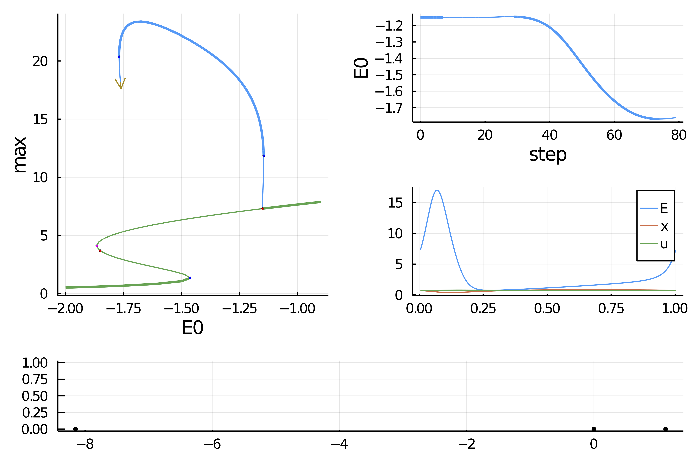
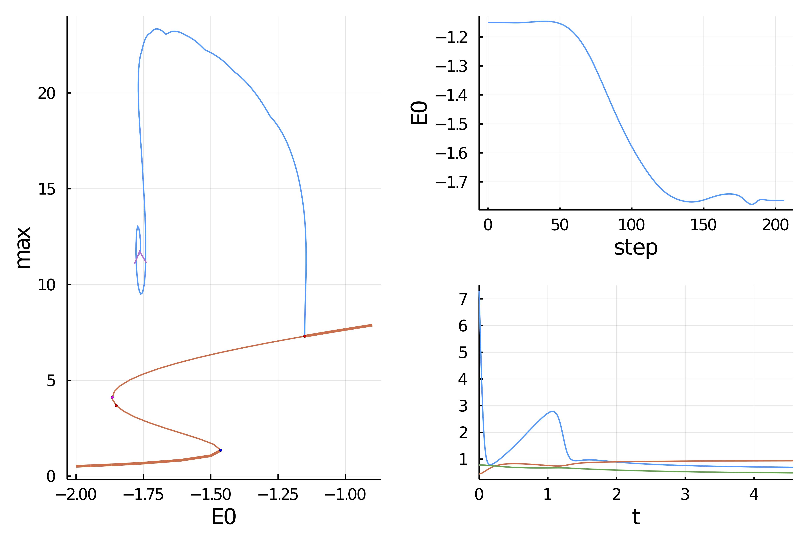

# Neural mass equation (automatic)

```@contents
Pages = ["tutorialsODE.md"]
Depth = 3
```

We present an example of the use of the package in the case of ODE. Although `BifurcationKit.jl` is not geared towards them, we provide some specific methods which allow to study the bifurcations of ODE in a relatively efficient way.

The following model is taken from [^Cortes]:

$$\left\{\begin{array}{l}
\tau \dot{E}=-E+g\left(J u x E+E_{0}\right) \\
\dot{x}=\tau_{D}^{-1}(1-x)-u E x \\
\dot{u}=U E(1-u)-\tau_{F}^{-1}(u-U)
\end{array}\right.$$


The model is interesting because the branch of periodic solutions converges to an homoclinic orbit which is challenging to compute with our methods. We provide three different ways to compute this periodic orbits and highlight their pro / cons.

It is easy to encode the ODE as follows

```@example TUTODE
using Revise, ForwardDiff, Parameters, Setfield, Plots, LinearAlgebra
using BifurcationKit
const BK = BifurcationKit

# sup norm
norminf = x -> norm(x, Inf)

# vector field
function TMvf!(dz, z, p, t)
	@unpack J, α, E0, τ, τD, τF, U0 = p
	E, x, u = z
	SS0 = J * u * x * E + E0
	SS1 = α * log(1 + exp(SS0 / α))
	dz[1] = (-E + SS1) / τ
	dz[2] =	(1.0 - x) / τD - u * x * E
	dz[3] = (U0 - u) / τF +  U0 * (1.0 - u) * E
	dz
end

# out of place method
TMvf(z, p) = TMvf!(similar(z), z, p, 0)

# we group the differentials together
dTMvf = (z,p) -> ForwardDiff.jacobian(x -> TMvf(x,p), z)
jet = BK.get3Jet(TMvf, dTMvf)

# parameter values
par_tm = (α = 1.5, τ = 0.013, J = 3.07, E0 = -2.0, τD = 0.200, U0 = 0.3, τF = 1.5, τS = 0.007)

# initial condition
z0 = [0.238616, 0.982747, 0.367876 ]
nothing #hide
```

We first compute the branch of equilibria

```@example TUTODE
# continuation options
opts_br = ContinuationPar(pMin = -10.0, pMax = -0.9, 
	# parameters to have a smooth result
	ds = 0.04, dsmax = 0.05,
		# this is to detect bifurcation points precisely
		detectBifurcation = 3,
	# Optional: bisection options for locating bifurcations
	nInversion = 8, maxBisectionSteps = 25, nev = 3)

# continuation of equilibria
br, = continuation(TMvf, dTMvf, z0, par_tm, (@lens _.E0), opts_br;
	printSolution = (x, p) -> (E = x[1], x = x[2], u = x[3]),
	tangentAlgo = BorderedPred(),
	plot = true, verbosity = 0, normC = norminf)

scene = plot(br, plotfold=false, markersize=3, legend=:topleft)
```

```julia
julia> br
Branch number of points: 72
Branch of Equilibrium
Type of vectors: Vector{Float64}
Parameters E0 from -2.0 to -0.9
Special points:
 (ind_ev = index of the bifurcating eigenvalue e.g. `br.eig[idx].eigenvals[ind_ev]`)
- #  1,    bp at E0 ≈ -1.46302733 ∈ (-1.46302733, -1.46302733), |δp|=4e-14, [converged], δ = ( 1,  0), step =  12, eigenelements in eig[ 13], ind_ev =   1
- #  2,  hopf at E0 ≈ -1.85012460 ∈ (-1.85012460, -1.85012447), |δp|=1e-07, [converged], δ = ( 2,  2), step =  32, eigenelements in eig[ 33], ind_ev =   3
- #  3,    bp at E0 ≈ -1.86522391 ∈ (-1.86522391, -1.86522391), |δp|=2e-15, [converged], δ = (-1,  0), step =  36, eigenelements in eig[ 37], ind_ev =   3
- #  4,  hopf at E0 ≈ -1.15105934 ∈ (-1.15105942, -1.15105934), |δp|=8e-08, [converged], δ = (-2, -2), step =  65, eigenelements in eig[ 66], ind_ev =   2
```

## Branch of periodic orbits with finite differences

We then compute the branch of periodic orbits from the last Hopf bifurcation point (on the right). We use finite differences to discretize the problem of finding periodic orbits. Obviously, this will be problematic when the period of the limit cycle grows unbounded close to the homoclinic orbit.

```julia
# newton parameters
optn_po = NewtonPar(verbose = true, tol = 1e-8,  maxIter = 10) 

# continuation parameters
opts_po_cont = ContinuationPar(dsmax = 0.1, ds= -0.0001, dsmin = 1e-4, pMax = 0., pMin=-5.,
	maxSteps = 110, newtonOptions = (@set optn_po.tol = 1e-7),
	nev = 2, precisionStability = 1e-8, detectBifurcation = 3, plotEveryStep = 10, saveSolEveryStep=1)

Mt = 200 # number of time sections
	br_potrap, utrap = continuation(jet...,
	# we want to branch form the 4th bif. point
	br, 4, opts_po_cont,
	# we want to use the Trapeze method to locate PO
	PeriodicOrbitTrapProblem(M = Mt);
	# this jacobian is specific to ODEs
	# it is computed using AD of the flow and
	# updated inplace
	linearPO = :Dense,
	# regular continuation options
	verbosity = 2,	plot = true,
	printSolution = (x, p) -> (xtt=reshape(x[1:end-1],3,Mt); return (max = maximum(xtt[1,:]), min = minimum(xtt[1,:]), period = x[end])),
	plotSolution = (x, p; k...) -> begin
		# the problem prob is passed back in p:
		xtt = BK.getTrajectory(p.prob, x, p.p)
		plot!(xtt.t, xtt.u[1,:]; label = "E", k...)
		plot!(xtt.t, xtt.u[2,:]; label = "x", k...)
		plot!(xtt.t, xtt.u[3,:]; label = "u", k...)
		plot!(br,subplot=1, putbifptlegend = false)
		end,
	normC = norminf)

scene = plot(br, br_potrap, markersize = 3)
plot!(scene, br_potrap.param, br_potrap.min, label = "")
```



We plot the maximum (resp. minimum) of the limit cycle. We can see that the min converges to the smallest equilibrium indicating a homoclinic orbit.

## Periodic orbits with Parallel Standard Shooting

We use a different method to compute periodic orbits: we rely on a fixed point of the flow. To compute the flow, we use `DifferentialEquations.jl`. This way of computing periodic orbits should be more precise than the previous one. We use a particular instance called multiple shooting which is computed in parallel. This is an additional advantage compared to the previous method.

```julia
using DifferentialEquations

# this is the ODEProblem used with `DiffEqBase.solve`
probsh = ODEProblem(TMvf!, copy(z0), (0., 1000.), par_tm; atol = 1e-10, rtol = 1e-9)

opts_po_cont = ContinuationPar(dsmax = 0.05, ds= -0.0001, dsmin = 1e-4, pMax = 0., pMin=-5., maxSteps = 210, newtonOptions = (@set optn_po.tol = 1e-6), nev = 25, precisionStability = 1e-8, detectBifurcation = 0, plotEveryStep = 10, saveSolEveryStep=0)

br_posh, = @time continuation(jet...,
	br, 4, opts_po_cont,
	# this is where we tell that we want Standard Shooting
	# with 15 time sections
	ShootingProblem(15, par_tm, probsh, Rodas4(), parallel = true);
	# this to help branching
	ampfactor = 1.0, δp = 0.0005,
	# deflation helps not converging to an equilibrium instead of a PO
	usedeflation = true,
	# this linear solver is specific to ODEs
	# it is computed using AD of the flow and
	# updated inplace
	linearPO = :autodiffDense,
	# we update the section along the branches
	updateSectionEveryStep = 2,
	# regular continuation parameters
	verbosity = 2,	plot = true,
	printSolution = (x, p) -> (return (max = getMaximum(p.prob, x, @set par_tm.E0 = p.p), period = getPeriod(p.prob, x, @set par_tm.E0 = p.p))),
	plotSolution = (x, p; k...) ->
		begin
			xtt = BK.getTrajectory(p.prob, x, @set par_tm.E0 = p.p)
			plot!(xtt; legend = false, k...);
			plot!(br, subplot=1, putbifptlegend = false)
		end,
	normC = norminf)
```


## References

[^Cortes]:> Cortes, Jesus M., Mathieu Desroches, Serafim Rodrigues, Romain Veltz, Miguel A. Muñoz, and Terrence J. Sejnowski. **Short-Term Synaptic Plasticity in the Deterministic Tsodyks–Markram Model Leads to Unpredictable Network Dynamics.**” Proceedings of the National Academy of Sciences 110, no. 41 (October 8, 2013): 16610–15. https://doi.org/10.1073/pnas.1316071110.
