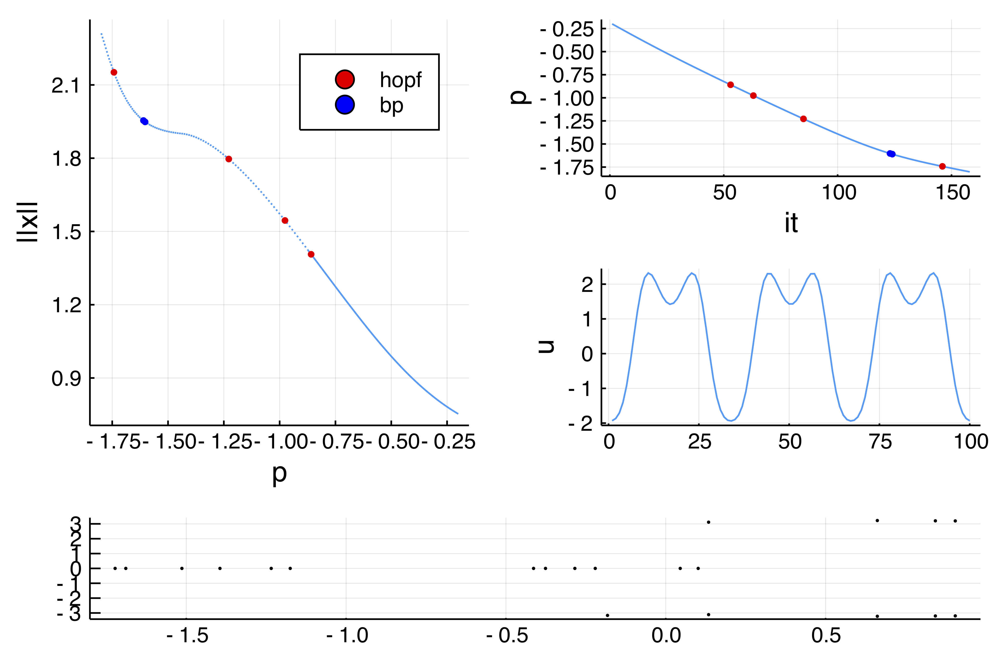

# Period doubling in the Barrio-Varea-Aragon-Maini model

The purpose of this example is to show how to handle period doubling bifurcations of periodic orbits.

!!! unknown "References"
    This example is taken from Aragón, J. L., R. A. Barrio, T. E. Woolley, R. E. Baker, and P. K. Maini. “Nonlinear Effects on Turing Patterns: Time Oscillations and Chaos.” Physical Review E 86, no. 2 (2012)
    
!!! info "Method and performance"
    We focus on the Shooting method but we could have based the computation of periodic orbits on finite differences instead. Performances of the current tutorial are directly linked to the ones of `DifferentialEquations.jl`.     

We focus on the following 1D model:

$$\tag{E}\begin{aligned}
&\frac{\partial u}{\partial t}=D \nabla^{2} u+\eta\left(u+a v-C u v-u v^{2}\right)\\
&\frac{\partial v}{\partial t}=\nabla^{2} v+\eta\left(b v+H u+C u v+u v^{2}\right)
\end{aligned}$$
with Neumann boundary conditions. We start by encoding the model

```julia
using Revise
using DiffEqOperators, ForwardDiff, DifferentialEquations, SparseArrays
using PseudoArcLengthContinuation, LinearAlgebra, Plots, Setfield
const PALC = PseudoArcLengthContinuation

norminf = x -> norm(x, Inf)
f(u, v, p) = p.η * (      u + p.a * v - p.C * u * v - u * v^2)
g(u, v, p) = p.η * (p.H * u + p.b * v + p.C * u * v + u * v^2)

function Laplacian(N, lx, bc = :Dirichlet)
	hx = 2lx/N
	D2x = CenteredDifference(2, 2, hx, N)
	if bc == :Neumann
		Qx = Neumann0BC(hx)
	elseif bc == :Dirichlet
		Qx = Dirichlet0BC(typeof(hx))
	end
	D2xsp = sparse(D2x * Qx)[1]
end

function NL!(dest, u, p, t = 0.)
	N = div(length(u), 2)
	u1 =  @view (u[1:N])
	u2 =  @view (u[N+1:end])
	dest[1:N]     .= f.(u1, u2, Ref(p))
	dest[N+1:end] .= g.(u1, u2, Ref(p))
	return dest
end

function Fbr!(f, u, p)
	mul!(f, p.Δ, u)
	f .= f .+ NL(u, p)
end

function NL(u, p)
	out = similar(u)
	NL!(out, u, p)
	out
end

function Fbr(x, p, t = 0.)
	f = similar(x)
	Fbr!(f, x, p)
end

# this is not very efficient but simple enough ;)
Jbr(x,p) = sparse(ForwardDiff.jacobian(x -> Fbr(x, p), x))
```	

We can now perform bifurcation of the following Turing solution:

```julia
N = 100
n = 2N
lx = 3pi /2
X = LinRange(-lx,lx, N)

Δ = Laplacian(N, lx, :Neumann)
D = 0.08
par_br = (η = 1.0, a = -1., b = -3/2., H = 3.0, D = D, C = -0.6, Δ = blockdiag(D*Δ, Δ))

u0 = 1.0 * cos.(2X)
solc0 = vcat(u0, u0)

# parameters for continuation
eigls = EigArpack(0.5, :LM)
opt_newton = NewtonPar(eigsolver = eigls, verbose=true, maxIter = 3200, tol=1e-9)
opts_br = ContinuationPar(dsmax = 0.04, ds = -0.01, pMin = -1.8,
	detectBifurcation = 2, nev = 21, plotEveryNsteps = 50, newtonOptions = opt_newton, maxSteps = 400)

br, _ = @time continuation(
	(x, p) -> Fbr(x, @set par_br.C = p),
	(x, p) -> Jbr(x, @set par_br.C = p),
	solc0, -0.2,
	opts_br;
	plot = true, verbosity = 2,
	printSolution = (x, p) -> norm(x, Inf),
	plotSolution = (x, p; kwargs...) -> plot!(x[1:end÷2];label="",ylabel ="u", kwargs...))
```

which yields


	
# Periodic orbits from the Hopf point (Shooting)

We continue the periodic orbit form the first Hopf point around $C\approx -0.8598$ using a Standard Simple Shooting method (see [Periodic orbits based on the shooting method](@ref)). To this end, we define a `SplitODEProblem` from `DifferentialEquations.jl` which is convenient for solving semilinear problems of the form 

$$\dot x = Ax+g(x)$$ 

where $A$ is the infinitesimal generator of a $C_0$-semigroup. We use the exponential-RK scheme `ETDRK2` ODE solver to compute the solution of (E) just after the Hopf point. 

```julia
f1 = DiffEqArrayOperator(par_br.Δ)
f2 = NL!
prob_sp = SplitODEProblem(f1, f2, solc0, (0.0, 280.0), @set par_br.C = -0.86)

sol = @time solve(prob_sp, ETDRK2(krylov=true); abstol=1e-14, reltol=1e-14, dt = 0.1)
```	

We estimate the period of the limit cycle to be around $T\approx 3$. We then use this as a guess for the shooting method:

```julia
# compute the guess for the shooting method
orbitsection = Array(sol[:, end])
initpo = vcat(vec(orbitsection), 3.)

# define the functional for the standard simple shooting based on the 
# ODE solver ETDRK2. SectionShooting implements an appropriate phase condition
probSh = p -> ShootingProblem(u -> Fbr(u, p), p, prob_sp, ETDRK2(krylov=true),
1, x -> PALC.sectionShooting(x, Array(sol[:,[end]]), p, Fbr); atol = 1e-14, rtol = 1e-14, dt = 0.1)

ls = GMRESIterativeSolvers(tol = 1e-7, N = length(initpo), maxiter = 50, verbose = false)
optn = NewtonPar(verbose = true, tol = 1e-9,  maxIter = 120, linsolver = ls)
out_po_sh, _, flag = @time newton(probSh(@set par_br.C = -0.86),
	initpo, optn; normN = norminf)
flag && printstyled(color=:red, "--> T = ", out_po_sh[end], ", amplitude = ", PALC.getAmplitude(probSh(@set par_br.C = -0.86), out_po_sh; ratio = 2),"\n")
```

which gives

```julia
--> T = 2.94557883943451, amplitude = 0.05791350025709674
```

We can now continue this periodic orbit:

```julia
eig = DefaultEig()
opts_po_cont = ContinuationPar(dsmin = 0.0001, dsmax = 0.01, ds= 0.005, pMin = -1.8, maxSteps = 170, newtonOptions = (@set optn.eigsolver = eig),
	nev = 10, precisionStability = 1e-2, detectBifurcation = 2)
	br_po_sh, _ , _ = @time continuationPOShooting(
		p -> probSh(@set par_br.C = p),
		out_po_sh, -0.86,
		opts_po_cont; verbosity = 3,
		plot = true,
		plotSolution = (x, p; kwargs...) -> PALC.plotPeriodicShooting!(x[1:end-1], 1; kwargs...),
		printSolution = (u, p) -> PALC.getMaximum(probSh(@set par_br.C = p), u; ratio = 2), normC = norminf)
```

We plot the result using `plotBranch(vcat(br_po_sh, br), label = "")`:


!!! tip "Numerical precision for stability"
    The Floquet multipliers are not very precisely computed here using the Shooting method. We know that `1=exp(0)` should be a Floquet multiplier but this is only true here at precision ~1e-3. In order to prevent spurious bifurcation detection, there is a threshold `precisionStability` in `ContinuationPar` for declaring an unstable eigenvalue. Another way would be to use Poincaré Shooting so that this issue does not show up.

# Periodic orbits from the PD point (Shooting)

We now compute the periodic orbits branching of the first Period-Doubling bifurcation point. It is straightforward to obtain an initial guess using the flow around the bifurcation point:

```julia
prob_sp = SplitODEProblem(f1, f2, solc0, (0.0, 300.0), @set par_br.C = -1.32)
# solution close to the PD point.
solpd = @time solve(prob_sp, ETDRK2(krylov=true); abstol=1e-14, reltol=1e-14, dt = 0.1)
```
The estimated period is $T_{pd}=6.2$:

```julia
orbitsectionpd = Array(solpd[:,end-100])
initpo_pd = vcat(vec(orbitsectionpd), 6.2)
```

For educational purposes, we show the newton outputs:

```julia
out_po_sh_pd, _, flag = @time newton(
		probSh(@set par_br.C = -1.32),
		initpo_pd, optn;normN = norminf)
flag && printstyled(color=:red, "--> T = ", out_po_sh_pd[end], ", amplitude = ", PALC.getAmplitude(probSh(@set par_br.C = -0.86), out_po_sh_pd; ratio = 2),"\n")
```
which gives

```julia
 Newton Iterations 
   Iterations      Func-count      f(x)      Linear-Iterations

        0                1     1.3462e-01         0
        1                2     2.1845e-02        11
        2                3     4.6417e-03        12
        3                4     6.9467e-04        13
        4                5     8.3113e-06        12
        5                6     2.5982e-07        13
        6                7     1.1674e-08        14
        7                8     5.2221e-10        13
  4.845103 seconds (3.07 M allocations: 1.959 GiB, 5.37% gc time)
--> T = 6.126423339476528, amplitude = 1.8457951639694683
```

We also compute the branch of periodic orbits using the following command:

```julia
opts_po_cont = ContinuationPar(dsmin = 0.0001, dsmax = 0.005, ds= 0.001, pMin = -1.8, maxSteps = 100, newtonOptions = (@set optn.eigsolver = eig), nev = 5, precisionStability = 1e-3, detectBifurcation = 1)
br_po_sh_pd, _ , _ = @time continuationPOShooting(
	p -> probSh(@set par_br.C = p),
	out_po_sh_pd, -1.32,
	opts_po_cont; verbosity = 2,
	plot = true,
	plotSolution = (x, p; kwargs...) -> PALC.plotPeriodicShooting!(x[1:end-1], 1; kwargs...),
	printSolution = (u, p) -> PALC.getMaximum(probSh(@set par_br.C = p), u; ratio = 2), normC = norminf)
```

and plot it using `plotBranch(vcat(br_po_sh, br, br_po_sh_pd), label = "")`:

